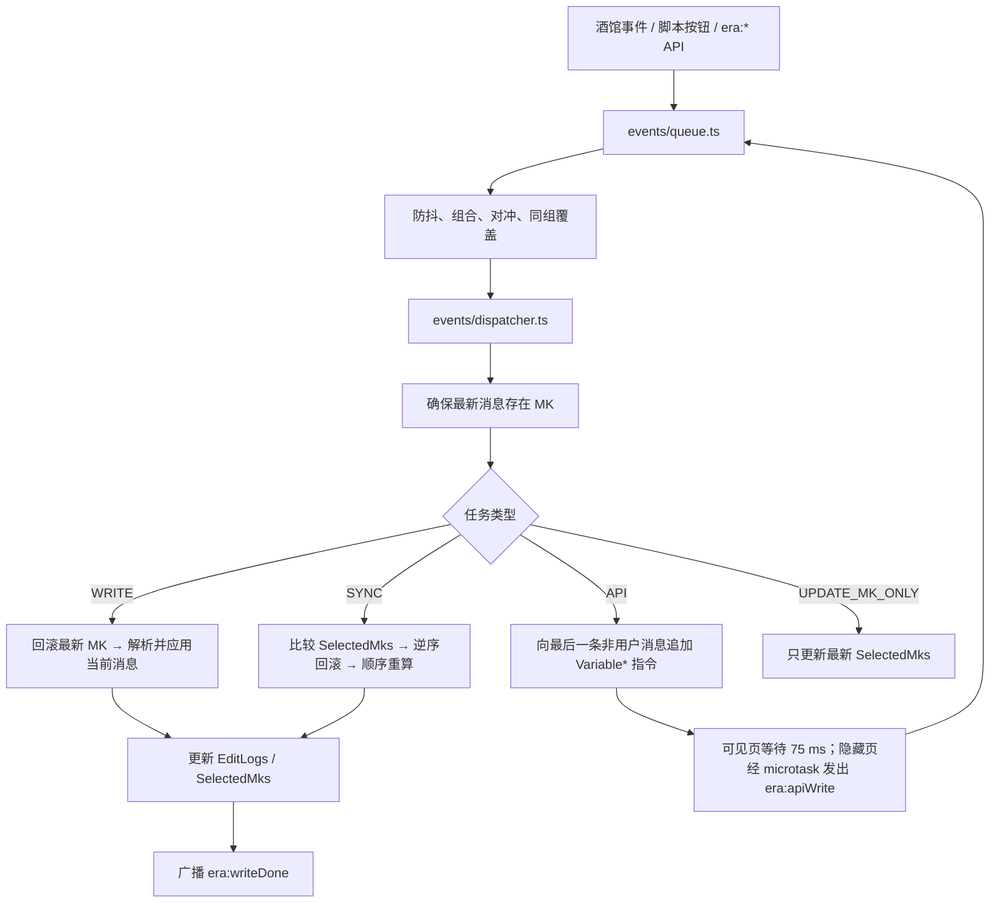
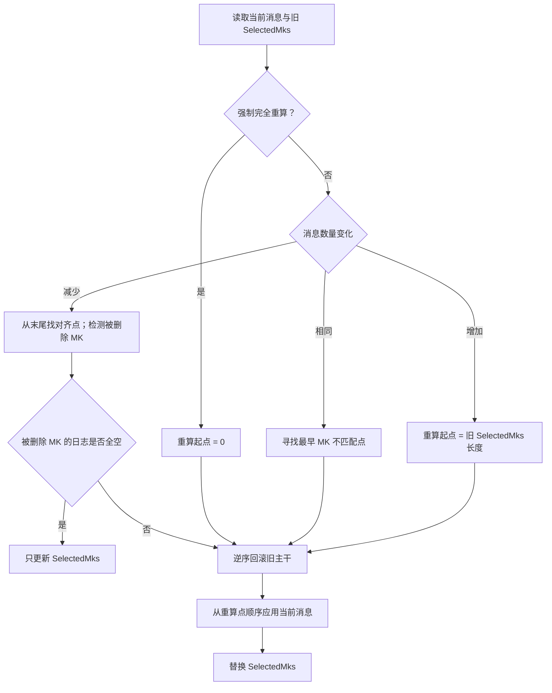

# Pi Prompt Inspector

生成时间：2026-08-05T07:06:44.951Z

> 此文件含完整对话、项目上下文或敏感信息；请勿随意提交、共享或上传。

## 来源概览

- Pi 内置默认系统提示与当前工作目录/日期
- Pi 内置工具的基础说明
- 项目上下文文件（AGENTS.md / CLAUDE.md 等）（contextFiles）
- 已加载的 Skills（skills）
- 当前激活的工具（selectedTools）
- 工具描述（注入系统提示）（toolSnippets）
- 工具/扩展追加的提示规则（promptGuidelines）

## 当前用户输入（Pi 处理后的当前回合）

```text
我想用正则将<战斗判定>替换成美化界面，替换出的判断窗口要包括里面的内容，而且要有水墨武侠风的感觉，帮我生成对应的正则表达式和替换内容
```

## Pi 拼接后的系统提示（序列化前）

> 这是该检查器运行时已看到的提示词。若后加载的扩展随后修改提示词，以“实际 Provider 请求”为准。

```text
You are an expert coding assistant operating inside pi, a coding agent harness. You help users by reading files, executing commands, editing code, and writing new files.

Available tools:
- read: Read file contents
- grep: Search file contents for patterns (respects .gitignore)
- find: Find files by glob pattern (respects .gitignore)
- ls: List directory contents
- bash: Execute bash commands (ls, grep, find, etc.)
- edit: Make precise file edits with exact text replacement, including multiple disjoint edits in one call
- write: Create or overwrite files
- todo: Manage the required TODO list
- question: Ask the user a concise clarifying question
- end_conversation: End Auto planning without switching to Act
- end_phase: Finish the active sprint phase

In addition to the tools above, you may have access to other custom tools depending on the project.

Guidelines:
- Use read to examine files instead of cat or sed.
- Use edit for precise changes (edits[].oldText must match exactly)
- When changing multiple separate locations in one file, use one edit call with multiple entries in edits[] instead of multiple edit calls
- Each edits[].oldText is matched against the original file, not after earlier edits are applied. Do not emit overlapping or nested edits. Merge nearby changes into one edit.
- Keep edits[].oldText as small as possible while still being unique in the file. Do not pad with large unchanged regions.
- Use write only for new files or complete rewrites.
- Use todo to create concrete, ordered TODO items before acting in Plan or Auto planning.
- When Auto mode is in Plan phase, first inspect with read-only tools, then use todo to produce a concrete TODO list before any edits. If the user only asked a question or no work is needed, call end_conversation instead of creating TODOs.
- When executing a TODO list in Act phases, update TODO statuses with todo as work progresses.
- When a TODO item changes, update it with todo so the current list is returned. Use todo with action 'list' if the current TODO state is not visible.
- todo is disabled in Fast mode even though its schema remains advertised for prompt-cache stability.
- Use type 'single' when the user must pick exactly one option.
- Use type 'multiple' when the user can pick several options.
- Use type 'open' when you need a free-text answer with no predefined options.
- A free-text 'Other (type your answer)' option is always included for single and multiple types.
- Use end_conversation only in Auto Plan mode when the request needs no edits and no Act phase.
- Use end_phase only when a sprint loop is active and the current sprint phase is complete.
- Do not call end_phase for ordinary Plan, Auto, Act, or Fast mode work.
- Be concise in your responses
- Show file paths clearly when working with files

Pi documentation (read only when the user asks about pi itself, its SDK, extensions, themes, skills, or TUI):
- Main documentation: F:\pi\node_modules\@earendil-works\pi-coding-agent\README.md
- Additional docs: F:\pi\node_modules\@earendil-works\pi-coding-agent\docs
- Examples: F:\pi\node_modules\@earendil-works\pi-coding-agent\examples (extensions, custom tools, SDK)
- When reading pi docs or examples, resolve docs/... under Additional docs and examples/... under Examples, not the current working directory
- When asked about: extensions (docs/extensions.md, examples/extensions/), themes (docs/themes.md), skills (docs/skills.md), prompt templates (docs/prompt-templates.md), TUI components (docs/tui.md), keybindings (docs/keybindings.md), SDK integrations (docs/sdk.md), custom providers (docs/custom-provider.md), adding models (docs/models.md), pi packages (docs/packages.md)
- When working on pi topics, read the docs and examples, and follow .md cross-references before implementing
- Always read pi .md files completely and follow links to related docs (e.g., tui.md for TUI API details)

<project_context>

Project-specific instructions and guidelines:

<project_instructions path="F:\Develop\AI\sillytavern\AGENTS.md">
# 酒馆助手前端界面或脚本编写

@.cursor/rules/项目基本概念.mdc
@.cursor/rules/酒馆助手接口.mdc
@.cursor/rules/前端界面.mdc
@.cursor/rules/脚本.mdc

善用5.6-Luna/Terra的并行子任务读取文件/执行计划，以此增加效率并减少上下文
</project_instructions>

</project_context>


The following skills provide specialized instructions for specific tasks.
Use the read tool to load a skill's file when the task matches its description.
When a skill file references a relative path, resolve it against the skill directory (parent of SKILL.md / dirname of the path) and use that absolute path in tool commands.

<available_skills>
  <skill>
    <name>wuxia-ui-playtest</name>
    <description>通过外部 Playwright/CDP UI runner 推进或检查 SillyTavern 武侠游戏的真实回合，并按需使用旧 CLI 做状态、快照、stat_data 和变量持久化诊断。用于剧情推进、多轮 UI 回归、提示词与变量调试、会话定位或武侠自动化故障排查；默认调用 pnpm wuxia:ui。真实推进会新增聊天楼层并修改当前存档。</description>
    <location>F:\Develop\AI\sillytavern\.agents\skills\wuxia-ui-playtest\SKILL.md</location>
  </skill>
</available_skills>
Current working directory: F:/Develop/AI/sillytavern

## Project Context Files

The files selected with /pick are injected below. Keep relevant README.md, SPECS.md, SPRINT.md, and other selected project documents up to date when your work changes setup, behavior, commands, architecture, or project expectations.

<context-file path=".claude\worktrees\focused-easley-c139d4\README.md">
# tavern_helper_template

酒馆助手编写前端界面或脚本的模板.

## 使用方法

无论哪种方式, 请阅读[教程文档](https://stagedog.github.io/青空莉/工具经验/实时编写前端界面或脚本/)来了解如何使用.

### 仅本地使用

你可以点击网页右上角的绿色 `Code` 按钮-`Download ZIP` 下载本模板的压缩包来只在本地使用

### 作为 Github 仓库

你可以通过以下两种方式中的一种来创建仓库:

- 点击网页右上角绿色 `Use this template` 按钮;
- 或者点击网页右上角的 `fork` 按钮, 但需要手动去 fork 所得仓库的 `Actions` 页面启用自动工作流.

在创建好仓库后, 你需要配置工作流的权限: 前往仓库 `Settings -> Actions -> General` 中将 `Workflow permissions` 设置为 `Read and write permissions`, 并勾选 `Allow GitHub Actions to create and approve pull requests`

## 如果只在本地使用

这意味着:

- 你将不能利用 jsdelivr 实现前端界面或脚本的自动更新;
- 也不能享受本模板提供的自动打包、自动更新功能:
  - 上传代码后, 自动打包 `src` 文件夹中的代码到 `dist` 文件夹中;
  - 自动更新成最新的编写模板, 自动更新酒馆和酒馆助手的参考文件……

但你本地依旧能很方便地使用这个模板.

## 如果创建为新仓库

在创建好仓库后, 你可以把仓库网址发给 AI, 问 AI 该**怎么启用 `core.symlinks`**, 然后克隆到本地使用; 或者, 你可以游玩 [Learn Git Branching](https://learngitbranching.js.org/?locale=zh_CN) 来学习 git 分支和合并.

#### `.vscode/launch.json` 文件

由于 `.vscode/launch.json` 文件中填写了你的酒馆地址, 你可能需要运行命令来忽略这个更改, 避免你的云酒馆 ip 地址暴露:

```bash
git update-index --skip-worktree .vscode/launch.json
```

### 示例文件夹

请不要删除`示例`文件夹, AI 需要参考其中的代码; 但你可以在 `webpack.config.ts` 中将 54 行左右的 `{示例,src}/` 改为 `src/` 来避免打包它们.

#### 利用 jsdelivr 实现前端界面或脚本的自动更新

由于你所制作的前端界面或脚本将被打包在 github 仓库中, 你将能用 jsdelivr 链接来访问它们, 而这个链接可以在前端界面或脚本中直接使用.

由此你就可以为用户创建这样一个自动更新的前端界面:

```html
<body>
  <script>
    $('body').load('https://testingcf.jsdelivr.net/gh/lolo-desu/lolocard/dist/日记络络/界面/介绍页/index.html')
  </script>
</body>
```

或一个自动更新的脚本:

```typescript
import 'https://testingcf.jsdelivr.net/gh/StageDog/tavern_resource/dist/酒馆助手/场景感/index.js'
```

更多请见于[文档](https://stagedog.github.io/青空莉/工具经验/实时编写前端界面或脚本/进阶技巧).

### 自动打包、自动更新功能

本仓库在 `.github/workflows` 文件夹中设置了几个 CI 工作流来为你带来自动打包、自动更新功能, 你也可以在网页上方的 `Actions` 中手动运行它们:

**`bundle.yaml`**

- 自动打包 `src` 文件夹中的代码到 `dist` 文件夹中, 并自动递增版本号从而让 jsdelivr 更快更新缓存;
- 自动将 `tavern_sync.yaml` 中[已经配置好了的角色卡、世界书或预设](https://stagedog.github.io/青空莉/工具经验/实时编写角色卡、世界书或预设/)打包成可以被酒馆导入的文件.

**`bump_deps.yaml`**

- 每三天一次, 自动更新第三方库依赖和酒馆助手 `@types` 文件夹.

**`sync_template.yaml`**

- 在你基于模板仓库创建新仓库后, 你的新仓库将不再和模板仓库有关联, 因此我设置了这个工作流用于同步模板仓库的更新 (如编程助手编写规则、MCP、slash_command.txt 文件等):
  - 发现模板仓库更新后, 这个工作流将会自动创建一个 pull request 来同步更新, 而**你需要手动批准 pull request, 因此建议你时常查看 github 的邮件通知;**
  - 如果模板仓库中有文件是你不想继续同步的, 可以在 `.github/.templatesyncignore` 中添加它.

### 打包冲突问题

为了自动更新和打包一些东西, 本项目直接打包源代码在 `dist/` 文件夹中并随仓库上传, 而这会让开发时经常出现分支冲突.

为了解决这一点, 仓库在 `.gitattribute` 中设置了对于 `dist/` 文件夹中的冲突总是使用当前版本. 这不会有什么问题: 在上传后, ci 会将 `dist/` 文件夹重新打包成最新版本, 因而你上传的 `dist/` 文件夹内容如何无关紧要.

为了启用这个功能, 请执行一次以下命令:

```bash
git config --global merge.ours.driver true
```

## 许可证

[Aladdin](LICENSE)

</context-file>

<context-file path="角色卡\红楼梦\README.md">
# 红楼梦角色卡 —— 结构骨架说明

> 依据 `信息/提取/00~04` 五份金庸卡复刻文档搭建，结构镜像 `角色卡/金庸群侠传`（伪同层 + ERA 变量 + 后台事件状态机架构）。
> 当前状态：**结构骨架已就位，题材内容待设计决策拍板后填充**（决策清单见文末）。

## 目录结构与文件状态

| 文件 | 状态 | 说明 |
|---|---|---|
| `index.yaml` | ✅ 骨架完成 | 空壳卡清单：`角色描述:''`、开场白锚串 `【入梦红楼】`、6+2 条世界书条目、3 条正则、4 个脚本 |
| `头像.png` | ❌ 待提供 | 卡面图片 |
| `正则/游戏页面.txt` | ✅ 可用 | 开发态 loader，指向 `http://localhost:5500/dist/红楼梦/index.html` |
| `正则/复制.txt` | ⬜ 占位 | 发布态内联 bundle，前端构建后回填 |
| `脚本/隐藏楼层.js` | ✅ 原样照搬 | 零改动（`wuxia:` 事件前缀按提取文档建议保留，nba2k 卡同样未改；若改名须同步前端 turnLock 四常量） |
| `脚本/ERA变量框架-魔改.js` | ✅ 原样照搬 | 零改动；1.0.5 备份版按文档建议不携带 |
| `脚本/调试.js` | ✅ 已改前缀 | `EVENT_KEY_PREFIX = "红楼事件条目-"` |
| `世界书/世界背景.yaml` | ✅ 已填充 | 按 D1（命运改写+情感养成）/ D3（原创入府）/ D4（120回全本+架空纪年）落实 |
| `世界书/输出提示词.txt` | ✅ 基本可用 | 通用函数+年龄换算+同场景过滤+才艺档位提示已就位；仅 `<可用地点>` 白名单待前端（`前端变量.周围地点`）接入 |
| `世界书/变量指导.txt` | ✅ 已填充 | 五节完整（按方案三：才艺五档造诣/判词只读/关系网0-100/重要物品定性/系统维护区禁写）；**`启用:true`，勿照抄金庸主版的 false** |
| `世界书/cot.txt` | ✅ 可用 | 四板块框架 + 红楼措辞，字段名已对齐（性情/才艺/关系网） |
| `世界书/世界历史.txt` | ✅ 可用 | 世界历史注入（16条/偏离优先8条），照搬金庸战斗骰子前半；剧情卡不设判定协议（D2 已定） |
| `世界书/红楼事件条目-模板.json` | ✅ 模板 | 11 字段 schema + 差分可写字段清单，发布前删除 |
| `世界书/红楼登场事件-模板.json` | ✅ 模板 | 5 字段 schema（含判词示例），发布前删除 |

尚未建立（属于工程侧，非卡包内）：`src/红楼梦/`（React 前端）、`src/红楼事件脚本/`（事件状态机）、世界书真源目录 `世界书/红楼梦1/`。

前端功能与 UI 规格已定稿：见 [前端设计.md](前端设计.md)（工笔重彩+太虚幻境双主题、双栏常驻、手机优先；v1=底座+判词册+情缘+舆图）。

## 命名与协议约定（已定，机械项）

- 事件条目：`红楼事件条目-第N回-NN-标题`（NN 补零；`人物经历` 键 = `第N回-NN-标题`，不带前缀）
- 登场条目：`红楼登场事件-第N回人物`（一回一文件，`人物经历` 恒 `{}`）
- 变量根名沿用中性命名：`世界信息 / user数据 / 角色数据 / 参与事件 / 后续事件线索 / 附近传闻 / 世界事件 / 前端变量 / 事件系统`
- 发布锚串：`【入梦红楼】`；开发/发布双正则切换（游戏页面 ↔ 复制）
- `delete` 差分统一放事件条目顶层；`关系网` 值格式 `关系名/数值`；`所在位置` 用 `/` 分层路径逐字匹配白名单

## 设计决策记录（2026-07-26 与用户确认）

- **D1 玩法侧重**：✅ 已定 —— **命运改写线（主）+ 情感养成线**。以「原定/偏离/未知」状态机承载判词命运改写；关系网/好感度深度养成。不做宅斗经营数值区。
- **D2 判定体系**：✅ 已定 —— **不设判定**。剧情卡定位，无战斗骰子/较量区/前端预生成随机数；原「判定骰子」条目改造为纯「世界历史」注入条目。
- **D3 主视角**：✅ 已定 —— **原创角色入府**（与金庸卡同模式，外来者身份介入原著事件线）。
- **D4 时间线范围与历法**：✅ 已定 —— **120 回全本**（含程高本后四十回结局事件）；纪年用架空「第N年」（黛玉进府 = 第1年），沿用 365/30 简化历法（日仅 1~30，参见 fix-wuxia-event-durations.mjs 的校验经验）。
- **D5 变量体系**：✅ 已定 —— **方案三「金陵册」**（剧情向，无属性数值）：
  - 角色档案：性别/外貌/性情/`才艺{名:造诣}`（五档：略通<粗通<娴熟<精妙<出神入化）/出生年份/状态/所在位置/身份{}/重要物品{定性描述}/人物经历{}/关系网{"关系名/亲密度0-100(补注)"}
  - 命运人物（十二钗等）档案额外含只读 `判词` 字段
  - `stat_data.前端变量.命运册`：脚本维护的只读区 `{人物:{判词,状态(原定/偏离/未知),批语}}`，前端做「太虚幻境判词册」面板；事件脚本需增加命运批语维护模块
  - 唯一数值 = 关系网亲密度（情感养成进度）；物品/才艺全定性
- **D6 内容规模**：✅ 已定 —— **重点回密（4-6 事件）、过场回略（1-2 或并入邻回）**，120 回全书预估 350-450 事件；先做第 1~5 回验证批次。
- **D7 事件结构 v2**（2026-07-27 确认，见 `世界书/红楼事件条目-模板.json`）：
  - 触发：架空时间轴 + 可选 `前置事件`（数组，所列事件全部归档后才触发，未满足顺延）
  - 扩展字段（均可选）：`事件类型`（宴集/诗社/丧仪/省亲/日常/机缘…）、`命运影响`（牵动判词的人物名单）
  - `后续事件` 改分支数组 `[{事件名,描述,条件}]`，`条件` ∈ 原定/偏离/任意（按本事件归档时结局状态投放线索，缺省=任意）
  - 兼容性：**前置事件与分支数组均可在现有事件脚本上兼容实现，无需 fork**（用户确认）；专用增量只剩「命运批语/命运册」维护模块（可作为独立脚本或事件脚本内新模块）
  - 地点白名单顶层约定：府内场景以府为顶层（`荣国府/贾母院/正房`、`宁国府/会芳园/天香楼`），府外以城市为顶层（`姑苏/阊门/葫芦庙`、`扬州/林府/内宅`），恒为三段
- **原文素材**：`原文/红楼梦.txt`（120 回全本，UTF-8）+ `原文/章节/第NNN回-标题.txt` ×120（拆分产物）；纪年指派见 `时间表.md`。**原文目录不随卡发布。**

## 验证批次内容（第1~5回，2026-07-27 生成）

- **事件条目 ×14**：第1回 3 条（梦识通灵/英莲被拐/火焚甄家）、第2回 2 条（雨村坐馆贾敏仙逝/冷子兴演说）、第3回 4 条（托荐起复/黛玉进府/宝黛初会/安置碧纱橱）、第4回 3 条（薛蟠夺英莲/乱判葫芦案/薛家进京）、第5回 2 条（赏梅家宴/梦游太虚）。回内与跨回后续事件链全部接通（1-01 → … → 5-02 单主链），跨回前置门槛 2 处（3-01←2-01、4-01←1-02）。
- **登场条目 ×5**：共建档 31 人；判词字段仅十二钗正册/副册/又副册人物持有（英莲、黛玉、宝钗、凤姐、迎探惜、李纨、袭人、秦可卿）；癞僧、跛道、警幻等仙家不设出生年份（提示词层不渲染年龄）。
- **已过校验**：全部 JSON 语法合法；必填字段齐全；后续事件/前置事件引用无悬空；人物经历键=事件键；地点三段路径跨文件逐字一致（府内以府为顶层、府外以城市为顶层，京师统一用「京城」）。
- 全部已注册进 `index.yaml`（启用:false 数据条目）并挂入 `__WI_META_FOLDERS__` 分组（红楼事件条目/红楼登场事件）。
- 香菱处理：沿用 `甄英莲` 单键，改名与归薛以身份/位置差分表达，未另建键。

## 改动联动 checklist（照搬自 00-总览）

改 loader URL/端口/目录名/入口正则名时，必须同时改四处：① 角色卡正则矩阵 ② loader guard 特征串 ③ 正文读取器 loader-only 判断 ④ 构建输出路径。
改 `wuxia:` 事件前缀时，必须同步隐藏楼层脚本与前端 `turnLock.ts` 两侧全部常量。

## 后续搭建顺序（摘自 00-总览 §7.3）

1. 定 `stat_data` 字段树（等 D1/D3/D5）→ 2. 最小伪同层链路（loader 正则+空白前端+隐藏楼层+guard）→ 3. 接 ERA 握手 → 4. 变量指导跑通落库 → 5. 输出提示词+cot 跑通剧情 → 6. 事件系统（先 2~3 条验证）→ 7. UI 打磨与预算调优。

</context-file>

<context-file path="角色卡\nba2k\README.md">
# NBA2K16 生涯模拟角色卡

仿 `角色卡/金庸群侠传` 的复合结构。玩法与系统设计见 [设计文档.md](./设计文档.md)，前端架构见 [`src/nba2k/架构.md`](../../src/nba2k/架构.md)。

## 目录

| 路径 | 内容 |
| ---- | ---- |
| `index.yaml` | 卡声明：首条消息、世界书挂载、正则矩阵、脚本库矩阵 |
| `世界书/` | 输出提示词、变量指导（ERA 格式）、cot、比赛规则、叙事风格、球队与球星档案、场外系统（代言/经纪人/恋爱）、赛季事件 |
| `正则/游戏页面.txt` | loader：把楼层显示替换为 `dist/nba2k/index.html` 的 iframe |
| `脚本/` | 隐藏楼层.js、ERA变量框架-魔改.js（复用自金庸卡） |
| `头像.png` | 占位头像（可自行替换） |

## 使用步骤

1. 构建前端：`pnpm build:src:fast`（产出 `dist/nba2k/index.html`，单文件自包含）。
2. 启动静态服务：VSCode Live Server 以仓库根目录为根、监听 5500 端口。
3. 打包角色卡：`node tavern_sync.mjs bundle nba2k` → 生成 `角色卡/nba2k.png`，导入酒馆。
   - 或 `node tavern_sync.mjs push nba2k` 直接推送到酒馆（已在 `tavern_sync.yaml` 登记，酒馆中名称：NBA2K16生涯）。
4. 酒馆中开启酒馆助手，新建聊天发送「【开始游戏】」，前端接管后按界面操作。

## 注意

- loader 正则的 `run_on_edit` 应保持关闭（避免编辑楼层时 loader 壳写入正文）。
- AI 变量块使用 ERA 指令格式，由 ERA变量框架-魔改 脚本落库；前端另有两处开局直写。
- 球员数据（373 人）打包在前端里，世界书不含球员数值，避免上下文膨胀。

</context-file>

<context-file path="酒馆资料\mvu zod教程\README.md">
# MVU Zod 角色卡：AI 生成手册

本目录用于指导 AI 在当前仓库中**生成、修改和审查 MVU Zod 角色卡**。它不是网页教程镜像，也不是面向玩家的插件安装说明。

内容提炼自[《手写 MVU zod 变量卡》](https://stagedog.github.io/络络/教程/手写mvu变量卡/)，并以当前仓库的模板、类型定义和工具实现为准。

## 资料优先级

发生冲突时，依次服从：

1. 用户当前要求；
2. 根目录 `AGENTS.md` 及 `.cursor/rules/*.mdc`；
3. 当前目标角色卡的已有实现；
4. `初始模板/角色卡/新建为src文件夹中的文件夹/`、`示例/角色卡示例/`、`util/mvu.ts` 和 `@types`；
5. 本手册；
6. `酒馆资料/写卡知识库` 中较早的 MVU 资料。

不要为了套教程而覆盖一张已经能工作的卡；先理解现状，再做最小改动。

## 阅读路线

- 普通 MVU
  Zod 卡：依次阅读 README、[01_Schema与初始化.md](01_Schema与初始化.md)、[02\_变量提示词\_JSONPatch与EJS.md](02_变量提示词_JSONPatch与EJS.md)、[04\_验收与排错.md](04_验收与排错.md)。
- 需要后台逻辑、主动生成或状态栏：再阅读 [03\_脚本与状态栏.md](03_脚本与状态栏.md)。
- 只修改现有卡：读取与改动相关的章节，并检查 04 的验收项。

## AI 的标准执行流程

1. **读取约束**：检查 `AGENTS.md`、规则文件、用户要求和目标目录。
2. **确认工程位置**：新卡从初始模板复制到 `src/角色卡名/`；不要把 `示例/` 或初始模板本身当成成品。
3. **设计变量**：只记录跨回合持续、会影响剧情/提示词/界面的状态。
4. **先写 Schema**：建立唯一、完整的变量结构，再写 `initvar.yaml`。
5. **写变量提示词**：变量列表、更新规则、输出格式三者必须与 Schema 同步。
6. **接入角色卡**：在 `index.yaml` 中配置世界书条目、正则和酒馆助手脚本。
7. **按需扩展**：只有需求明确时才增加 EJS、后台脚本、主动生成或状态栏。
8. **生成并验证**：运行项目检查，验证初始化、一次真实更新、下一回合读取和界面同步。

## 标准目录

```text
src/角色卡名/
├─ index.yaml
├─ schema.ts
├─ 第一条消息/
│  └─ 0.txt
├─ 脚本/
│  ├─ MVU/index.ts                   # 模板保留的 MVU 源码镜像/组织文件
│  └─ 变量结构/index.ts
├─ 世界书/
│  └─ 变量/
│     ├─ initvar.yaml
│     ├─ 变量列表.txt
│     ├─ 变量更新规则.yaml
│     └─ 变量输出格式.yaml
└─ 界面/状态栏/                 # 仅在需要状态栏时保留/实现
   ├─ index.html
   ├─ index.ts
   ├─ store.ts
   └─ App.vue
```

### 必需产物

- `schema.ts`：纯 Zod 4 Schema，无注册副作用。
- `index.yaml` 的脚本库：加载 MVU bundle；模板中的 `脚本/MVU/index.ts`
  可作为同一导入的源码镜像，是否引用其 dist 以目标卡配置为准。
- `脚本/变量结构/index.ts`：注册 Schema。
- `initvar.yaml`：新聊天的默认变量。
- `变量列表.txt`：把最新变量发给 AI。
- `变量更新规则.yaml`：告诉 AI 什么情况下更新。
- `变量输出格式.yaml`：要求 AI 输出可解析的 JSON Patch。
- `index.yaml`：把以上内容接入角色卡。

### 按需产物

- 多开局的独立 `<initvar>`。
- EJS 动态提示词。
- 使用 MVU API 的后台脚本。
- 可显示/编辑变量的 Vue 状态栏及占位符正则。

### 生成物

- `schema.json` 由构建流程从 `src/**/schema.ts` 生成，不手改。
- `dist/**` 由构建流程生成，不手改。

## 模板复用原则

尽量复制当前初始模板，再填写角色卡专属内容。以下配置容易随项目版本变化，不要从记忆重建：

- MVU 与变量结构脚本的远程导入地址；
- 变量世界书条目的插入位置、顺序和递归设置；
- 变量更新隐藏/折叠正则；
- 状态栏加载正则；
- `变量输出格式.yaml` 的完整协议。

当前模板中，变量列表、更新规则和输出格式为系统 D0、顺序 `14720`；`[initvar]变量初始化勿开`
保持禁用。若模板以后变化，跟随模板而不是本手册中的数值。

## 第一条消息

第一条消息写正常剧情。仅在有状态栏时显式放置：

```text
<StatusPlaceHolderImpl/>
```

MVU 不会保证自动添加这个占位符。

多开局需要不同初始值时，可在各自第一条消息中放完整初始化块：

````text
<UpdateVariable>
<initvar>
```yaml
角色:
  络络:
    好感度: 10
```
</initvar>
</UpdateVariable>
````

默认优先使用完整初始值；不要把关键变量留给模型猜测。

## 禁止事项

- 不在 Schema 和 `initvar` 外再包一层 `stat_data`。
- 不把 Schema 定义与 `registerMvuSchema` 合并到同一文件。
- 不使用复数标签 `<status_current_variables>`。
- 不让 JSON Patch 路径以 `/stat_data` 开头。
- 不假设 `<StatusPlaceHolderImpl/>` 会自动出现。
- 不用 `getAllVariables()` 作为状态栏双向数据源。
- 不在状态栏 `index.html` 手写 `<script type="module">`。
- 不直接编辑 `schema.json` 或 `dist`。
- 不在没安装提示词模板插件的卡里强依赖 EJS。
- 不为“可能以后有用”创建大量变量、脚本和界面。

## 最终交付标准

AI 完成角色卡后，必须说明：

- 创建或修改了哪些文件；
- 变量结构与玩法如何对应；
- 哪些功能依赖 MVU、提示词模板或酒馆助手；
- 实际运行了哪些检查；
- 尚未在真实酒馆环境验证的部分。

</context-file>

<context-file path="README.md">
# tavern_helper_template

酒馆助手编写前端界面或脚本的模板.

## 使用方法

无论哪种方式, 请阅读[教程文档](https://stagedog.github.io/青空莉/工具经验/实时编写前端界面或脚本/)来了解如何使用.

### 仅本地使用

你可以点击网页右上角的绿色 `Code` 按钮-`Download ZIP` 下载本模板的压缩包来只在本地使用

### 作为 Github 仓库

你可以通过以下两种方式中的一种来创建仓库:

- 点击网页右上角绿色 `Use this template` 按钮;
- 或者点击网页右上角的 `fork` 按钮, 但需要手动去 fork 所得仓库的 `Actions` 页面启用自动工作流.

在创建好仓库后, 你需要配置工作流的权限: 前往仓库 `Settings -> Actions -> General` 中将 `Workflow permissions` 设置为 `Read and write permissions`, 并勾选 `Allow GitHub Actions to create and approve pull requests`

## 如果只在本地使用

这意味着:

- 你将不能利用 jsdelivr 实现前端界面或脚本的自动更新;
- 也不能享受本模板提供的自动打包、自动更新功能:
  - 上传代码后, 自动打包 `src` 文件夹中的代码到 `dist` 文件夹中;
  - 自动更新成最新的编写模板, 自动更新酒馆和酒馆助手的参考文件……

但你本地依旧能很方便地使用这个模板.

## 如果创建为新仓库

在创建好仓库后, 你可以把仓库网址发给 AI, 问 AI 该**怎么启用 `core.symlinks`**, 然后克隆到本地使用; 或者, 你可以游玩 [Learn Git Branching](https://learngitbranching.js.org/?locale=zh_CN) 来学习 git 分支和合并.

#### `.vscode/launch.json` 文件

由于 `.vscode/launch.json` 文件中填写了你的酒馆地址, 你可能需要运行命令来忽略这个更改, 避免你的云酒馆 ip 地址暴露:

```bash
git update-index --skip-worktree .vscode/launch.json
```

### 示例文件夹

请不要删除`示例`文件夹, AI 需要参考其中的代码; 但你可以在 `webpack.config.ts` 中将 54 行左右的 `{示例,src}/` 改为 `src/` 来避免打包它们.

#### 利用 jsdelivr 实现前端界面或脚本的自动更新

由于你所制作的前端界面或脚本将被打包在 github 仓库中, 你将能用 jsdelivr 链接来访问它们, 而这个链接可以在前端界面或脚本中直接使用.

由此你就可以为用户创建这样一个自动更新的前端界面:

```html
<body>
  <script>
    $('body').load('https://testingcf.jsdelivr.net/gh/lolo-desu/lolocard/dist/日记络络/界面/介绍页/index.html')
  </script>
</body>
```

或一个自动更新的脚本:

```typescript
import 'https://testingcf.jsdelivr.net/gh/StageDog/tavern_resource/dist/酒馆助手/场景感/index.js'
```

更多请见于[文档](https://stagedog.github.io/青空莉/工具经验/实时编写前端界面或脚本/进阶技巧).

### 自动打包、自动更新功能

本仓库在 `.github/workflows` 文件夹中设置了几个 CI 工作流来为你带来自动打包、自动更新功能, 你也可以在网页上方的 `Actions` 中手动运行它们:

**`bundle.yaml`**

- 自动打包 `src` 文件夹中的代码到 `dist` 文件夹中, 并自动递增版本号从而让 jsdelivr 更快更新缓存;
- 自动将 `tavern_sync.yaml` 中[已经配置好了的角色卡、世界书或预设](https://stagedog.github.io/青空莉/工具经验/实时编写角色卡、世界书或预设/)打包成可以被酒馆导入的文件.

**`bump_deps.yaml`**

- 每三天一次, 自动更新第三方库依赖和酒馆助手 `@types` 文件夹.

**`sync_template.yaml`**

- 在你基于模板仓库创建新仓库后, 你的新仓库将不再和模板仓库有关联, 因此我设置了这个工作流用于同步模板仓库的更新 (如编程助手编写规则、MCP、slash_command.txt 文件等):
  - 发现模板仓库更新后, 这个工作流将会自动创建一个 pull request 来同步更新, 而**你需要手动批准 pull request, 因此建议你时常查看 github 的邮件通知;**
  - 如果模板仓库中有文件是你不想继续同步的, 可以在 `.github/.templatesyncignore` 中添加它.

### 打包冲突问题

为了自动更新和打包一些东西, 本项目直接打包源代码在 `dist/` 文件夹中并随仓库上传, 而这会让开发时经常出现分支冲突.

为了解决这一点, 仓库在 `.gitattribute` 中设置了对于 `dist/` 文件夹中的冲突总是使用当前版本. 这不会有什么问题: 在上传后, ci 会将 `dist/` 文件夹重新打包成最新版本, 因而你上传的 `dist/` 文件夹内容如何无关紧要.

为了启用这个功能, 请执行一次以下命令:

```bash
git config --global merge.ours.driver true
```

## 许可证

[Aladdin](LICENSE)

</context-file>

<context-file path="src\绑定plus脚本\README.md">
# 绑定plus

## 功能定位

`绑定plus` 是挂在 SillyTavern `扩展菜单` 里的资源绑定面板，用来把一整套游玩配置自动绑定到：

- `当前角色`
- `当前聊天`

它主要解决这类需求：

- 不同 `char 角色`，自动切不同配置
- 同一 `char` 的不同聊天，自动切不同配置
- 第一次配好后，下次切回来自动恢复

当前面板已覆盖这些资源：

- `user 人设`
- `user 人设条目快照`
- `user 人设通用条目`
- `API 连接 profile`
- `预设`
- `预设 prompt 开关快照`
- `酒馆助手脚本`
- `酒馆正则`
- `世界书`
- `世界书条目开关快照`
- `绑定组`

## 先分清几个概念

- `char 角色`：聊天对象，也是“绑定到当前角色”里的角色。
- `当前角色`：一律指当前打开的 `char`。
- `user 人设`：用户自己的 Persona，是被切换的资源之一。
- `绑定组`：一整套可复用的绑定资源快照，不等于聊天/角色本身。

`char 角色` 和 `user 人设` 不是同一个东西。

## 绑定模型

绑定目标只有两类：

- `当前角色`
- `当前聊天`

触发顺序固定为：

1. 先计算当前 `char 角色` 绑定
2. 再叠加当前聊天绑定
3. 聊天绑定覆盖角色绑定

补充说明：

- 单值资源会覆盖，例如 `user 人设`、`API 连接 profile`、`预设`、`角色主世界书`、`聊天世界书`
- 集合资源会合并，例如脚本、正则、全局世界书、角色附加世界书、世界书条目
- 应用时按差异同步，不是简单“全关再全开”
- 删除 SillyTavern 聊天时，`绑定plus` 会自动清理该聊天对应的聊天绑定；角色绑定不受影响

## 各页说明

### 用户人设页

右侧主要分成两块：

- 上方：当前 `user 人设` 的基础描述
- 下方：条目与文件夹

这里要注意：

- 输入框里编辑的是 `基础设定`
- 最终写回给 Persona 的描述，是“基础设定 + 当前生效通用条目 + 当前生效本地条目”的自动拼装结果
- `当前人设条目` 只属于当前 user 人设
- `通用条目` 的条目内容和文件夹结构对所有 user 人设共享
- `通用条目` 的勾选状态仍按每个 user 人设独立保存
- 文件夹只负责整理和折叠条目
- 文件夹不直接参与聊天/角色绑定

在这个页面点击顶部：

- `绑定到当前聊天`
- `绑定到当前角色`

写入的是：

- 当前 `user 人设`
- 当前手动启用中的本地条目 ID 快照
- 当前 user 人设手动启用中的通用条目 ID 快照

也就是：

- `userPersonaAvatarId`
- `userPersonaEnabledTraitIds`
- `userPersonaEnabledSharedTraitIds`

不是绑定文件夹，也不是绑定旧的 profile 容器。

这个页面还支持：

- `保存为默认条目状态`
- `批量导入`
- `添加文件夹`
- `添加条目`

其中 `批量导入`、`添加文件夹`、`添加条目` 会跟随当前范围：

- 在 `当前人设条目` 下操作当前 user 人设自己的条目
- 在 `通用条目` 下操作所有 user 人设共享的通用条目池

### 预设页

预设页绑定的不只是“当前预设名”，还包括当前预设里 prompt 的勾选快照。

也就是说，顶部：

- `绑定到当前聊天`
- `绑定到当前角色`

会一起写入：

- `presetName`
- `presetEnabledPromptIds`

这个页面还支持：

- `设为默认预设`
- `保存为默认预设条目状态`
- 搜索和预览 prompt 内容

默认预设的作用是：

- 当前聊天和当前角色都没有绑预设时，回退到这套默认预设

### API连接页

这里绑定的是酒馆的 `connection profile`，不是直接写裸 `API URL / Key / Model`。

顶部：

- `绑定到当前聊天`
- `绑定到当前角色`

会写入：

- `connectionProfileName`

实现上通过酒馆斜杠命令 `/profile` 切换当前连接 profile。

因此推荐流程是：

- 先在酒馆里把当前连接配置保存成 profile
- 再回到 `绑定plus` 里把这个 profile 绑定到聊天或角色

这样切换时能恢复的是一整套连接配置，而不是零散字段。

### 酒馆助手脚本页

这里按脚本作用域显示资源：

- `global`
- `preset`
- `character`

顶部 `绑定到当前聊天 / 绑定到当前角色` 表示：

- 把当前选中的脚本加入当前绑定
- 再点一次则移除当前选中的脚本

### 酒馆正则页

逻辑和脚本页一致，也区分：

- `global`
- `preset`
- `character`

顶部按钮会把当前选中的正则加入或移出当前绑定。

### 世界书与条目页

这个页面既能绑定世界书本体，也能绑定条目启用快照。

顶部：

- `绑定到当前聊天`
- `绑定到当前角色`

会一起写入：

- 当前选中的世界书
- 该世界书当前条目启用状态快照

这里覆盖的世界书类型包括：

- `全局世界书`
- `角色主世界书`
- `角色附加世界书`
- `聊天世界书`

这个页面还支持：

- `保存为默认世界书条目状态`
- 搜索和预览世界书条目内容

### 绑定组页

`绑定组` 是可复用的整套资源快照。

它的用途是：

- 把当前聊天绑定导出成一个可复用模板
- 把当前角色绑定导出成一个可复用模板
- 再把这套模板应用回别的聊天或角色

在 `绑定组` 页中：

- 顶部 `绑定到当前聊天 / 绑定到当前角色` 的语义会变成“把当前绑定组应用到当前聊天/角色”
- 额外的导出按钮会把当前聊天或角色的绑定内容导出到当前绑定组

### 测试页

测试页集中放这些内容：

- 切换事件检测
- Plus 接口探测
- 兼容性自检
- 变更保护快照与回滚
- `绑定plus` 主题预设与颜色微调
- 绑定存储管理：查看并删除聊天/角色绑定，导出/导入 `绑定plus` JSON 配置，主要用于清理旧版本留下的已删除聊天残留绑定和在缓存清理后恢复配置
- 清理残留人设条目：删除酒馆设置里没有对应头像文件的 user 人设残留（幽灵条目）

## 顶部按钮

- `绑定到当前聊天`：把当前页选中的资源写入当前聊天绑定；在 `绑定组` 页里表示“应用绑定组到当前聊天”
- `绑定到当前角色`：把当前页选中的资源写入当前角色绑定；在 `绑定组` 页里表示“应用绑定组到当前角色”
- `设为默认人设`：调用酒馆现有默认 Persona 按钮逻辑
- `设为默认预设`：`绑定plus` 自己的默认预设回退

## 默认与回退

和 `绑定plus` 回退链直接相关的默认状态有 4 类：

- 默认 `user 人设条目状态`
- 默认 `预设`
- 默认 `预设条目状态`
- 默认 `世界书条目状态`

另外还有一个 `设为默认人设` 按钮，但它调用的是酒馆原生默认 Persona 逻辑，不属于 `绑定plus` 自己的聊天/角色绑定回退链。

优先级可以这样理解：

- 有绑定快照时，优先应用绑定快照
- 没有绑定快照但保存过默认状态时，回退到默认状态
- 两者都没有时，尽量恢复到进入绑定系统前的基线状态，或保留当前手动状态

## 批量导入

`用户人设 -> 条目与文件夹` 支持 YAML 或 JSON 批量导入。

推荐 YAML 结构：

```yaml
性格:
  - 傲娇: 嘴上不承认在意，但会用行动偷偷照顾对方。
  - 慢热:
      描述: 熟悉之前会克制表达，建立信任后才逐渐主动。

外挂:
  - 学霸: 学习能力极强，能快速掌握陌生知识。
  - 可怜光环: 天生惹人怜爱，更容易激发保护欲。

通用备注: 默认保持第一人称，不主动替 char 做决定。
```

解析规则：

- 顶层 `键: 值` = 单独条目
- 顶层 `键: 数组` = 文件夹
- 数组里的每项按“条目名: 条目描述”解析
- 也兼容显式“文件夹 / 条目”包装结构
- 同名条目优先更新，不盲目重复新增
- 同名文件夹会把新条目并入原文件夹
- 导入条目默认 `关闭`

## 存储

主要使用这些本地存储键：

- `tavern_helper_persona_traits_{avatarId}`：条目列表
- `tavern_helper_persona_shared_traits_v1`：通用条目列表与通用文件夹
- `tavern_helper_persona_advanced_{avatarId}`：文件夹、规则、默认条目状态等高级配置
- `tavern_helper_persona_base_desc_{avatarId}`：基础描述
- `tavern_helper_persona_snapshot_{avatarId}`：变更保护快照
- `tavern_helper_context_bindings_v1`：聊天 / 角色绑定
- `tavern_helper_binding_groups_v1`：绑定组
- `tavern_helper_default_preset_v1`：默认预设
- `tavern_helper_default_preset_prompts_v1`：默认预设条目状态
- `tavern_helper_default_worldbook_entries_v1`：默认世界书条目状态
- `bindingplus_theme_v1`：面板主题配置
- `tavern_helper_persona_plus_applied_global`：当前已应用状态与回退基线

### 备份导出与导入

可以到：

```text
绑定plus -> 测试页 -> 绑定存储管理
```

点击 `导出配置` 下载 `bindingplus-backup-*.json`，点击 `导入配置` 可把配置内容合并恢复到当前浏览器。

备份包含：

- 聊天 / 角色绑定
- 绑定组
- 默认预设、默认预设条目状态、默认世界书条目状态
- `user 人设` 条目、通用条目、文件夹/高级配置、基础描述、变更保护快照
- `绑定plus` 主题配置

导入采用合并覆盖：同一聊天/角色绑定、同一绑定组、同名默认快照、同一 `avatarId` 的 user 人设配置会以备份为准，其他本地数据会保留。

备份只保存 `绑定plus` 自己记录的配置和资源名称，不包含实际世界书内容、酒馆预设文件、酒馆助手脚本文件、正则内容或 API connection profile 内容。恢复后，这些资源本体仍需在 SillyTavern 中存在同名项，绑定才能正常应用。

### 清理已删除聊天绑定

新版本会监听 SillyTavern 的 `CHAT_DELETED` 事件。删除聊天后，如果 `tavern_helper_context_bindings_v1` 中存在匹配的 `当前聊天` 绑定，会自动删除整条聊天绑定。

旧版本已经残留的绑定无法可靠判断聊天文件是否还存在，因此不会自动批量猜测删除。可以到：

```text
绑定plus -> 测试页 -> 绑定存储管理
```

找到对应的聊天绑定后点击 `删除绑定`。在预设、API连接、脚本、正则、世界书等资源页的“被哪些聊天/角色绑定使用”列表中，也可以直接删除对应残留绑定。

### 幽灵 user 人设过滤与清理

`绑定plus` 的 user 人设列表通过酒馆助手 API 读取全量人设（含分页外的），数据来源是酒馆设置里的 `power_user.personas` 映射表。这个映射表可能残留已删除人设的孤儿条目（旧版本酒馆 bug、导入过备份、手动删过头像文件等），表现为列表里出现“无描述”的已删除人设，而酒馆自带人设管理里看不到、也删不掉。

对策分两层：

- 显示层：每次渲染人设列表前会拉取服务器上真实存在的头像文件列表，API 结果中没有对应文件的条目直接过滤掉不显示；文件列表拉取失败时不做过滤（宁可多显示也不误删）
- 数据层：到 `测试页 -> 绑定存储管理` 点击 `清理残留人设条目`，会把 `power_user.personas` / `persona_descriptions` 中没有对应头像文件的条目从酒馆设置里真正删除并保存（清理前必须成功拉到文件列表，否则自动放弃）

## 文件说明

```text
绑定plus脚本/
├── index.ts
├── handlers.ts
├── ui.ts
├── styles.ts
├── types.ts
├── 术语说明.md
├── 酒馆命令.txt
├── 信息.txt
└── README.md
```

</context-file>

<context-file path="src\事件脚本\README.md">
# ERA 事件系统 V5.2

模块化重构版的事件处理系统，用于管理游戏中的时间驱动事件。

## 模块结构

```
src/事件脚本/
├── index.ts              # 入口文件
├── era-main.js           # 主脚本，事件循环与监听
├── era-utils.js          # 工具函数模块
├── era-event-loader.js   # 事件加载模块
├── era-event-checker.js  # 事件检查模块
├── era-turn-queue.js     # 回合串行队列与线索计数规划
├── era-notifications.js  # 前端通知适配与 toastr 回退桥
└── era-event-operations.js # 事件操作模块
```

## 模块说明

### era-utils.js - 工具函数

提供基础工具函数：

| 函数                                                   | 说明                                    |
| ------------------------------------------------------ | --------------------------------------- |
| `log`, `logError`, `logSuccess`, `logWarning`          | 日志工具                                |
| `compareTime(currentTime, targetTime, comparisonType)` | 时间比较，支持 `>=`、`>` 和 `diff` 模式 |
| `calculateDateOffset(dateObject, days)`                | 日期偏移计算                            |
| `calculateTimeOffset(dateObject, duration)`            | 时间偏移计算（支持小时级精度）          |
| `getEndTime(eventData)`                                | 获取事件结束时间                        |
| `formatDate(timeObj)`                                  | 格式化时间对象为字符串                  |
| `isDebutEvent(eventName)`                              | 判断是否为登场事件                      |
| `getEventShortName(eventName)`                         | 提取事件核心名称                        |

**配置项 (CONFIG)**:

- `DEBUG_MODE`: 调试模式开关
- `EVENT_KEY_PREFIXES`: 事件条目前缀 `['事件条目-', '成长条目-']`
- `EVENT_KEY_PATTERNS`: 事件匹配正则
- `DEBUT_EVENT_PATTERN`: 登场事件匹配正则 `/登场事件-/`
- `ELASTIC_TRIGGER_DAYS`: 弹性触发天数 (10天)
- `SHORT_EVENT_THRESHOLD_DAYS`: 短期事件阈值 (30天)
- `DEFAULT_FOLLOWUP_LIFETIME`: 后续事件线索存活回合数 (3)

### era-event-loader.js - 事件加载

| 函数                                  | 说明                                   |
| ------------------------------------- | -------------------------------------- |
| `loadEventManifest()`                 | 加载生成式事件目录与索引               |
| `loadEventDefinitions(runtimeKeys)`   | 按运行时键按需加载事件分片             |
| `loadEventCheckpointAtOrBefore(time)` | 加载目标时间之前最近的开局检查点       |
| `loadEventDefinitionsFromWorldbook()` | 显式调试回退：从角色世界书加载事件定义 |

生产环境事件数据由 `scripts/generate-wuxia-event-assets.mjs` 从 `世界书/**/*.yaml` 生成到
`src/事件脚本/generated/event-data/`，构建时会自动执行
`pnpm generate:events`。事件定义不再在开局时扫描并解析整本角色世界书，而是先读 manifest，再按当前事件窗口、进行中事件和待结算事件加载对应分片；`ERA_EVENT_DATA_PROVIDER=worldbook`（或 localStorage 同名开关）仅用于调试回退。

事件条目命名规则：

- 精确前缀：`事件条目-xxx`、`成长条目-xxx`
- 正则匹配：`xxx事件条目-xxx`、`xxx登场事件-xxx`

### era-event-checker.js - 事件检查

| 函数                                                | 说明                                 |
| --------------------------------------------------- | ------------------------------------ |
| `isTimeForEvent(currentTime, eventData, eventName)` | 检查事件是否到达原定触发时间         |
| `isEventDiscoverable(currentTime, eventData)`       | 检查事件是否进入提前十天的可发现窗口 |
| `isTimeAfterEventEnd(currentTime, endTime)`         | 检查是否到达或超过实际结束时间       |

**弹性时间机制**：短期事件（持续时间 ≤
30天）提前10天只开放传闻。玩家精确到达完整事件地点、且全部有效前置事件已经完成时，事件才会提前启动；否则仍按原定时间启动。提前启动会保留原事件的小时级持续时长。

### era-event-operations.js - 事件操作

| 函数                                                     | 说明                   |
| -------------------------------------------------------- | ---------------------- |
| `initializeEventList(eventDefinitions)`                  | 智能批量初始化事件列表 |
| `batchStartEvents(eventNames, eventDefinitions)`         | 批量开始事件           |
| `batchCompleteDebutEvents(eventNames, eventDefinitions)` | 批量完成登场事件       |
| `playerJoinsEvent(eventName, eventData)`                 | 玩家参与事件           |
| `batchEndEvents(eventNames, eventDefinitions)`           | 批量结束事件并应用差分 |

### era-main.js - 主脚本

负责：

1. 模块导入与初始化
2. 主检查函数 `checkEvents()` - 批量检查并处理事件状态变更
3. 玩家位置触发检查 - 层级式地点匹配
4. 后续事件线索计数器处理
5. 事件监听器注册

## 事件生命周期

```
未发生事件 ──自身触发条件成立────────> 进行中事件 ──当前时间 >= 实际结束时间──> 已完成事件
     │                                      │
     ├──提前10天──> 附近传闻                 └── 玩家到达完整地点 ──> 参与事件
     ├──单一时间锚点且其余条件成立，精确到场──> 提前启动
     ├──绝对窗口结束且条件仍不成立──> 已失效事件
     └──登场事件到原定时间──> 已完成事件
```

## 事件定义格式

事件定义存储在世界书条目中，内容为 JSON 格式：

```json
{
  "触发条件": {
    "全部": [
      { "事件完成": "事件A" },
      { "变量": "事件分支结果.事件A.变心", "等于": 1 },
      { "时间": { "年": 1, "月": 3, "日": 15, "时": 8 } }
    ]
  },
  "事件持续时间": { "日": 1, "时": 2 },
  "事件地点": "国家/地区/地点",
  "事件详情": "酒馆举办庆典活动",
  "事件引子": "听说酒馆最近很热闹",
  "insert": {
    "角色名": { "属性": "值" }
  },
  "update": {
    "角色名": { "属性": "新值" }
  },
  "delete": {
    "角色名": { "属性": {} }
  },
  "分支标记": { "变心": 0 },
  "后续事件": { "事件B": "线索B", "事件C": "线索C" }
}
```

**差分操作说明**：

- `insert`: 新增角色或属性
- `update`: 更新现有属性
- `delete`: 删除属性
- 普通事件必须提供非空 `事件概要`，它表示事件按原定发展完成后的持久结果
- `参与事件.<事件名>.结局`: 玩家参与时以 `事件概要` 初始化；只有最终结果实质改变时才改写
- `参与事件.<事件名>.insert/update/delete`: 玩家参与时由普通 `insert/update/delete`
  复制生成的当前结局快照；事件结算时以这三块为准
- 旧时间触发 `{ "类型":"时间", ... }` 继续支持；新条件支持 `时间`、`事件完成`、变量比较、嵌套 `全部/任一`
- 条件事件使用绝对 `事件结束时间` 或相对 `事件持续时间` 二选一；条件事件不进入确定性 checkpoint
- `后续事件`只生成目标事件线索，不构成前置门控。多个目标条件同时成立时自然并行，互斥由目标事件自己的条件表达
- `参与事件.<事件名>.分支标记`只允许在已有 0/1 间修改；结算时快照归档到只读、可回退的 `事件分支结果`
- 普通事件的 `事件引子` 必须是非空字符串；`附近传闻` 的出现范围固定由 `事件地点` 前两级派生，例如 `大宋/临安府/牛家村`
  会在 `大宋/临安府` 及其下级地点显示，玩家到达完整 `事件地点` 后改为加入事件，不再显示传闻

## 数据结构

事件系统使用的变量路径：

```
stat_data
├── 世界信息
│   └── 时间: { 年, 月, 日, 时 }
├── 事件系统
│   ├── 未发生事件: { 事件名: 触发条件 }
│   ├── 进行中事件: { 事件名: 实际结束时间 }
│   ├── 已完成事件: { 事件名: 0|1 }  // 0=未参与, 1=已参与
│   └── 已失效事件: { 事件名: 绝对结束时间 }
├── 参与事件:
│   └── 简化事件名:
│       ├── 描述: "事件参与描述"
│       ├── 结局: "当前预期最终结果（以事件概要初始化）"
│       ├── insert: { 角色名: { ... } }
│       ├── update: { 角色名: { ... } }
│       ├── delete: { 角色名: { ... } }
│       └── 分支标记: { 标记名: 0|1 }
├── 世界事件: { 完整事件名: { 时间, 地点, 概要 } }
├── 事件分支结果: { 完整事件名: { 标记名: 0|1 } }
├── 前端变量:
│   ├── 事件结局状态: { 完整事件名: "原定"|"偏离"|"未知" }
│   ├── 事件结算进度: { 完整事件名: { 分支标记: { 标记名: 0|1 } } } // ERA预备快照，成功后删除
│   ├── 事件调度状态: { schemaVersion: 1, manifestHash: "...", lastCheckedTime: { 年, 月, 日, 时 } }
│   └── 事件运行时键版本: 2
├── 附近传闻: { 简化事件名: 引子文本 }
├── 后续事件线索: { 目标事件名: 描述 }
├── 后续事件线索计数: { 目标事件名: 剩余回合数 }
├── 角色数据: { 角色名: { 属性 } }
└── user数据
    └── 所在位置: "地点路径"
```

## 事件监听

系统监听以下事件：

- `tavern_events.CHAT_CHANGED`: 聊天切换时重新初始化
- `tavern_events.MESSAGE_SENT`: 消息发送时触发事件检查
- `wuxia:turn-completed`: 回合成功后与事件检查共用串行队列，只递减回合开始前已有的线索计数
- `era:writeDone`: ERA 变量更新完成时触发检查
- `GameInitialized`: 前端初始化完成信号

## 事件通知适配接口

事件脚本通过动态全局名 `WuxiaEventNotification:<bridgeId>` 发布 v1 通知接口。接口常量和 TypeScript 类型位于
`src/shared/wuxiaEventNotifications.ts`；前端不应猜测当前动态名称，而应监听桥的生命周期事件：

- `wuxia:event-notification:discover`：前端加载或重载后发送，要求当前事件脚本重发就绪公告。
- `wuxia:event-notification:ready`：事件脚本携带 `{ version, bridgeId, globalName, startedAt }` 宣布接口可用。
- `wuxia:event-notification:disposed`：事件脚本实例卸载或被新实例替换时发送同形公告。

前端收到兼容的 `ready` 后，通过 `waitGlobalInitialized(globalName)` 取得 `WuxiaEventNotificationApi`，再注册同步适配器：

```ts
const api = await waitGlobalInitialized<WuxiaEventNotificationApi>(ready.globalName);
if (api.version !== WUXIA_EVENT_NOTIFICATION_API_VERSION) return;

const unregister = api.registerAdapter({
  ownerId: 'my-wuxia-ui',
  mountedAt: Date.now(),
  show(notice) {
    // 先同步放入前端自己的通知队列，再返回 true。
    enqueueNotice(notice);
    return true;
  },
});
```

`EventNotice` 包含 `version、id、source、kind、level、message、eventNames?、durationMs?、createdAt`。 `kind` 可为
`system-ready`、`event-started`、`debut-event-completed`、`player-entered-event`、 `event-completed` 或
`event-data-error`；`level` 可为 `info`、`success`、`warning` 或 `error`。

适配器必须同步返回 `true` 表示通知已经入队。没有适配器、显式版本不兼容、返回非 `true`
或抛错时，事件脚本会立即以原文案、原级别和原显式时长回退到酒馆 `toastr`，且通知错误不会打断事件事务。同一桥只保留
`mountedAt` 最新的前端实例；旧实例迟到注册或调用旧的 `unregister` 都不会清除新实例。前端卸载时应调用
`unregister()`，并在桥 `disposed` 后丢弃对应接口；所有卸载操作均可重复调用。

## 性能优化

V5.2 版本的优化：

1. **模块化架构** - 按功能拆分为独立模块
2. **批量操作** - 批量初始化/触发/结束事件
3. **智能初始化** - 检测已过期事件直接批量结算
4. **性能提升** - 50个事件初始化从8秒降至0.3秒

后续线索、计数、人物差分、世界事件、完成状态和事件分支结果在同一次 ERA 结算事务中提交，初始计数为3；同一目标已有线索时首次写入保留且不续期。

当前版本的开局路径进一步采用：

1. **单快照提交** - 开局事件规划、过期历史归档、角色差分和运行时索引在一次 `updateVariablesWith`
   中提交，并在提交后统一回读校验。
2. **生成式资源** -
   manifest 保存完整条件、持续时间、多后续关系和分片索引；checkpoint 只保存纯时间事件的历史完成键与角色快照。
3. **稀疏未来状态** - 生成式 provider 不再把数百个未来事件写入
   `未发生事件`，而由调度索引计算当前候选集；旧存档仍保留原有桶并增量迁移，不覆盖已有角色状态。
4. **写入信号合并** - direct 写入等待对应完成信号并传播失败；事件状态刷新按 refresh
   hint 选择性执行，避免一次写入触发多轮全量扫描。

生成器默认报告无法解析为事件图边的后续引用（例如“全书完”“待定”或不存在的事件）。这些引用会记录在 manifest 的
`unresolvedReferences` 中；发布前可运行 `pnpm generate:events -- --strict` 将其作为阻断错误检查。

</context-file>

<context-file path="src\ERA变量框架\README.md">
# ERA 变量框架

ERA 是运行在酒馆助手脚本环境中的聊天级变量框架。它把 AI 消息内的变量指令应用到 `chat` 变量，并通过消息密钥（Message
Key，简称 MK）、编辑日志（EditLog）和已选 MK 链（SelectedMks）实现回滚、swipe 分支切换和历史重算。

本文档根据当前恢复出的 21 个 TypeScript 模块编写，描述的是**现有代码的真实行为**。文末的“优化评估”只提出建议，本次恢复没有修改框架逻辑。

## 1. 核心能力

- 从 AI 消息中解析 `<VariableInsert>`、`<VariableEdit>` 和 `<VariableDelete>` 指令。
- 将状态存放在聊天作用域的 `stat_data` 中。
- 为每条消息正文注入 MK，使变量状态与具体消息内容绑定。
- 为每个 MK 保存可逆的 EditLog。
- 在删除消息、切换 swipe 或切换聊天后执行“逆序回滚、顺序重算”。
- 通过六个 `era:*` 事件接受外部脚本的变量写入请求。
- 通过 `{{ERA:...}}` 和 `{{ERA-withmeta:...}}` 宏读取状态。
- 在写入或同步后广播 `era:writeDone`。

## 2. 目录结构

```text
src/ERA变量框架/
├── index.ts                         # 入口与事件监听
├── api/
│   ├── command.ts                   # 外部事件 API 与 writeDone 广播
│   ├── command.test.ts              # API 入队、隐藏页调度与正文合并回归
│   ├── writeScheduler.ts            # 可见性自适应的 API flush 调度器
│   ├── writeScheduler.test.ts       # timer/microtask/提升/续排回归
│   └── macro/
│       ├── parser.ts                # ERA 宏注册与替换
│       └── patch.ts                 # 可选的消息强制重渲染
├── core/
│   ├── crud/
│   │   ├── patcher.ts               # 单消息指令解析与 CRUD 总入口
│   │   ├── delete.ts                # 删除与 necessary 保护
│   │   ├── update.ts                # 更新与 updatable 保护
│   │   └── insert/
│   │       ├── insert.ts            # 非破坏性插入
│   │       └── template.ts          # $template 继承与合并
│   ├── key/
│   │   └── mk.ts                    # MK 读取、生成、注入与校准
│   ├── rollback.ts                  # EditLog 逆序回滚与历史值追溯
│   └── sync.ts                      # 历史差异检测与重算
├── events/
│   ├── merger.ts                    # 事件分组、组合、对冲与覆盖
│   ├── queue.ts                     # 串行队列与批处理
│   └── dispatcher.ts                # 任务分发与后置广播
└── utils/
    ├── constants.ts                 # 路径、标签、事件和公共负载
    ├── data.ts                      # 转义、合并、EditLog/JSONL 解析
    ├── era_data.ts                  # ERA chat 变量读写
    ├── log.ts                       # 分级日志
    ├── message.ts                   # 消息读取与更新
    └── string.ts                    # 指令块与代码围栏处理
```

## 3. 总体架构



框架依赖以下酒馆助手全局接口：

- `getChatMessages`、`setChatMessages`
- `getVariables`、`updateVariablesWith`
- `eventOn`、`eventEmit`、`tavern_events`
- `getButtonEvent`
- `registerMacroLike`
- `getScriptId`
- jQuery `$`

唯一显式第三方依赖是 `lodash`。部分模块仍通过全局 `_` 隐式使用 Lodash。

## 4. Chat 变量数据模型

所有核心数据固定存放在 `{ type: 'chat' }` 作用域：

```ts
type EraChatVariables = {
  ERAMetaData?: {
    EditLogs?: Record<string, string | EditLogEntry[] | EditLogEntry>;
    SelectedMks?: Array<string | null | undefined>;
  };
  stat_data?: unknown;
};

type EditLogEntry =
  | { op: 'insert'; path: string; value_new: unknown }
  | { op: 'update'; path: string; value_old: unknown; value_new: unknown }
  | { op: 'delete'; path: string; value_old: unknown };
```

实际示例：

```json
{
  "ERAMetaData": {
    "EditLogs": {
      "era_mk_1759246942209_jipmrj": "[{\"op\":\"update\",\"path\":\"player.hp\",\"value_old\":90,\"value_new\":100}]"
    },
    "SelectedMks": ["era_mk_greeting", "era_mk_1759246942209_jipmrj"]
  },
  "stat_data": {
    "player": {
      "hp": 100
    }
  }
}
```

### 4.1 `stat_data`

当前游戏或故事状态。AI 指令和外部 API 的增、改、删最终都作用于此对象。

### 4.2 `ERAMetaData.EditLogs`

以 MK 为键，记录该消息当前内容产生的所有变更。当前实现通过 `JSON.stringify(editLog)` 保存，所以运行时通常是“MK →
JSON 字符串”，而不是类型声明中所写的“MK → 数组”。读取侧的 `parseEditLog` 同时兼容：

- 数组；
- 单个对象；
- JSON 数组字符串；
- 无效或缺失值。

同一 MK 被重新处理时，日志会被**覆盖**而不是追加；即使消息没有有效变量指令，也会写入 `"[]"`。

### 4.3 `ERAMetaData.SelectedMks`

按 `message_id` 建索引的稀疏数组，表示当前聊天主干中每一楼对应的 MK。它是历史差异检测、回滚和重算的基准。

### 4.4 内部字段

`$meta`、`$template` 等所有以 `$` 开头的字段均被视为内部字段。 `statWithoutMeta` 和普通 ERA 宏会递归移除**所有** `$`
前缀字段，而不只是 `$meta`。

## 5. 消息密钥 MK

MK 被直接写入当前激活消息正文：

```xml
<era_data>{"era-message-key"="era_mk_时间戳_随机串","era-message-type"="assistant"}</era_data>
```

生成格式：

```text
era_mk_${Date.now()}_${Math.random 生成的 6 位 base36 字符串}
```

关键行为：

- 只从当前激活内容读取 MK；不会到其他 swipe 中寻找旧 MK。
- 当前 swipe 没有 MK 时会获得全新 MK。
- MK 块会被插到正文顶部，原正文跟在换行之后。
- 消息类型取 `user` 或 `assistant`；非 `user` 角色会被写成 `assistant`。
- `updateLatestSelectedMk` 会确保最新消息有 MK，并校准对应的 `SelectedMks` 项。

消息正文内的 MK 是框架的状态锚点。手动删除或伪造 `<era_data>` 块会影响差异检测与回滚。

## 6. 变量指令

单条消息的固定处理顺序为：

1. 提取全部 `<VariableInsert>`；
2. 提取全部 `<VariableEdit>`；
3. 提取全部 `<VariableDelete>`；
4. 解析类似 JSONL 的对象；
5. 执行数据转义；
6. 严格按 **Insert → Edit → Delete** 应用；
7. 覆盖写入该 MK 的 EditLog。

即使三类标签在正文中交错排列，实际执行顺序也不会改变。

指令块可以包含一个对象，也可以包含多个首尾相接的对象：

```xml
<VariableInsert>
{"player":{"hp":100}}
{"world":{"weather":"晴"}}
</VariableInsert>
```

解析器只提取顶层 `{...}` 对象，不支持顶层数组或标量。

### 6.1 VariableInsert

```xml
<VariableInsert>
{
  "player": {
    "name": "张三",
    "hp": 100,
    "inventory": []
  }
}
</VariableInsert>
```

规则：

- 只写入不存在的路径，不覆盖已有值。
- 如果基础路径整体不存在，则把补丁和模板合成为一个原子值，只记录一条 `insert` 日志。
- 如果基础路径已存在，且当前值和补丁都是普通对象，则递归补充不存在的子路径。
- 路径已存在但结构不兼容时跳过并记录警告。
- 根对象不能被标量替换。

日志：

```json
{
  "op": "insert",
  "path": "player",
  "value_new": {
    "name": "张三",
    "hp": 100
  }
}
```

### 6.2 `$template`

模板只在 Insert 流程中作为默认值使用。优先级从低到高为：

1. 上层继承内容；
2. 当前父节点变量中的 `$template`；
3. 父模板中的通用 `$template` 原型；
4. 当前 key 的特异性模板；
5. 实际 Insert 补丁。

对象会深度合并；高优先级数组会整体替换低优先级数组，不按索引合并。空补丁 `{}` 会完全采用计算后的模板内容。

模板示意：

```json
{
  "characters": {
    "$template": {
      "$template": {
        "hp": 10,
        "mana": 100
      },
      "黄蓉": {
        "hp": 15,
        "title": "丐帮帮主"
      }
    }
  }
}
```

### 6.3 VariableEdit

```xml
<VariableEdit>
{
  "player": {
    "hp": 120
  }
}
</VariableEdit>
```

规则：

- 只修改已经存在的完整叶子路径。
- 普通对象会继续递归；数组和其他非普通对象被视为叶子值并整体替换。
- 路径不存在时只跳过该项，不中断同块的其他操作。
- 即使新旧值相同，也会记录 `update`。
- 源码**没有实现** `"+=10"`、`"-=2"` 等运算表达式；它们会作为普通字符串写入。

日志：

```json
{
  "op": "update",
  "path": "player.hp",
  "value_old": 100,
  "value_new": 120
}
```

`$meta.updatable`：

- 未设置时默认允许更新。
- 当前节点为 `false` 时，整个分支停止递归。
- 同一补丁显式包含 `"$meta": { "updatable": true }` 时，当前实现会绕过该节点保护。

### 6.4 VariableDelete

```xml
<VariableDelete>
{
  "player": {
    "gold": {}
  }
}
</VariableDelete>
```

删除意图由补丁结构决定：

- 空对象 `{}`、非对象或 `null`：删除当前节点。
- 非空普通对象：保留当前节点，递归删除指定子节点。
- 不存在路径跳过。
- 根对象禁止删除。

```js
eventEmit('era:deleteByObject', { player: {} });
// 删除整个 player

eventEmit('era:deleteByObject', {
  player: { gold: {}, mana: {} },
});
// 只删除 player.gold 和 player.mana
```

日志：

```json
{
  "op": "delete",
  "path": "player.gold",
  "value_old": 100
}
```

`$meta.necessary`：

- `"self"`：禁止直接删除当前节点，仍允许递归删除子节点。
- `"all"`：禁止直接删除当前节点，也禁止递归删除子节点。
- 补丁含空 `$meta` 或明确含 `$meta.necessary` 时，会绕过当前实现中的 `"all"` 递归保护。
- 直接删除受保护节点本身不能由同一个空补丁豁免，需先递归删除保护元数据。

### 6.5 数组兼容行为

Insert 和 Edit 都会经过 `sanitizeArrays`。这个函数不会删除 `null`，而是把数组的直接对象元素和子数组执行
`JSON.stringify`：

```json
{
  "inventory": [{ "name": "药", "count": 1 }]
}
```

可能存为：

```json
{
  "inventory": ["{\"name\":\"药\",\"count\":1}"]
}
```

调用方不能假定“对象数组”会保持标准 JSON 对象结构。

## 7. 数据转义

在应用指令前，框架会递归转义对象键和所有字符串值：

```text
.  → __DOT__
"  → __DQUOTE__
'  → __SQUOTE__
```

广播 `era:writeDone` 和展开宏时再反转义。非字符串原始值保持不变。

当前编码没有保留字转义层，因此原始数据中应避免直接使用：

```text
__DOT__
__DQUOTE__
__SQUOTE__
```

否则反转义后可能得到不同内容；键名还可能与另一个转义后的键碰撞。

## 8. EditLog 与回滚

`rollbackByMk(MK)` 读取该 MK 的日志并严格逆序执行：

| 日志操作                       | 回滚动作         |
| ------------------------------ | ---------------- |
| `insert`                       | `unset(path)`    |
| `update`                       | 恢复 `value_old` |
| `delete`                       | 恢复 `value_old` |
| update/delete 缺少 `value_old` | `unset(path)`    |

回滚不会删除对应 EditLog。

### 8.1 历史旧值追溯

Edit 生成日志时，`findLatestNewValue` 会：

1. 从目标消息的前一条开始向旧消息扫描；
2. 跳过用户消息和没有 MK 的消息；
3. 读取每条消息 MK 对应的 EditLog；
4. 逆序寻找目标路径的最新 `value_new`；
5. 若日志修改了目标路径的父对象，则尝试从父级 `value_new` 中取子路径；
6. 未找到或遇到该路径的 delete 日志时返回 `null`。

## 9. 历史同步

`resyncStateOnHistoryChange` 通过当前消息 MK 序列和旧 `SelectedMks` 判断差异。



具体规则：

- 消息减少：从后向前找当前 MK 与旧 MK 的对齐点。
- 消息数量相同：找到最早的 MK 不匹配位置。
- 消息增加：从旧 `SelectedMks.length` 开始处理。
- 强制完全重算：从消息 0 开始。
- 被删除 MK 的 EditLog 全为空时，只修正 `SelectedMks`。
- 否则从重算点后的旧 MK 开始逆序回滚，再按当前消息顺序重新应用。

`forceSyncLastAiMessage` 是一个未接入入口事件的内部导出，设计用途是处理“正文被外部修改但 MK未变”的情况。

## 10. 事件系统

入口注册 19 类普通监听事件，并为 3 个脚本按钮注册监听器。

| 分组                  | 事件                                                                    | 行为                               |
| --------------------- | ----------------------------------------------------------------------- | ---------------------------------- |
| `WRITE`               | `APP_READY`、`manual_write`、`era:apiWrite`                             | 回滚最新 MK 后重新应用最后 AI 消息 |
| `SYNC`                | `MESSAGE_RECEIVED`、`MESSAGE_DELETED`、`MESSAGE_SWIPED`、`CHAT_CHANGED` | 历史同步                           |
| `SYNC`                | `manual_sync`、`manual_full_sync`、`combo_sync`                         | 普通或强制同步                     |
| `API`                 | 六个 `era:*` 写入事件                                                   | 向消息追加变量指令                 |
| `UPDATE_MK_ONLY`      | `MESSAGE_SENT`                                                          | 只确保最新用户消息 MK              |
| `COLLISION_DETECTORS` | `GENERATION_STARTED`                                                    | 只用于对冲/组合                    |
| `COMBO_STARTERS`      | `MESSAGE_UPDATED`                                                       | 只用于组合                         |

### 10.1 收集窗口

| 队首事件          | 等待时间 |
| ----------------- | -------: |
| 任意 API 事件     |     0 ms |
| `MESSAGE_SWIPED`  |   500 ms |
| `MESSAGE_UPDATED` |  1500 ms |
| 其他事件          |   300 ms |

防抖只在一次 `processQueue` 处理循环开始时执行。处理任务期间新到达的下一批事件不会重新等待。

### 10.2 组合与对冲

```text
MESSAGE_UPDATED + GENERATION_STARTED
时间差 ≤ 1600 ms
→ combo_sync
```

```text
MESSAGE_SWIPED + GENERATION_STARTED
时间差 ≤ 600 ms
→ 两个事件都丢弃
```

组合和对冲只检查相邻的存活事件。

### 10.3 同组合并

相邻的 WRITE 或 SYNC 事件由后者覆盖前者：

```text
SYNC(A), SYNC(B)   → SYNC(B)
WRITE(A), WRITE(B) → WRITE(B)
```

未配对的 `GENERATION_STARTED` 和 `MESSAGE_UPDATED` 会在合并结束时清除。

### 10.4 脚本按钮

| 按钮名称       | 入队事件           | 最终行为               |
| -------------- | ------------------ | ---------------------- |
| `写入变量修改` | `manual_write`     | 回滚并重写最后 AI 消息 |
| `手动同步状态` | `manual_sync`      | 普通历史同步           |
| `强制完全重算` | `manual_full_sync` | 从消息 0 开始重算      |

## 11. 外部事件 API

ERA 不直接向其他脚本暴露函数；外部调用方通过 `eventEmit` 发起请求。

| 事件                      | detail                                                                                      |
| ------------------------- | ------------------------------------------------------------------------------------------- |
| `era:insertByObject`      | 要插入的对象                                                                                |
| `era:updateByObject`      | 要更新的对象                                                                                |
| `era:deleteByObject`      | 描述删除路径的对象                                                                          |
| `era:transactionByObject` | `{ transactionId, operations: Array<{ type: 'insert' \| 'update' \| 'delete', payload }> }` |
| `era:insertByPath`        | `{ path: string, value: unknown }`                                                          |
| `era:updateByPath`        | `{ path: string, value: unknown }`                                                          |
| `era:deleteByPath`        | `{ path: string }`                                                                          |

```js
eventEmit('era:insertByObject', {
  player: { name: '郭靖', hp: 100 },
});

eventEmit('era:updateByPath', {
  path: 'player.hp',
  value: 120,
});

eventEmit('era:deleteByPath', {
  path: 'player.gold',
});

eventEmit('era:transactionByObject', {
  transactionId: 'event-settlement-42',
  operations: [
    { type: 'update', payload: { player: { hp: 80 } } },
    { type: 'delete', payload: { quests: { active: { old_event: {} } } } },
    { type: 'insert', payload: { quests: { completed: { old_event: true } } } },
  ],
});
```

批事务会先完整校验并克隆全部 operation，再按声明顺序一次性加入现有 API 写入队列。同一 flush 只更新一次 assistant 消息、发出一次
`era:apiWrite`，并在 `era:writeDone` 中返回 `transactionIds`（单事务时同时返回 `transactionId`）。

真实执行链：

```text
era:* API
→ 进入 ERA 事件队列
→ ApiWriteJob 进入独立写入队列
→ 可见页在 75 ms 窗口内收集任务；隐藏页在当前调用栈结束后经 microtask flush
→ 相邻同类型任务按 Insert/Edit/Delete 各自规则合并
→ 压缩正文中相邻、同类型的合法 Variable* 块
→ 找到最后一条“非用户”消息并一次性更新正文
→ setChatMessages(refresh: none)
→ era:apiWrite
→ WRITE：回滚旧日志并重算整条消息
→ era:writeDone
```

合并规则：

- `VariableInsert`：同一路径以先到值为准，缺失路径继续补入。
- `VariableEdit`：同一路径以后到值为准。
- `VariableDelete`：合并所有删除路径；任一侧以空对象删除父节点时，父节点删除优先。
- 只有相邻且同类型的任务或正文块会合并，Insert/Edit/Delete 的先后边界会被保留。
- 合法 JSON 块使用紧凑 JSON 重写；无法解析的块保持原文。

路径 API 使用 `_.set({}, path, value)` 构造嵌套对象。普通单操作外部调用没有 request ID、同步返回值或失败结果；批事务使用
`transactionId` 关联最终 `writeDone`。写入队列一次 flush 只更新一次消息并发送一次 `era:apiWrite`。

API flush 使用可见性自适应调度：

- 页面可见时保留 75 ms 合并窗口，并通过 `scheduleUnthrottledTimeout` 优先把 timer 注册到顶层窗口；
- 页面隐藏时不再等待 timer，而是用 `queueMicrotask` 在当前 JavaScript 调用栈结束后启动 flush；
- 已注册 75 ms timer 后页面转为隐藏，会取消 timer 并提升为 microtask；即使取消失败，调度 ID 校验也会忽略陈旧回调；
- timer 或 microtask 注册失败时立即 fallback flush，避免任务永久留在队列中；
- single-flight 和 flush 完成后队列非空自动续排机制继续防止并发写入及遗漏后续任务。

隐藏页路径仍会合并同一调用栈内的同步入队；跨异步 continuation 的任务不保证共享 75
ms 批次，这是避免 Chromium 将后台 timer 延迟十几秒至数分钟所作的取舍。

调度诊断记录
`scheduledAt`、`expectedAt`、`actualStartAt`、`lagMs`、`timerSource`、调度/启动时队列长度和页面可见状态。`timerSource`
可能为 `top`、`parent`、`self`、`microtask-hidden`、 `microtask-promoted` 或 `immediate-fallback`。

## 12. `era:writeDone`

写入、回滚或同步发生后，框架广播：

```ts
type WriteDonePayload = {
  mk: string;
  message_id: number;
  actions: {
    rollback: boolean;
    apply: boolean;
    resync: boolean;
    api: boolean;
    apiWrite: boolean;
  };
  selectedMks: Array<string | null | undefined>;
  editLogs: Record<string, string | EditLogEntry[] | EditLogEntry>;
  stat: unknown;
  statWithoutMeta: unknown;
  consecutiveProcessingCount: number;
  transactionIds?: string[];
  transactionId?: string;
  syncIds?: string[];
};
```

监听示例：

```js
eventOn('era:writeDone', detail => {
  console.log('写入楼层', detail.message_id);
  console.log('当前 MK', detail.mk);
  console.log('纯净状态', detail.statWithoutMeta);
});
```

注意：

- `stat` 包含内部字段，`statWithoutMeta` 移除了全部 `$*` 字段。
- 两份状态在广播前均执行 ERA 反转义。
- `editLogs` 不执行反转义，且当前通常含 JSON 字符串。
- API 接收任务的 `actions.api` 不会跨任务传给后续 `era:apiWrite`；实际 API 完成广播通常表现为
  `api: false, apiWrite: true`。
- API flush 含批事务时，`transactionIds` 会原样透传；恰好一个事务时同时提供 `transactionId`。
- SYNC 事件（如 `manual_full_sync`）的 detail 携带 `syncId`/`syncIds` 时，处理完成后在 `syncIds`
  中原样回传（含同批合并的全部 ID），供等待方精确匹配"自己发起的同步已完成"。
- `writeDone` 当前没有显式 `success` 或 `error` 字段。

## 13. ERA 宏

```text
{{ERA:path.to.value}}
{{ERA:array[0].name}}
{{ERA:$ALLDATA}}

{{ERA-withmeta:path.to.value}}
{{ERA-withmeta:$ALLDATA}}
```

返回规则：

| 查询结果             | 替换内容         |
| -------------------- | ---------------- |
| 路径不存在           | 空字符串         |
| 对象或数组           | 紧凑 JSON        |
| `null`               | 字符串 `"null"`  |
| 字符串、数字、布尔值 | `String(value)`  |
| `$ALLDATA`           | 整个 `stat_data` |

普通 `ERA` 会递归移除全部 `$` 前缀字段；`ERA-withmeta` 保留内部字段。两者都会反转义输出。

当前快速检测使用区分大小写的 `text.includes('{{ERA')`，因此虽然正式正则不区分大小写且允许空白，
`{{era:...}}`、`{{ ERA:...}}` 实际不会进入替换流程。推荐统一使用文档所示的大写、无前置空格形式。

## 14. 可选强制重渲染

脚本变量：

| 变量             |  默认值 | 含义                 |
| ---------------- | ------: | -------------------- |
| `强制重载功能`   | `false` | 是否启用             |
| `强制重载消息数` |     `1` | 重渲染最近多少条消息 |

启用后：

1. 等待 1000 ms；
2. 获取全部消息并取最后 N 条；
3. 点击每条消息的编辑按钮；
4. 等待 50 ms 后点击确认；
5. 消息间等待 100 ms。

实现依赖 `.mes_button.mes_edit` 和 `.mes_edit_done.menu_button` DOM 选择器。调度器不会 `await`
此流程，因此多个重渲染请求可能并行。

## 15. 日志

日志级别：

```ts
debug = 0;
log = 1;
warn = 2;
error = 3;
```

当前启动级别强制设为 `debug`，debug 还受模块白名单限制。格式为：

```text
《ERA》（可选 MK）「模块名」【函数名】消息
```

`logContext.mk` 是全局可变上下文，依赖事件队列串行执行来保持正确归属。

### 15.1 持久化耗时诊断

ERA 额外维护一个最多 600 条记录的持久化环形缓冲，存储键为：

```text
era_diagnostics_v1
```

诊断记录带 `runtimeId`、`correlationId`、阶段名和耗时。超过 5 秒的操作会记录 `slow`，此后每 15 秒记录一次
`watchdog`；iframe 重载后仍可读取上一实例留下的记录。

在 ERA 脚本 iframe 的控制台中：

```js
window.ERADiagnostics.read(); // 读取全部记录
window.ERADiagnostics.state(); // 查看当前队列、任务和 API flush 状态
window.ERADiagnostics.clear(); // 清空记录
```

也可以从同源页面直接读取：

```js
JSON.parse(localStorage.getItem('era_diagnostics_v1') || '[]');
```

重点判断：

- `flush-api-write-queue-scheduled` 后长期没有 `scheduled-flush-started`：调度没有获得执行机会；新版本隐藏页正常应使用
  `timerSource: microtask-hidden`，且 `lagMs` 通常接近 0；
- `timerSource: microtask-promoted`：任务最初在可见页使用 75 ms timer，随后因页面转为隐藏而提升；
- `timerSource: immediate-fallback`：timer 或 microtask 注册抛错，框架已改为立即 flush；同时检查相邻的
  `schedule-flush-timer-error`；
- 最后停在 `utils-message / set-chat-message`：楼层 `setChatMessages` 保存或其底层队列慢。
- 最后停在 `utils-era-data / update-stat-data` 或 `update-meta-data`：`updateVariablesWith` / 聊天变量保存慢。
- 最后停在 `events-dispatcher / phase:finalize-selected-mk`：ERA 收尾校准慢或抛错。
- 出现 `events-queue / process-queue-unhandled-rejection` 且 `isProcessing=true`：队列因异常未解锁。
- `write-done-emitting` 已出现，但 `write-done-listeners-settled` 很晚：ERA 核心写入已结束，慢点在外部 `era:writeDone`
  监听链。

## 16. 构建

入口文件是 `src/ERA变量框架/index.ts`，现有 Webpack 配置会自动发现它。

仅构建 `src` 项目：

```bash
pnpm exec webpack --mode development --env srcOnly=true
```

输出：

```text
dist/ERA变量框架/index.js
```

最初从 bundle 恢复源码时的验证结果：

- 最初提取的 21 个 TypeScript 文件与内联 source map 的 `sourcesContent` 逐字节一致；
- 审计发现 `api/command.ts` 的 `sourcesContent` 已过期，原 bundle 实际执行的是 75
  ms 写入队列、相邻任务合并和正文块压缩实现，因此该文件已按实际 webpack 模块反向还原；
- 当时其余 20 个模块的编译代码与原 bundle 的对应实际模块逐字节一致；
- 当时修正后重新构建的 21 个实际 webpack 模块全部与原 bundle 对应模块逐字节一致（比较时排除内联 source map 载荷）；
- 所有相对导入均可解析；
- Webpack 开发构建成功。

上述逐字节结果仅是源码恢复基线。此后 `api/command.ts`
已接入新的可见性自适应调度器，当前源码和 bundle 会有意偏离旧 bundle；应以当前回归测试、构建结果和运行诊断为验收依据。

原脚本与新构建文件整体仍不会逐字节相同，因为 `api/command.ts` 的新 source
map 现在记录了真实还原源码，而原脚本携带的是过期源码。验收应比较实际模块代码和差分行为，不应再以旧 `sourcesContent`
为真值。

差分回归覆盖：

- 初始 Insert、连续 Insert 合并、连续 Edit 末值覆盖、Delete；
- `{{ERA:...}}` 宏在初始写入、API 写入、追加消息和删除消息后的值；
- 消息删除后的 EditLog 回滚与 `SelectedMks` 同步；
- `era:apiWrite` 合并次数、`era:writeDone`、最终 `stat_data` 和消息正文。

当前目录还包含 API 调度的永久回归测试，覆盖隐藏页 microtask、可见页 75 ms
timer、可见转隐藏提升、陈旧回调隔离、注册失败立即 flush、flush 后续排，以及隐藏页同步入队后的正文合并。

除每次运行自然生成的 MK 时间戳外，原 bundle 与新构建在上述场景中的所有观察结果一致。

## 17. 优化评估

### 17.1 总结

整体设计的优点是职责拆分清楚、MK 与正文绑定、EditLog 可逆、历史同步思路完整，且所有事件最终进入同一个调度链。API 正文写入已经具有独立队列、可见性自适应调度和批量合并，并已有针对调度关键路径的永久回归测试。当前仍需优先处理的是事件队列异常恢复、数据编码安全和状态/日志的一致性，并继续把其余临时差分场景固化为回归基线。

### 17.2 P0：队列异常后可能永久锁死

证据：

- `processQueue` 设置 `isProcessing = true` 后没有外围 `try/finally`。
- `dispatchAndExecuteTask` 的主体虽有 `catch`，但其 `finally` 中仍有可能失败的 `await updateLatestSelectedMk()`。
- 该异常会跳过队列解锁和等待者通知。
- `pushToQueue` 没有处理 `processQueue()` 返回的 Promise。

影响：一次后置校准异常就可能让后续所有 ERA 事件停止处理。

建议：

1. 用最外层 `try/finally` 无条件复位锁并通知等待者；
2. 单个任务异常只隔离该任务，不终止整个队列；
3. 在 `pushToQueue` 入口显式捕获并记录 rejection；
4. 添加“调度器 finally 抛错后下一任务仍能运行”的测试。

### 17.3 P1：优先修复

#### API flush 失败时任务不会重新入队

`flushApiWriteQueue` 在读取目标消息前就通过 `splice(0)`
取走当前任务。如果找不到 AI 消息或消息更新失败，本批任务不会重新放回队列；调用方也没有 request ID 或失败事件可用于确认。

建议为 flush 增加显式成功/失败结果和有限重试策略；是否在“没有 AI 消息”时保留任务，需要先定义跨楼层写入的兼容语义。

#### 空聊天不会清理旧状态

`resyncStateOnHistoryChange` 在消息列表为空时直接返回。删除全部消息后，旧 `stat_data`、 `SelectedMks`
和日志引入的状态仍可能保留。

建议逆序回滚全部旧 MK 并清空 `SelectedMks`；是否保留历史 EditLog 应制定明确兼容策略。

#### CRUD 和 EditLog 不是同一事务

Insert/Edit/Delete 通过多次 `updateEraStatData`
落盘，最后才单独保存 EditLog。任一步骤失败都可能产生“状态已修改但日志缺失”的不可可靠回滚状态。

建议先构造完整变更计划，再在一次 `updateVariablesWith` 中同时提交 `stat_data` 和当前 MK 日志；失败时不要更新
`SelectedMks`，并向上抛出错误。

#### 转义方案不可逆

`a.b` 与 `a__DOT__b` 等输入可能在转义后碰撞；原始字面量 `__DOT__` 也会在反转义时变成 `.`。对象键碰撞会覆盖数据。

建议引入带版本的可逆编码，并为旧存档提供迁移。迁移前至少应在输入处拒绝三个保留 token。

#### JSONL 注释清理会破坏合法字符串

解析前直接全局删除 `//`、`/*...*/` 和 `<!--...-->`，例如 `{"url":"https://example.com"}` 会被截断。

建议使用字符串感知的扫描器；更理想的是把协议收敛为标准 JSON 数组或严格 JSONL，并在入口校验。

#### 不安全键与路径

数据复制函数直接向普通 `{}` 写入外部键，路径 API 又接受任意 Lodash path。`__proto__`、 `prototype`、`constructor`
等输入可能改变对象原型或污染后续数据。

建议在所有 AI/API 边界拒绝危险路径段，使用 `Object.create(null)` 或安全赋值，并做 schema 校验。

#### 损坏 EditLog 被视为空日志

`parseEditLog` 对缺失、合法空数组和解析失败都返回
`[]`。同步快速路径可能把损坏日志误判为“没有变量修改”，从而跳过必要回滚。

建议返回可区分的 `missing | valid | invalid` 结果；无效日志应阻断破坏性同步并给出明确错误。

#### “最后 AI 消息”可能选中 system 消息

`findLastAiMessage` 只排除用户消息，因此 system 等非 user 消息也会被当成 API 指令注入目标。

建议严格筛选 `role === 'assistant'`，MK 中的消息类型只作兼容校验。

#### 保护豁免范围过大

补丁中出现 `$meta.updatable: true` 或 `$meta.necessary` 时，当前豁免会影响同一补丁下的其他业务字段或兄弟删除项。

建议把豁免限制在元数据那条精确路径，解除保护与业务修改分成两个操作。

### 17.4 P2：近期优化

| 项目                     | 当前问题                                                      | 建议                                |
| ------------------------ | ------------------------------------------------------------- | ----------------------------------- |
| 同消息连续 Edit          | `intraMessageState` 只写不读，后续日志 `value_old` 可能不准确 | 优先读楼内状态，再查历史            |
| EditLog 类型契约         | 类型声明为数组，实际通常存 JSON 字符串                        | 统一存数组，或广播前规范化          |
| 数组数据形态             | 对象数组会被字符串化，且注释误称“删除 null”                   | 明确兼容需求；无必要则保留标准 JSON |
| 事件时间窗               | 收集 500/1500 ms，小于规则 600/1600 ms                        | 收集窗口覆盖规则截止时间            |
| 后续批次                 | 处理期间新批次不重新防抖                                      | 每批重新计算收集截止时间            |
| 宏快速检测               | 与不区分大小写、允许空白的正式正则不一致                      | 删除快速判断或统一规则              |
| 重渲染                   | 未 await、无互斥、依赖 DOM 点击                               | 单实例合并；优先宿主刷新 API        |
| `writeDone` 成功语义     | 部分操作失败后仍可能广播                                      | 增加 `success/error/stage`          |
| `actions.api`            | API 来源不会跨任务保留到最终广播                              | 删除字段或传递关联上下文            |
| MK 校验                  | 正则不锚定开头，也不验证前缀、角色、重复 MK                   | 严格解析并做冲突检测                |
| `forceSyncLastAiMessage` | 无 MK 分支直接调用必然跳过的写入函数                          | 先确保 MK 再重算                    |
| 旧值追溯性能             | 每个 Edit 叶子重新扫描消息和日志                              | 单次处理建立消息/MK/日志索引        |
| 状态快照性能             | 完整状态多次深拷贝和反转义                                    | 单次遍历或按需读取                  |
| 日志开销                 | 默认 debug，频繁 clone/JSON.stringify 大对象                  | 默认 log/warn，采用惰性日志参数     |
| 根数据校验               | `ERAMetaData`、`stat_data` 可为 null/数组/标量                | plain-object 校验与自愈             |
| API 参数                 | 无 schema、危险路径和序列化失败检查                           | 用 Zod/type guard 验证六类 detail   |
| 转义/净化递归            | 外部循环对象或极深对象可导致栈溢出                            | 限定 JSON-compatible 或使用 WeakSet |

### 17.5 P3：维护性

- 定义 `EraMetaData`、`EditLogEntry`、`EraDataBlock` 和六类 API detail 的判别联合类型，逐步替换 `any`。
- 合并 `utils/message.ts` 与 `core/key/mk.ts` 中重复的 `parseEraData`。
- 在隐式使用 `_` 的模块中显式导入 Lodash。
- 清理不可达的 `CHARACTER_MESSAGE_RENDERED` 忽略逻辑、长期注释掉的旧实现和未使用的 `rollbackByMk(..., silent)` 参数。
- `mergeEventBatch` 的调试快照只需保存事件类型，不必 `cloneDeep(detail)`。
- 给 EditLog 制定分支历史保留和垃圾回收策略，避免长会话无限增长。
- 将宿主消息、变量、时钟、随机源和日志包装成可注入 adapter，提高单元测试能力。

## 18. 推荐实施顺序与验收

### 阶段一：先建立回归基线

- 事件队列异常解锁；
- 连续 API 追加；
- Insert/Edit/Delete 与逆序回滚；
- 同楼多次修改同一路径；
- 删除全部消息；
- swipe、删除和完全重算；
- 损坏 EditLog；
- 保护解除与同补丁业务修改；
- URL、注释样文本、奇偶反斜杠 JSON；
- 对象数组和保留 token；
- `__proto__` 与危险 path；
- system/user/assistant 消息选择；
- 伪造或重复 MK。

### 阶段二：修复 P0/P1

先修复事件队列解锁和 API
flush 失败反馈；随后处理空聊天、事务一致性、可逆编码、严格日志解析和输入安全。每一项都应保持现有事件名、指令标签和宏语法兼容。

### 阶段三：统一类型与性能

统一 EditLog 存储/广播格式，增加 schema，缓存历史索引，降低全状态深拷贝和 debug 日志开销。

### 验收标准

- 任意单任务抛错后，后续队列任务仍能执行。
- 同时发出多次 API 写入时，每个指令块恰好保留一次并只触发一次合并写入。
- 任意历史操作后，`stat_data` 等于从当前消息主干自零重放得到的结果。
- 每次状态提交都有可解析、可逆的对应 EditLog。
- 转义满足 `decode(encode(value)) === value`，包括保留 token。
- 无效事件 detail、危险路径、损坏日志不会静默进入快速同步。
- 大状态和长聊天有可重复的性能基准，不出现明显 UI 长任务。

</context-file>

<context-file path="src\JM\开局前端\README.md">
# 开局前端

`src/JM/开局前端/` 是这个界面的源码目录，最终单文件产物由仓库构建流程输出到 `dist/JM/开局前端/index.html`。

## 结构说明

- `index.html`：静态结构骨架。入口页 `screen-mode` 负责承载共享的“开局设置”面板。
- `index.scss`：界面样式。入口设置区与模式卡共用这一份样式，不要把设置样式散到其他文件。
- `index.ts`：前端入口，只负责加载样式并启动 `app.ts`。
- `app.ts`：事件绑定入口，负责设置开关、模式切换、步骤按钮和输入框监听。
- `state.ts`：选择状态、设置默认值、设置缓存和步骤重置逻辑。
- `render.ts`：页面渲染与设置控件同步。
- `flow.ts`：步骤流转、随机选择和最终提交入口调度。
- `tavern-settings.ts`：把“开局设置”同步到局部正则、局部脚本和当前角色世界书，并同步高难身份路线的 chat 变量与关联世界书条目。
- `hard-routes.ts`：高难身份路线的 key、显示名、难度、性别兼容性和默认值。
- `popup.ts`：设置同步结果弹窗。
- `submit.ts`：最终文案拼接与注入世界。
- `data.ts` / `data-access.ts`：职业、特征、改造等数据及其读取逻辑。
- `dom.ts` / `types.ts`：DOM 辅助与共享类型。

## 修改边界

- 开局设置属于入口层共享配置。不要再把设置面板放回“自定义开局”的步骤页；自定义开局和快捷开局都应复用同一份设置状态。
- 改入口结构或设置面板位置：优先改 `index.html` 和 `index.scss`。
- 改设置状态、默认值或缓存：优先改 `state.ts`。
- 改设置控件显示、禁用态或摘要展示：优先改 `render.ts`。
- 改设置同步目标、路线变量或世界书条目同步规则：优先改 `tavern-settings.ts`，弹窗表现看 `popup.ts`。
- 改高难身份路线选项或变量 key：优先改 `hard-routes.ts`，世界书 EJS 与提交校验必须同步确认。
- 改步骤流程：优先改 `flow.ts`。
- 改最终发送给酒馆的描述：优先改 `submit.ts`。
- 改选项内容：优先改 `data.ts`。

## 构建与验证

1. 开发时使用 `pnpm watch`
2. 正式打包使用 `pnpm build`
3. 回归测试使用 `pnpm test`

## 注意

- 不要直接修改 `dist/**` 下的产物。
- 设置控件 id 视为契约，保持 `setting-enable-variables`、`setting-use-text-status-bar`、`setting-generate-options`
  不变。
- `GenerationSettings` 结构、缓存 key、即时同步和同步结果弹窗是既有行为，改界面时不要顺手改掉。
- 高难身份路线使用独立缓存 key `jm-opening-frontend-hard-identity-route-v1`，不属于
  `GenerationSettings`，切换路线不应触发 `applyGenerationSettings`。
- 切换高难身份路线和点击“注入世界”都会写入 chat 变量 `hardIdentityRoute`；默认值为 `none`，用于清空旧聊天残留路线。
- `hardIdentityRoute` 为任一路线时会打开当前角色世界书条目 `cot` 和 `高难身份路线`；切回 `none` 时会关闭这两个条目。
- 当前开放的高难身份路线为路线一、路线二、路线三、路线四和路线九；路线五到路线八仍保持未开放禁用态。
- 变量脚本同步只管理 `ERA变量框架-1.0.5`。不要再匹配、开启或关闭 `ERA变量框架1.4.11`。

</context-file>

<context-file path="src\nba2k\data\README.md">
# 数据来源说明

## teams.json → teams.ts
NBA 2K16 (2015-16 赛季) 30 支球队。overall 为球队总评：数值依据 NBA 2K16 首发名单的球队实力排名（SAS/CLE/GSW 居前，PHI 垫底）结合 2K16 时代评分尺度推定，非逐队核实的游戏内原始数值。colors 为该时期球队官方主/副色。

## players.json → players.ts
NBA 2K16（2015-16赛季揭幕阵容，即2K16首发名单）。overall：各队核心/明星球员采用NBA 2K16真实首发评分（如库里93、勒布朗94、杜兰特92、威少90、哈登91、安东尼·戴维斯93、利拉德89、莱昂纳德89、保罗90、格里芬89、马克·加索尔88、沃尔88、科比85、邓肯85等，凭资料回忆，个别可能±1）；其余角色球员与部分新秀的overall为按其2015-16赛季实际地位推定（多在66-79区间）。attrs的19项细项全部为推定值（非2K16原始细项导出）：明星球员细项尽量贴近2K16真实倾向与其真实打法，角色球员按位置/风格与overall校准；potential按年龄与上升空间推定。阵容为2015年10月赛季开始时名单（不含赛季中交易加盟球员）；号码、身高为2015-16赛季真实数据。

</context-file>

<context-file path="tmp\_upstream_sillytavern\default\scaffold\README.md">
# Content Scaffolding

Content files in this folder will be copied for all users (old and new) on the server startup.

1. You **must** create an `index.json` file in `/default/scaffold` for it to work. The syntax is the same as for default content.
2. All file paths should be relative to `/default/scaffold`, the use of subdirectories is allowed.
3. Scaffolded files are copied first, so they override any of the default files (presets/settings/etc.) that have the same file name.

## Example

```json
[
    {
        "filename": "themes/Midnight.json",
        "type": "theme"
    },
    {
        "filename": "backgrounds/city.png",
        "type": "background"
    },
    {
        "filename": "characters/Charlie.png",
        "type": "character"
    }
]
```

</context-file>

<context-file path="tmp\_upstream_sillytavern\README.md">
# SillyTavern

LLM Frontend for Power Users

## Resources

- GitHub: <https://github.com/SillyTavern/SillyTavern>
- Docs: <https://docs.sillytavern.app/>
- Discord: <https://discord.gg/sillytavern>
- Reddit: <https://reddit.com/r/SillyTavernAI>

## License

AGPL-3.0

</context-file>

<context-file path="tmp\_upstream_st_prompt_template\README.md">
# SillyTavern EJS Template Extension

This extension supercharges SillyTavern's macro system, enabling you to use full-fledged JavaScript within your prompts, character cards, and World Info. It leverages [EJS (Embedded JavaScript templating)](https://ejs.co/) to bring dynamic logic, conditions, loops, and advanced variable management directly into your creative workflow.

Go beyond simple text replacement and create truly dynamic and responsive AI interactions.

[中文文档](README_CN.md)

## Core Features

- **Advanced Scripting**: Use JavaScript logic (`<% ... %>`) anywhere in your prompts, character definitions, or World Info entries.
- **Dynamic Prompt Generation**: Process templates *before* sending them to the LLM. This allows for conditional text, variable insertion (`<%- variables.someValue %>`), and complex, on-the-fly prompt construction.
- **Dynamic Chat Rendering**: Process templates in the LLM's response *after* it's received. This lets you run code from the AI's output to update variables or change how messages are displayed.
- **Powerful Prompt Injection**: Gain precise control over the final prompt structure.
    - **Content Injection**: Use simple tags like `[GENERATE:BEFORE]` in a World Info entry's title to inject its content at the start or end of the prompt context.
    - **Prompt Injection**: Use the `@INJECT` syntax for fine-grained control, allowing you to insert entire messages (`{role: 'system', content: '...'}`) at absolute positions, relative to other messages, or based on regex matches.
- **Comprehensive API**: A rich set of built-in functions (`getvar`, `setvar`, `getwi`, `getchar`) to interact with SillyTavern's data, manage state, and fetch content dynamically.
- **Scoped Variables**: Manage state with `global`, `local` (chat-specific), and even `message`-specific variables that persist across sessions.
- **Full Compatibility**: Works alongside SillyTavern's original macro syntax.

## Basic Usage

Simply use EJS tags in any text field that gets sent to the LLM. The extension will process them at the appropriate time.

**Example 1: Simple Output**
Display a variable's value in a character's prompt.

```javascript
// In a World Info entry or character definition
Character's current affinity: <%- getvar('affinity') %>
```

**Example 2: Conditional Logic**
Change the prompt based on a variable.

```javascript
<% if (getvar('affinity', { defaults: 0 }) > 50) { %>
You are my trusted friend.
<% } else { %>
I'm still wary of you.
<% } %>
```

**Example 3: Updating Variables from LLM Output**
Let the LLM's response modify the character's state.

```javascript
// LLM generates this message
<% setvar('affinity', getvar('affinity') + 10) -%>
Your kindness has been noted. My affinity for you has increased.
New affinity: <%- getvar('affinity') %>
```

The user will see the message with the updated affinity value, and the `affinity` variable will be saved for future interactions.

## Installation

1. In SillyTavern, navigate to the **Extensions** panel (the puzzle piece icon).
2. Under **Install extension**, paste this repository's URL into the text field.
3. Click **Install for all users**.
4. Once installed, enable the **Prompt Template** extension from the list.

## Documentation

For a complete guide to all features and advanced usage, please see:
- **[features.md](docs/features.md)**: A detailed description of all functionalities, including Content Injection, Prompt Injection, and settings.
- **[reference.md](docs/reference.md)**: The full API reference for all available functions, variables, and libraries (`_`, `faker`, etc.).

## License

This project is open-source and available under the [AGPL-3.0 License](LICENSE).
</context-file>

You are moonpi.

## Fast Mode

You are in Fast mode. Work directly.

- Use read, grep, find, ls, bash, edit, and write as needed.
- Do not use todo, question, or end_conversation; The system disables those tools in Fast mode.
- Keep the response and edits proportional to the request.
```

## 可用来源元数据

```json
{
  "cwd": "F:\\Develop\\AI\\sillytavern",
  "skills": [
    {
      "name": "wuxia-ui-playtest",
      "description": "通过外部 Playwright/CDP UI runner 推进或检查 SillyTavern 武侠游戏的真实回合，并按需使用旧 CLI 做状态、快照、stat_data 和变量持久化诊断。用于剧情推进、多轮 UI 回归、提示词与变量调试、会话定位或武侠自动化故障排查；默认调用 pnpm wuxia:ui。真实推进会新增聊天楼层并修改当前存档。",
      "filePath": "F:\\Develop\\AI\\sillytavern\\.agents\\skills\\wuxia-ui-playtest\\SKILL.md",
      "baseDir": "F:\\Develop\\AI\\sillytavern\\.agents\\skills\\wuxia-ui-playtest",
      "sourceInfo": {
        "path": "F:\\Develop\\AI\\sillytavern\\.agents\\skills\\wuxia-ui-playtest\\SKILL.md",
        "source": "auto",
        "scope": "project",
        "origin": "top-level",
        "baseDir": "F:\\Develop\\AI\\sillytavern\\.agents"
      },
      "disableModelInvocation": false
    }
  ],
  "contextFiles": [
    {
      "path": "F:\\Develop\\AI\\sillytavern\\AGENTS.md",
      "content": "# 酒馆助手前端界面或脚本编写\n\n@.cursor/rules/项目基本概念.mdc\n@.cursor/rules/酒馆助手接口.mdc\n@.cursor/rules/前端界面.mdc\n@.cursor/rules/脚本.mdc\n\n善用5.6-Luna/Terra的并行子任务读取文件/执行计划，以此增加效率并减少上下文"
    }
  ],
  "selectedTools": [
    "read",
    "grep",
    "find",
    "ls",
    "bash",
    "edit",
    "write",
    "todo",
    "question",
    "end_conversation",
    "end_phase"
  ],
  "toolSnippets": {
    "read": "Read file contents",
    "grep": "Search file contents for patterns (respects .gitignore)",
    "find": "Find files by glob pattern (respects .gitignore)",
    "ls": "List directory contents",
    "bash": "Execute bash commands (ls, grep, find, etc.)",
    "edit": "Make precise file edits with exact text replacement, including multiple disjoint edits in one call",
    "write": "Create or overwrite files",
    "todo": "Manage the required TODO list",
    "question": "Ask the user a concise clarifying question",
    "end_conversation": "End Auto planning without switching to Act",
    "end_phase": "Finish the active sprint phase"
  },
  "promptGuidelines": [
    "Use read to examine files instead of cat or sed.",
    "Use edit for precise changes (edits[].oldText must match exactly)",
    "When changing multiple separate locations in one file, use one edit call with multiple entries in edits[] instead of multiple edit calls",
    "Each edits[].oldText is matched against the original file, not after earlier edits are applied. Do not emit overlapping or nested edits. Merge nearby changes into one edit.",
    "Keep edits[].oldText as small as possible while still being unique in the file. Do not pad with large unchanged regions.",
    "Use write only for new files or complete rewrites.",
    "Use todo to create concrete, ordered TODO items before acting in Plan or Auto planning.",
    "When Auto mode is in Plan phase, first inspect with read-only tools, then use todo to produce a concrete TODO list before any edits. If the user only asked a question or no work is needed, call end_conversation instead of creating TODOs.",
    "When executing a TODO list in Act phases, update TODO statuses with todo as work progresses.",
    "When a TODO item changes, update it with todo so the current list is returned. Use todo with action 'list' if the current TODO state is not visible.",
    "todo is disabled in Fast mode even though its schema remains advertised for prompt-cache stability.",
    "Use type 'single' when the user must pick exactly one option.",
    "Use type 'multiple' when the user can pick several options.",
    "Use type 'open' when you need a free-text answer with no predefined options.",
    "A free-text 'Other (type your answer)' option is always included for single and multiple types.",
    "Use end_conversation only in Auto Plan mode when the request needs no edits and no Act phase.",
    "Use end_phase only when a sprint loop is active and the current sprint phase is complete.",
    "Do not call end_phase for ordinary Plan, Auto, Act, or Fast mode work."
  ]
}
```

## 实际发送给模型提供商的请求

> 这是 Pi 在发送前捕获的 provider 专用 payload，包含完整会话消息、工具定义以及最终序列化后的提示内容。

```json
{
  "model": "kimi-k3",
  "messages": [
    {
      "role": "system",
      "content": "You are an expert coding assistant operating inside pi, a coding agent harness. You help users by reading files, executing commands, editing code, and writing new files.\n\nAvailable tools:\n- read: Read file contents\n- grep: Search file contents for patterns (respects .gitignore)\n- find: Find files by glob pattern (respects .gitignore)\n- ls: List directory contents\n- bash: Execute bash commands (ls, grep, find, etc.)\n- edit: Make precise file edits with exact text replacement, including multiple disjoint edits in one call\n- write: Create or overwrite files\n- todo: Manage the required TODO list\n- question: Ask the user a concise clarifying question\n- end_conversation: End Auto planning without switching to Act\n- end_phase: Finish the active sprint phase\n\nIn addition to the tools above, you may have access to other custom tools depending on the project.\n\nGuidelines:\n- Use read to examine files instead of cat or sed.\n- Use edit for precise changes (edits[].oldText must match exactly)\n- When changing multiple separate locations in one file, use one edit call with multiple entries in edits[] instead of multiple edit calls\n- Each edits[].oldText is matched against the original file, not after earlier edits are applied. Do not emit overlapping or nested edits. Merge nearby changes into one edit.\n- Keep edits[].oldText as small as possible while still being unique in the file. Do not pad with large unchanged regions.\n- Use write only for new files or complete rewrites.\n- Use todo to create concrete, ordered TODO items before acting in Plan or Auto planning.\n- When Auto mode is in Plan phase, first inspect with read-only tools, then use todo to produce a concrete TODO list before any edits. If the user only asked a question or no work is needed, call end_conversation instead of creating TODOs.\n- When executing a TODO list in Act phases, update TODO statuses with todo as work progresses.\n- When a TODO item changes, update it with todo so the current list is returned. Use todo with action 'list' if the current TODO state is not visible.\n- todo is disabled in Fast mode even though its schema remains advertised for prompt-cache stability.\n- Use type 'single' when the user must pick exactly one option.\n- Use type 'multiple' when the user can pick several options.\n- Use type 'open' when you need a free-text answer with no predefined options.\n- A free-text 'Other (type your answer)' option is always included for single and multiple types.\n- Use end_conversation only in Auto Plan mode when the request needs no edits and no Act phase.\n- Use end_phase only when a sprint loop is active and the current sprint phase is complete.\n- Do not call end_phase for ordinary Plan, Auto, Act, or Fast mode work.\n- Be concise in your responses\n- Show file paths clearly when working with files\n\nPi documentation (read only when the user asks about pi itself, its SDK, extensions, themes, skills, or TUI):\n- Main documentation: F:\\pi\\node_modules\\@earendil-works\\pi-coding-agent\\README.md\n- Additional docs: F:\\pi\\node_modules\\@earendil-works\\pi-coding-agent\\docs\n- Examples: F:\\pi\\node_modules\\@earendil-works\\pi-coding-agent\\examples (extensions, custom tools, SDK)\n- When reading pi docs or examples, resolve docs/... under Additional docs and examples/... under Examples, not the current working directory\n- When asked about: extensions (docs/extensions.md, examples/extensions/), themes (docs/themes.md), skills (docs/skills.md), prompt templates (docs/prompt-templates.md), TUI components (docs/tui.md), keybindings (docs/keybindings.md), SDK integrations (docs/sdk.md), custom providers (docs/custom-provider.md), adding models (docs/models.md), pi packages (docs/packages.md)\n- When working on pi topics, read the docs and examples, and follow .md cross-references before implementing\n- Always read pi .md files completely and follow links to related docs (e.g., tui.md for TUI API details)\n\n<project_context>\n\nProject-specific instructions and guidelines:\n\n<project_instructions path=\"F:\\Develop\\AI\\sillytavern\\AGENTS.md\">\n# 酒馆助手前端界面或脚本编写\n\n@.cursor/rules/项目基本概念.mdc\n@.cursor/rules/酒馆助手接口.mdc\n@.cursor/rules/前端界面.mdc\n@.cursor/rules/脚本.mdc\n\n善用5.6-Luna/Terra的并行子任务读取文件/执行计划，以此增加效率并减少上下文\n</project_instructions>\n\n</project_context>\n\n\nThe following skills provide specialized instructions for specific tasks.\nUse the read tool to load a skill's file when the task matches its description.\nWhen a skill file references a relative path, resolve it against the skill directory (parent of SKILL.md / dirname of the path) and use that absolute path in tool commands.\n\n<available_skills>\n  <skill>\n    <name>wuxia-ui-playtest</name>\n    <description>通过外部 Playwright/CDP UI runner 推进或检查 SillyTavern 武侠游戏的真实回合，并按需使用旧 CLI 做状态、快照、stat_data 和变量持久化诊断。用于剧情推进、多轮 UI 回归、提示词与变量调试、会话定位或武侠自动化故障排查；默认调用 pnpm wuxia:ui。真实推进会新增聊天楼层并修改当前存档。</description>\n    <location>F:\\Develop\\AI\\sillytavern\\.agents\\skills\\wuxia-ui-playtest\\SKILL.md</location>\n  </skill>\n</available_skills>\nCurrent working directory: F:/Develop/AI/sillytavern\n\n## Project Context Files\n\nThe files selected with /pick are injected below. Keep relevant README.md, SPECS.md, SPRINT.md, and other selected project documents up to date when your work changes setup, behavior, commands, architecture, or project expectations.\n\n<context-file path=\".claude\\worktrees\\focused-easley-c139d4\\README.md\">\n# tavern_helper_template\n\n酒馆助手编写前端界面或脚本的模板.\n\n## 使用方法\n\n无论哪种方式, 请阅读[教程文档](https://stagedog.github.io/青空莉/工具经验/实时编写前端界面或脚本/)来了解如何使用.\n\n### 仅本地使用\n\n你可以点击网页右上角的绿色 `Code` 按钮-`Download ZIP` 下载本模板的压缩包来只在本地使用\n\n### 作为 Github 仓库\n\n你可以通过以下两种方式中的一种来创建仓库:\n\n- 点击网页右上角绿色 `Use this template` 按钮;\n- 或者点击网页右上角的 `fork` 按钮, 但需要手动去 fork 所得仓库的 `Actions` 页面启用自动工作流.\n\n在创建好仓库后, 你需要配置工作流的权限: 前往仓库 `Settings -> Actions -> General` 中将 `Workflow permissions` 设置为 `Read and write permissions`, 并勾选 `Allow GitHub Actions to create and approve pull requests`\n\n## 如果只在本地使用\n\n这意味着:\n\n- 你将不能利用 jsdelivr 实现前端界面或脚本的自动更新;\n- 也不能享受本模板提供的自动打包、自动更新功能:\n  - 上传代码后, 自动打包 `src` 文件夹中的代码到 `dist` 文件夹中;\n  - 自动更新成最新的编写模板, 自动更新酒馆和酒馆助手的参考文件……\n\n但你本地依旧能很方便地使用这个模板.\n\n## 如果创建为新仓库\n\n在创建好仓库后, 你可以把仓库网址发给 AI, 问 AI 该**怎么启用 `core.symlinks`**, 然后克隆到本地使用; 或者, 你可以游玩 [Learn Git Branching](https://learngitbranching.js.org/?locale=zh_CN) 来学习 git 分支和合并.\n\n#### `.vscode/launch.json` 文件\n\n由于 `.vscode/launch.json` 文件中填写了你的酒馆地址, 你可能需要运行命令来忽略这个更改, 避免你的云酒馆 ip 地址暴露:\n\n```bash\ngit update-index --skip-worktree .vscode/launch.json\n```\n\n### 示例文件夹\n\n请不要删除`示例`文件夹, AI 需要参考其中的代码; 但你可以在 `webpack.config.ts` 中将 54 行左右的 `{示例,src}/` 改为 `src/` 来避免打包它们.\n\n#### 利用 jsdelivr 实现前端界面或脚本的自动更新\n\n由于你所制作的前端界面或脚本将被打包在 github 仓库中, 你将能用 jsdelivr 链接来访问它们, 而这个链接可以在前端界面或脚本中直接使用.\n\n由此你就可以为用户创建这样一个自动更新的前端界面:\n\n```html\n<body>\n  <script>\n    $('body').load('https://testingcf.jsdelivr.net/gh/lolo-desu/lolocard/dist/日记络络/界面/介绍页/index.html')\n  </script>\n</body>\n```\n\n或一个自动更新的脚本:\n\n```typescript\nimport 'https://testingcf.jsdelivr.net/gh/StageDog/tavern_resource/dist/酒馆助手/场景感/index.js'\n```\n\n更多请见于[文档](https://stagedog.github.io/青空莉/工具经验/实时编写前端界面或脚本/进阶技巧).\n\n### 自动打包、自动更新功能\n\n本仓库在 `.github/workflows` 文件夹中设置了几个 CI 工作流来为你带来自动打包、自动更新功能, 你也可以在网页上方的 `Actions` 中手动运行它们:\n\n**`bundle.yaml`**\n\n- 自动打包 `src` 文件夹中的代码到 `dist` 文件夹中, 并自动递增版本号从而让 jsdelivr 更快更新缓存;\n- 自动将 `tavern_sync.yaml` 中[已经配置好了的角色卡、世界书或预设](https://stagedog.github.io/青空莉/工具经验/实时编写角色卡、世界书或预设/)打包成可以被酒馆导入的文件.\n\n**`bump_deps.yaml`**\n\n- 每三天一次, 自动更新第三方库依赖和酒馆助手 `@types` 文件夹.\n\n**`sync_template.yaml`**\n\n- 在你基于模板仓库创建新仓库后, 你的新仓库将不再和模板仓库有关联, 因此我设置了这个工作流用于同步模板仓库的更新 (如编程助手编写规则、MCP、slash_command.txt 文件等):\n  - 发现模板仓库更新后, 这个工作流将会自动创建一个 pull request 来同步更新, 而**你需要手动批准 pull request, 因此建议你时常查看 github 的邮件通知;**\n  - 如果模板仓库中有文件是你不想继续同步的, 可以在 `.github/.templatesyncignore` 中添加它.\n\n### 打包冲突问题\n\n为了自动更新和打包一些东西, 本项目直接打包源代码在 `dist/` 文件夹中并随仓库上传, 而这会让开发时经常出现分支冲突.\n\n为了解决这一点, 仓库在 `.gitattribute` 中设置了对于 `dist/` 文件夹中的冲突总是使用当前版本. 这不会有什么问题: 在上传后, ci 会将 `dist/` 文件夹重新打包成最新版本, 因而你上传的 `dist/` 文件夹内容如何无关紧要.\n\n为了启用这个功能, 请执行一次以下命令:\n\n```bash\ngit config --global merge.ours.driver true\n```\n\n## 许可证\n\n[Aladdin](LICENSE)\n\n</context-file>\n\n<context-file path=\"角色卡\\红楼梦\\README.md\">\n# 红楼梦角色卡 —— 结构骨架说明\n\n> 依据 `信息/提取/00~04` 五份金庸卡复刻文档搭建，结构镜像 `角色卡/金庸群侠传`（伪同层 + ERA 变量 + 后台事件状态机架构）。\n> 当前状态：**结构骨架已就位，题材内容待设计决策拍板后填充**（决策清单见文末）。\n\n## 目录结构与文件状态\n\n| 文件 | 状态 | 说明 |\n|---|---|---|\n| `index.yaml` | ✅ 骨架完成 | 空壳卡清单：`角色描述:''`、开场白锚串 `【入梦红楼】`、6+2 条世界书条目、3 条正则、4 个脚本 |\n| `头像.png` | ❌ 待提供 | 卡面图片 |\n| `正则/游戏页面.txt` | ✅ 可用 | 开发态 loader，指向 `http://localhost:5500/dist/红楼梦/index.html` |\n| `正则/复制.txt` | ⬜ 占位 | 发布态内联 bundle，前端构建后回填 |\n| `脚本/隐藏楼层.js` | ✅ 原样照搬 | 零改动（`wuxia:` 事件前缀按提取文档建议保留，nba2k 卡同样未改；若改名须同步前端 turnLock 四常量） |\n| `脚本/ERA变量框架-魔改.js` | ✅ 原样照搬 | 零改动；1.0.5 备份版按文档建议不携带 |\n| `脚本/调试.js` | ✅ 已改前缀 | `EVENT_KEY_PREFIX = \"红楼事件条目-\"` |\n| `世界书/世界背景.yaml` | ✅ 已填充 | 按 D1（命运改写+情感养成）/ D3（原创入府）/ D4（120回全本+架空纪年）落实 |\n| `世界书/输出提示词.txt` | ✅ 基本可用 | 通用函数+年龄换算+同场景过滤+才艺档位提示已就位；仅 `<可用地点>` 白名单待前端（`前端变量.周围地点`）接入 |\n| `世界书/变量指导.txt` | ✅ 已填充 | 五节完整（按方案三：才艺五档造诣/判词只读/关系网0-100/重要物品定性/系统维护区禁写）；**`启用:true`，勿照抄金庸主版的 false** |\n| `世界书/cot.txt` | ✅ 可用 | 四板块框架 + 红楼措辞，字段名已对齐（性情/才艺/关系网） |\n| `世界书/世界历史.txt` | ✅ 可用 | 世界历史注入（16条/偏离优先8条），照搬金庸战斗骰子前半；剧情卡不设判定协议（D2 已定） |\n| `世界书/红楼事件条目-模板.json` | ✅ 模板 | 11 字段 schema + 差分可写字段清单，发布前删除 |\n| `世界书/红楼登场事件-模板.json` | ✅ 模板 | 5 字段 schema（含判词示例），发布前删除 |\n\n尚未建立（属于工程侧，非卡包内）：`src/红楼梦/`（React 前端）、`src/红楼事件脚本/`（事件状态机）、世界书真源目录 `世界书/红楼梦1/`。\n\n前端功能与 UI 规格已定稿：见 [前端设计.md](前端设计.md)（工笔重彩+太虚幻境双主题、双栏常驻、手机优先；v1=底座+判词册+情缘+舆图）。\n\n## 命名与协议约定（已定，机械项）\n\n- 事件条目：`红楼事件条目-第N回-NN-标题`（NN 补零；`人物经历` 键 = `第N回-NN-标题`，不带前缀）\n- 登场条目：`红楼登场事件-第N回人物`（一回一文件，`人物经历` 恒 `{}`）\n- 变量根名沿用中性命名：`世界信息 / user数据 / 角色数据 / 参与事件 / 后续事件线索 / 附近传闻 / 世界事件 / 前端变量 / 事件系统`\n- 发布锚串：`【入梦红楼】`；开发/发布双正则切换（游戏页面 ↔ 复制）\n- `delete` 差分统一放事件条目顶层；`关系网` 值格式 `关系名/数值`；`所在位置` 用 `/` 分层路径逐字匹配白名单\n\n## 设计决策记录（2026-07-26 与用户确认）\n\n- **D1 玩法侧重**：✅ 已定 —— **命运改写线（主）+ 情感养成线**。以「原定/偏离/未知」状态机承载判词命运改写；关系网/好感度深度养成。不做宅斗经营数值区。\n- **D2 判定体系**：✅ 已定 —— **不设判定**。剧情卡定位，无战斗骰子/较量区/前端预生成随机数；原「判定骰子」条目改造为纯「世界历史」注入条目。\n- **D3 主视角**：✅ 已定 —— **原创角色入府**（与金庸卡同模式，外来者身份介入原著事件线）。\n- **D4 时间线范围与历法**：✅ 已定 —— **120 回全本**（含程高本后四十回结局事件）；纪年用架空「第N年」（黛玉进府 = 第1年），沿用 365/30 简化历法（日仅 1~30，参见 fix-wuxia-event-durations.mjs 的校验经验）。\n- **D5 变量体系**：✅ 已定 —— **方案三「金陵册」**（剧情向，无属性数值）：\n  - 角色档案：性别/外貌/性情/`才艺{名:造诣}`（五档：略通<粗通<娴熟<精妙<出神入化）/出生年份/状态/所在位置/身份{}/重要物品{定性描述}/人物经历{}/关系网{\"关系名/亲密度0-100(补注)\"}\n  - 命运人物（十二钗等）档案额外含只读 `判词` 字段\n  - `stat_data.前端变量.命运册`：脚本维护的只读区 `{人物:{判词,状态(原定/偏离/未知),批语}}`，前端做「太虚幻境判词册」面板；事件脚本需增加命运批语维护模块\n  - 唯一数值 = 关系网亲密度（情感养成进度）；物品/才艺全定性\n- **D6 内容规模**：✅ 已定 —— **重点回密（4-6 事件）、过场回略（1-2 或并入邻回）**，120 回全书预估 350-450 事件；先做第 1~5 回验证批次。\n- **D7 事件结构 v2**（2026-07-27 确认，见 `世界书/红楼事件条目-模板.json`）：\n  - 触发：架空时间轴 + 可选 `前置事件`（数组，所列事件全部归档后才触发，未满足顺延）\n  - 扩展字段（均可选）：`事件类型`（宴集/诗社/丧仪/省亲/日常/机缘…）、`命运影响`（牵动判词的人物名单）\n  - `后续事件` 改分支数组 `[{事件名,描述,条件}]`，`条件` ∈ 原定/偏离/任意（按本事件归档时结局状态投放线索，缺省=任意）\n  - 兼容性：**前置事件与分支数组均可在现有事件脚本上兼容实现，无需 fork**（用户确认）；专用增量只剩「命运批语/命运册」维护模块（可作为独立脚本或事件脚本内新模块）\n  - 地点白名单顶层约定：府内场景以府为顶层（`荣国府/贾母院/正房`、`宁国府/会芳园/天香楼`），府外以城市为顶层（`姑苏/阊门/葫芦庙`、`扬州/林府/内宅`），恒为三段\n- **原文素材**：`原文/红楼梦.txt`（120 回全本，UTF-8）+ `原文/章节/第NNN回-标题.txt` ×120（拆分产物）；纪年指派见 `时间表.md`。**原文目录不随卡发布。**\n\n## 验证批次内容（第1~5回，2026-07-27 生成）\n\n- **事件条目 ×14**：第1回 3 条（梦识通灵/英莲被拐/火焚甄家）、第2回 2 条（雨村坐馆贾敏仙逝/冷子兴演说）、第3回 4 条（托荐起复/黛玉进府/宝黛初会/安置碧纱橱）、第4回 3 条（薛蟠夺英莲/乱判葫芦案/薛家进京）、第5回 2 条（赏梅家宴/梦游太虚）。回内与跨回后续事件链全部接通（1-01 → … → 5-02 单主链），跨回前置门槛 2 处（3-01←2-01、4-01←1-02）。\n- **登场条目 ×5**：共建档 31 人；判词字段仅十二钗正册/副册/又副册人物持有（英莲、黛玉、宝钗、凤姐、迎探惜、李纨、袭人、秦可卿）；癞僧、跛道、警幻等仙家不设出生年份（提示词层不渲染年龄）。\n- **已过校验**：全部 JSON 语法合法；必填字段齐全；后续事件/前置事件引用无悬空；人物经历键=事件键；地点三段路径跨文件逐字一致（府内以府为顶层、府外以城市为顶层，京师统一用「京城」）。\n- 全部已注册进 `index.yaml`（启用:false 数据条目）并挂入 `__WI_META_FOLDERS__` 分组（红楼事件条目/红楼登场事件）。\n- 香菱处理：沿用 `甄英莲` 单键，改名与归薛以身份/位置差分表达，未另建键。\n\n## 改动联动 checklist（照搬自 00-总览）\n\n改 loader URL/端口/目录名/入口正则名时，必须同时改四处：① 角色卡正则矩阵 ② loader guard 特征串 ③ 正文读取器 loader-only 判断 ④ 构建输出路径。\n改 `wuxia:` 事件前缀时，必须同步隐藏楼层脚本与前端 `turnLock.ts` 两侧全部常量。\n\n## 后续搭建顺序（摘自 00-总览 §7.3）\n\n1. 定 `stat_data` 字段树（等 D1/D3/D5）→ 2. 最小伪同层链路（loader 正则+空白前端+隐藏楼层+guard）→ 3. 接 ERA 握手 → 4. 变量指导跑通落库 → 5. 输出提示词+cot 跑通剧情 → 6. 事件系统（先 2~3 条验证）→ 7. UI 打磨与预算调优。\n\n</context-file>\n\n<context-file path=\"角色卡\\nba2k\\README.md\">\n# NBA2K16 生涯模拟角色卡\n\n仿 `角色卡/金庸群侠传` 的复合结构。玩法与系统设计见 [设计文档.md](./设计文档.md)，前端架构见 [`src/nba2k/架构.md`](../../src/nba2k/架构.md)。\n\n## 目录\n\n| 路径 | 内容 |\n| ---- | ---- |\n| `index.yaml` | 卡声明：首条消息、世界书挂载、正则矩阵、脚本库矩阵 |\n| `世界书/` | 输出提示词、变量指导（ERA 格式）、cot、比赛规则、叙事风格、球队与球星档案、场外系统（代言/经纪人/恋爱）、赛季事件 |\n| `正则/游戏页面.txt` | loader：把楼层显示替换为 `dist/nba2k/index.html` 的 iframe |\n| `脚本/` | 隐藏楼层.js、ERA变量框架-魔改.js（复用自金庸卡） |\n| `头像.png` | 占位头像（可自行替换） |\n\n## 使用步骤\n\n1. 构建前端：`pnpm build:src:fast`（产出 `dist/nba2k/index.html`，单文件自包含）。\n2. 启动静态服务：VSCode Live Server 以仓库根目录为根、监听 5500 端口。\n3. 打包角色卡：`node tavern_sync.mjs bundle nba2k` → 生成 `角色卡/nba2k.png`，导入酒馆。\n   - 或 `node tavern_sync.mjs push nba2k` 直接推送到酒馆（已在 `tavern_sync.yaml` 登记，酒馆中名称：NBA2K16生涯）。\n4. 酒馆中开启酒馆助手，新建聊天发送「【开始游戏】」，前端接管后按界面操作。\n\n## 注意\n\n- loader 正则的 `run_on_edit` 应保持关闭（避免编辑楼层时 loader 壳写入正文）。\n- AI 变量块使用 ERA 指令格式，由 ERA变量框架-魔改 脚本落库；前端另有两处开局直写。\n- 球员数据（373 人）打包在前端里，世界书不含球员数值，避免上下文膨胀。\n\n</context-file>\n\n<context-file path=\"酒馆资料\\mvu zod教程\\README.md\">\n# MVU Zod 角色卡：AI 生成手册\n\n本目录用于指导 AI 在当前仓库中**生成、修改和审查 MVU Zod 角色卡**。它不是网页教程镜像，也不是面向玩家的插件安装说明。\n\n内容提炼自[《手写 MVU zod 变量卡》](https://stagedog.github.io/络络/教程/手写mvu变量卡/)，并以当前仓库的模板、类型定义和工具实现为准。\n\n## 资料优先级\n\n发生冲突时，依次服从：\n\n1. 用户当前要求；\n2. 根目录 `AGENTS.md` 及 `.cursor/rules/*.mdc`；\n3. 当前目标角色卡的已有实现；\n4. `初始模板/角色卡/新建为src文件夹中的文件夹/`、`示例/角色卡示例/`、`util/mvu.ts` 和 `@types`；\n5. 本手册；\n6. `酒馆资料/写卡知识库` 中较早的 MVU 资料。\n\n不要为了套教程而覆盖一张已经能工作的卡；先理解现状，再做最小改动。\n\n## 阅读路线\n\n- 普通 MVU\n  Zod 卡：依次阅读 README、[01_Schema与初始化.md](01_Schema与初始化.md)、[02\\_变量提示词\\_JSONPatch与EJS.md](02_变量提示词_JSONPatch与EJS.md)、[04\\_验收与排错.md](04_验收与排错.md)。\n- 需要后台逻辑、主动生成或状态栏：再阅读 [03\\_脚本与状态栏.md](03_脚本与状态栏.md)。\n- 只修改现有卡：读取与改动相关的章节，并检查 04 的验收项。\n\n## AI 的标准执行流程\n\n1. **读取约束**：检查 `AGENTS.md`、规则文件、用户要求和目标目录。\n2. **确认工程位置**：新卡从初始模板复制到 `src/角色卡名/`；不要把 `示例/` 或初始模板本身当成成品。\n3. **设计变量**：只记录跨回合持续、会影响剧情/提示词/界面的状态。\n4. **先写 Schema**：建立唯一、完整的变量结构，再写 `initvar.yaml`。\n5. **写变量提示词**：变量列表、更新规则、输出格式三者必须与 Schema 同步。\n6. **接入角色卡**：在 `index.yaml` 中配置世界书条目、正则和酒馆助手脚本。\n7. **按需扩展**：只有需求明确时才增加 EJS、后台脚本、主动生成或状态栏。\n8. **生成并验证**：运行项目检查，验证初始化、一次真实更新、下一回合读取和界面同步。\n\n## 标准目录\n\n```text\nsrc/角色卡名/\n├─ index.yaml\n├─ schema.ts\n├─ 第一条消息/\n│  └─ 0.txt\n├─ 脚本/\n│  ├─ MVU/index.ts                   # 模板保留的 MVU 源码镜像/组织文件\n│  └─ 变量结构/index.ts\n├─ 世界书/\n│  └─ 变量/\n│     ├─ initvar.yaml\n│     ├─ 变量列表.txt\n│     ├─ 变量更新规则.yaml\n│     └─ 变量输出格式.yaml\n└─ 界面/状态栏/                 # 仅在需要状态栏时保留/实现\n   ├─ index.html\n   ├─ index.ts\n   ├─ store.ts\n   └─ App.vue\n```\n\n### 必需产物\n\n- `schema.ts`：纯 Zod 4 Schema，无注册副作用。\n- `index.yaml` 的脚本库：加载 MVU bundle；模板中的 `脚本/MVU/index.ts`\n  可作为同一导入的源码镜像，是否引用其 dist 以目标卡配置为准。\n- `脚本/变量结构/index.ts`：注册 Schema。\n- `initvar.yaml`：新聊天的默认变量。\n- `变量列表.txt`：把最新变量发给 AI。\n- `变量更新规则.yaml`：告诉 AI 什么情况下更新。\n- `变量输出格式.yaml`：要求 AI 输出可解析的 JSON Patch。\n- `index.yaml`：把以上内容接入角色卡。\n\n### 按需产物\n\n- 多开局的独立 `<initvar>`。\n- EJS 动态提示词。\n- 使用 MVU API 的后台脚本。\n- 可显示/编辑变量的 Vue 状态栏及占位符正则。\n\n### 生成物\n\n- `schema.json` 由构建流程从 `src/**/schema.ts` 生成，不手改。\n- `dist/**` 由构建流程生成，不手改。\n\n## 模板复用原则\n\n尽量复制当前初始模板，再填写角色卡专属内容。以下配置容易随项目版本变化，不要从记忆重建：\n\n- MVU 与变量结构脚本的远程导入地址；\n- 变量世界书条目的插入位置、顺序和递归设置；\n- 变量更新隐藏/折叠正则；\n- 状态栏加载正则；\n- `变量输出格式.yaml` 的完整协议。\n\n当前模板中，变量列表、更新规则和输出格式为系统 D0、顺序 `14720`；`[initvar]变量初始化勿开`\n保持禁用。若模板以后变化，跟随模板而不是本手册中的数值。\n\n## 第一条消息\n\n第一条消息写正常剧情。仅在有状态栏时显式放置：\n\n```text\n<StatusPlaceHolderImpl/>\n```\n\nMVU 不会保证自动添加这个占位符。\n\n多开局需要不同初始值时，可在各自第一条消息中放完整初始化块：\n\n````text\n<UpdateVariable>\n<initvar>\n```yaml\n角色:\n  络络:\n    好感度: 10\n```\n</initvar>\n</UpdateVariable>\n````\n\n默认优先使用完整初始值；不要把关键变量留给模型猜测。\n\n## 禁止事项\n\n- 不在 Schema 和 `initvar` 外再包一层 `stat_data`。\n- 不把 Schema 定义与 `registerMvuSchema` 合并到同一文件。\n- 不使用复数标签 `<status_current_variables>`。\n- 不让 JSON Patch 路径以 `/stat_data` 开头。\n- 不假设 `<StatusPlaceHolderImpl/>` 会自动出现。\n- 不用 `getAllVariables()` 作为状态栏双向数据源。\n- 不在状态栏 `index.html` 手写 `<script type=\"module\">`。\n- 不直接编辑 `schema.json` 或 `dist`。\n- 不在没安装提示词模板插件的卡里强依赖 EJS。\n- 不为“可能以后有用”创建大量变量、脚本和界面。\n\n## 最终交付标准\n\nAI 完成角色卡后，必须说明：\n\n- 创建或修改了哪些文件；\n- 变量结构与玩法如何对应；\n- 哪些功能依赖 MVU、提示词模板或酒馆助手；\n- 实际运行了哪些检查；\n- 尚未在真实酒馆环境验证的部分。\n\n</context-file>\n\n<context-file path=\"README.md\">\n# tavern_helper_template\n\n酒馆助手编写前端界面或脚本的模板.\n\n## 使用方法\n\n无论哪种方式, 请阅读[教程文档](https://stagedog.github.io/青空莉/工具经验/实时编写前端界面或脚本/)来了解如何使用.\n\n### 仅本地使用\n\n你可以点击网页右上角的绿色 `Code` 按钮-`Download ZIP` 下载本模板的压缩包来只在本地使用\n\n### 作为 Github 仓库\n\n你可以通过以下两种方式中的一种来创建仓库:\n\n- 点击网页右上角绿色 `Use this template` 按钮;\n- 或者点击网页右上角的 `fork` 按钮, 但需要手动去 fork 所得仓库的 `Actions` 页面启用自动工作流.\n\n在创建好仓库后, 你需要配置工作流的权限: 前往仓库 `Settings -> Actions -> General` 中将 `Workflow permissions` 设置为 `Read and write permissions`, 并勾选 `Allow GitHub Actions to create and approve pull requests`\n\n## 如果只在本地使用\n\n这意味着:\n\n- 你将不能利用 jsdelivr 实现前端界面或脚本的自动更新;\n- 也不能享受本模板提供的自动打包、自动更新功能:\n  - 上传代码后, 自动打包 `src` 文件夹中的代码到 `dist` 文件夹中;\n  - 自动更新成最新的编写模板, 自动更新酒馆和酒馆助手的参考文件……\n\n但你本地依旧能很方便地使用这个模板.\n\n## 如果创建为新仓库\n\n在创建好仓库后, 你可以把仓库网址发给 AI, 问 AI 该**怎么启用 `core.symlinks`**, 然后克隆到本地使用; 或者, 你可以游玩 [Learn Git Branching](https://learngitbranching.js.org/?locale=zh_CN) 来学习 git 分支和合并.\n\n#### `.vscode/launch.json` 文件\n\n由于 `.vscode/launch.json` 文件中填写了你的酒馆地址, 你可能需要运行命令来忽略这个更改, 避免你的云酒馆 ip 地址暴露:\n\n```bash\ngit update-index --skip-worktree .vscode/launch.json\n```\n\n### 示例文件夹\n\n请不要删除`示例`文件夹, AI 需要参考其中的代码; 但你可以在 `webpack.config.ts` 中将 54 行左右的 `{示例,src}/` 改为 `src/` 来避免打包它们.\n\n#### 利用 jsdelivr 实现前端界面或脚本的自动更新\n\n由于你所制作的前端界面或脚本将被打包在 github 仓库中, 你将能用 jsdelivr 链接来访问它们, 而这个链接可以在前端界面或脚本中直接使用.\n\n由此你就可以为用户创建这样一个自动更新的前端界面:\n\n```html\n<body>\n  <script>\n    $('body').load('https://testingcf.jsdelivr.net/gh/lolo-desu/lolocard/dist/日记络络/界面/介绍页/index.html')\n  </script>\n</body>\n```\n\n或一个自动更新的脚本:\n\n```typescript\nimport 'https://testingcf.jsdelivr.net/gh/StageDog/tavern_resource/dist/酒馆助手/场景感/index.js'\n```\n\n更多请见于[文档](https://stagedog.github.io/青空莉/工具经验/实时编写前端界面或脚本/进阶技巧).\n\n### 自动打包、自动更新功能\n\n本仓库在 `.github/workflows` 文件夹中设置了几个 CI 工作流来为你带来自动打包、自动更新功能, 你也可以在网页上方的 `Actions` 中手动运行它们:\n\n**`bundle.yaml`**\n\n- 自动打包 `src` 文件夹中的代码到 `dist` 文件夹中, 并自动递增版本号从而让 jsdelivr 更快更新缓存;\n- 自动将 `tavern_sync.yaml` 中[已经配置好了的角色卡、世界书或预设](https://stagedog.github.io/青空莉/工具经验/实时编写角色卡、世界书或预设/)打包成可以被酒馆导入的文件.\n\n**`bump_deps.yaml`**\n\n- 每三天一次, 自动更新第三方库依赖和酒馆助手 `@types` 文件夹.\n\n**`sync_template.yaml`**\n\n- 在你基于模板仓库创建新仓库后, 你的新仓库将不再和模板仓库有关联, 因此我设置了这个工作流用于同步模板仓库的更新 (如编程助手编写规则、MCP、slash_command.txt 文件等):\n  - 发现模板仓库更新后, 这个工作流将会自动创建一个 pull request 来同步更新, 而**你需要手动批准 pull request, 因此建议你时常查看 github 的邮件通知;**\n  - 如果模板仓库中有文件是你不想继续同步的, 可以在 `.github/.templatesyncignore` 中添加它.\n\n### 打包冲突问题\n\n为了自动更新和打包一些东西, 本项目直接打包源代码在 `dist/` 文件夹中并随仓库上传, 而这会让开发时经常出现分支冲突.\n\n为了解决这一点, 仓库在 `.gitattribute` 中设置了对于 `dist/` 文件夹中的冲突总是使用当前版本. 这不会有什么问题: 在上传后, ci 会将 `dist/` 文件夹重新打包成最新版本, 因而你上传的 `dist/` 文件夹内容如何无关紧要.\n\n为了启用这个功能, 请执行一次以下命令:\n\n```bash\ngit config --global merge.ours.driver true\n```\n\n## 许可证\n\n[Aladdin](LICENSE)\n\n</context-file>\n\n<context-file path=\"src\\绑定plus脚本\\README.md\">\n# 绑定plus\n\n## 功能定位\n\n`绑定plus` 是挂在 SillyTavern `扩展菜单` 里的资源绑定面板，用来把一整套游玩配置自动绑定到：\n\n- `当前角色`\n- `当前聊天`\n\n它主要解决这类需求：\n\n- 不同 `char 角色`，自动切不同配置\n- 同一 `char` 的不同聊天，自动切不同配置\n- 第一次配好后，下次切回来自动恢复\n\n当前面板已覆盖这些资源：\n\n- `user 人设`\n- `user 人设条目快照`\n- `user 人设通用条目`\n- `API 连接 profile`\n- `预设`\n- `预设 prompt 开关快照`\n- `酒馆助手脚本`\n- `酒馆正则`\n- `世界书`\n- `世界书条目开关快照`\n- `绑定组`\n\n## 先分清几个概念\n\n- `char 角色`：聊天对象，也是“绑定到当前角色”里的角色。\n- `当前角色`：一律指当前打开的 `char`。\n- `user 人设`：用户自己的 Persona，是被切换的资源之一。\n- `绑定组`：一整套可复用的绑定资源快照，不等于聊天/角色本身。\n\n`char 角色` 和 `user 人设` 不是同一个东西。\n\n## 绑定模型\n\n绑定目标只有两类：\n\n- `当前角色`\n- `当前聊天`\n\n触发顺序固定为：\n\n1. 先计算当前 `char 角色` 绑定\n2. 再叠加当前聊天绑定\n3. 聊天绑定覆盖角色绑定\n\n补充说明：\n\n- 单值资源会覆盖，例如 `user 人设`、`API 连接 profile`、`预设`、`角色主世界书`、`聊天世界书`\n- 集合资源会合并，例如脚本、正则、全局世界书、角色附加世界书、世界书条目\n- 应用时按差异同步，不是简单“全关再全开”\n- 删除 SillyTavern 聊天时，`绑定plus` 会自动清理该聊天对应的聊天绑定；角色绑定不受影响\n\n## 各页说明\n\n### 用户人设页\n\n右侧主要分成两块：\n\n- 上方：当前 `user 人设` 的基础描述\n- 下方：条目与文件夹\n\n这里要注意：\n\n- 输入框里编辑的是 `基础设定`\n- 最终写回给 Persona 的描述，是“基础设定 + 当前生效通用条目 + 当前生效本地条目”的自动拼装结果\n- `当前人设条目` 只属于当前 user 人设\n- `通用条目` 的条目内容和文件夹结构对所有 user 人设共享\n- `通用条目` 的勾选状态仍按每个 user 人设独立保存\n- 文件夹只负责整理和折叠条目\n- 文件夹不直接参与聊天/角色绑定\n\n在这个页面点击顶部：\n\n- `绑定到当前聊天`\n- `绑定到当前角色`\n\n写入的是：\n\n- 当前 `user 人设`\n- 当前手动启用中的本地条目 ID 快照\n- 当前 user 人设手动启用中的通用条目 ID 快照\n\n也就是：\n\n- `userPersonaAvatarId`\n- `userPersonaEnabledTraitIds`\n- `userPersonaEnabledSharedTraitIds`\n\n不是绑定文件夹，也不是绑定旧的 profile 容器。\n\n这个页面还支持：\n\n- `保存为默认条目状态`\n- `批量导入`\n- `添加文件夹`\n- `添加条目`\n\n其中 `批量导入`、`添加文件夹`、`添加条目` 会跟随当前范围：\n\n- 在 `当前人设条目` 下操作当前 user 人设自己的条目\n- 在 `通用条目` 下操作所有 user 人设共享的通用条目池\n\n### 预设页\n\n预设页绑定的不只是“当前预设名”，还包括当前预设里 prompt 的勾选快照。\n\n也就是说，顶部：\n\n- `绑定到当前聊天`\n- `绑定到当前角色`\n\n会一起写入：\n\n- `presetName`\n- `presetEnabledPromptIds`\n\n这个页面还支持：\n\n- `设为默认预设`\n- `保存为默认预设条目状态`\n- 搜索和预览 prompt 内容\n\n默认预设的作用是：\n\n- 当前聊天和当前角色都没有绑预设时，回退到这套默认预设\n\n### API连接页\n\n这里绑定的是酒馆的 `connection profile`，不是直接写裸 `API URL / Key / Model`。\n\n顶部：\n\n- `绑定到当前聊天`\n- `绑定到当前角色`\n\n会写入：\n\n- `connectionProfileName`\n\n实现上通过酒馆斜杠命令 `/profile` 切换当前连接 profile。\n\n因此推荐流程是：\n\n- 先在酒馆里把当前连接配置保存成 profile\n- 再回到 `绑定plus` 里把这个 profile 绑定到聊天或角色\n\n这样切换时能恢复的是一整套连接配置，而不是零散字段。\n\n### 酒馆助手脚本页\n\n这里按脚本作用域显示资源：\n\n- `global`\n- `preset`\n- `character`\n\n顶部 `绑定到当前聊天 / 绑定到当前角色` 表示：\n\n- 把当前选中的脚本加入当前绑定\n- 再点一次则移除当前选中的脚本\n\n### 酒馆正则页\n\n逻辑和脚本页一致，也区分：\n\n- `global`\n- `preset`\n- `character`\n\n顶部按钮会把当前选中的正则加入或移出当前绑定。\n\n### 世界书与条目页\n\n这个页面既能绑定世界书本体，也能绑定条目启用快照。\n\n顶部：\n\n- `绑定到当前聊天`\n- `绑定到当前角色`\n\n会一起写入：\n\n- 当前选中的世界书\n- 该世界书当前条目启用状态快照\n\n这里覆盖的世界书类型包括：\n\n- `全局世界书`\n- `角色主世界书`\n- `角色附加世界书`\n- `聊天世界书`\n\n这个页面还支持：\n\n- `保存为默认世界书条目状态`\n- 搜索和预览世界书条目内容\n\n### 绑定组页\n\n`绑定组` 是可复用的整套资源快照。\n\n它的用途是：\n\n- 把当前聊天绑定导出成一个可复用模板\n- 把当前角色绑定导出成一个可复用模板\n- 再把这套模板应用回别的聊天或角色\n\n在 `绑定组` 页中：\n\n- 顶部 `绑定到当前聊天 / 绑定到当前角色` 的语义会变成“把当前绑定组应用到当前聊天/角色”\n- 额外的导出按钮会把当前聊天或角色的绑定内容导出到当前绑定组\n\n### 测试页\n\n测试页集中放这些内容：\n\n- 切换事件检测\n- Plus 接口探测\n- 兼容性自检\n- 变更保护快照与回滚\n- `绑定plus` 主题预设与颜色微调\n- 绑定存储管理：查看并删除聊天/角色绑定，导出/导入 `绑定plus` JSON 配置，主要用于清理旧版本留下的已删除聊天残留绑定和在缓存清理后恢复配置\n- 清理残留人设条目：删除酒馆设置里没有对应头像文件的 user 人设残留（幽灵条目）\n\n## 顶部按钮\n\n- `绑定到当前聊天`：把当前页选中的资源写入当前聊天绑定；在 `绑定组` 页里表示“应用绑定组到当前聊天”\n- `绑定到当前角色`：把当前页选中的资源写入当前角色绑定；在 `绑定组` 页里表示“应用绑定组到当前角色”\n- `设为默认人设`：调用酒馆现有默认 Persona 按钮逻辑\n- `设为默认预设`：`绑定plus` 自己的默认预设回退\n\n## 默认与回退\n\n和 `绑定plus` 回退链直接相关的默认状态有 4 类：\n\n- 默认 `user 人设条目状态`\n- 默认 `预设`\n- 默认 `预设条目状态`\n- 默认 `世界书条目状态`\n\n另外还有一个 `设为默认人设` 按钮，但它调用的是酒馆原生默认 Persona 逻辑，不属于 `绑定plus` 自己的聊天/角色绑定回退链。\n\n优先级可以这样理解：\n\n- 有绑定快照时，优先应用绑定快照\n- 没有绑定快照但保存过默认状态时，回退到默认状态\n- 两者都没有时，尽量恢复到进入绑定系统前的基线状态，或保留当前手动状态\n\n## 批量导入\n\n`用户人设 -> 条目与文件夹` 支持 YAML 或 JSON 批量导入。\n\n推荐 YAML 结构：\n\n```yaml\n性格:\n  - 傲娇: 嘴上不承认在意，但会用行动偷偷照顾对方。\n  - 慢热:\n      描述: 熟悉之前会克制表达，建立信任后才逐渐主动。\n\n外挂:\n  - 学霸: 学习能力极强，能快速掌握陌生知识。\n  - 可怜光环: 天生惹人怜爱，更容易激发保护欲。\n\n通用备注: 默认保持第一人称，不主动替 char 做决定。\n```\n\n解析规则：\n\n- 顶层 `键: 值` = 单独条目\n- 顶层 `键: 数组` = 文件夹\n- 数组里的每项按“条目名: 条目描述”解析\n- 也兼容显式“文件夹 / 条目”包装结构\n- 同名条目优先更新，不盲目重复新增\n- 同名文件夹会把新条目并入原文件夹\n- 导入条目默认 `关闭`\n\n## 存储\n\n主要使用这些本地存储键：\n\n- `tavern_helper_persona_traits_{avatarId}`：条目列表\n- `tavern_helper_persona_shared_traits_v1`：通用条目列表与通用文件夹\n- `tavern_helper_persona_advanced_{avatarId}`：文件夹、规则、默认条目状态等高级配置\n- `tavern_helper_persona_base_desc_{avatarId}`：基础描述\n- `tavern_helper_persona_snapshot_{avatarId}`：变更保护快照\n- `tavern_helper_context_bindings_v1`：聊天 / 角色绑定\n- `tavern_helper_binding_groups_v1`：绑定组\n- `tavern_helper_default_preset_v1`：默认预设\n- `tavern_helper_default_preset_prompts_v1`：默认预设条目状态\n- `tavern_helper_default_worldbook_entries_v1`：默认世界书条目状态\n- `bindingplus_theme_v1`：面板主题配置\n- `tavern_helper_persona_plus_applied_global`：当前已应用状态与回退基线\n\n### 备份导出与导入\n\n可以到：\n\n```text\n绑定plus -> 测试页 -> 绑定存储管理\n```\n\n点击 `导出配置` 下载 `bindingplus-backup-*.json`，点击 `导入配置` 可把配置内容合并恢复到当前浏览器。\n\n备份包含：\n\n- 聊天 / 角色绑定\n- 绑定组\n- 默认预设、默认预设条目状态、默认世界书条目状态\n- `user 人设` 条目、通用条目、文件夹/高级配置、基础描述、变更保护快照\n- `绑定plus` 主题配置\n\n导入采用合并覆盖：同一聊天/角色绑定、同一绑定组、同名默认快照、同一 `avatarId` 的 user 人设配置会以备份为准，其他本地数据会保留。\n\n备份只保存 `绑定plus` 自己记录的配置和资源名称，不包含实际世界书内容、酒馆预设文件、酒馆助手脚本文件、正则内容或 API connection profile 内容。恢复后，这些资源本体仍需在 SillyTavern 中存在同名项，绑定才能正常应用。\n\n### 清理已删除聊天绑定\n\n新版本会监听 SillyTavern 的 `CHAT_DELETED` 事件。删除聊天后，如果 `tavern_helper_context_bindings_v1` 中存在匹配的 `当前聊天` 绑定，会自动删除整条聊天绑定。\n\n旧版本已经残留的绑定无法可靠判断聊天文件是否还存在，因此不会自动批量猜测删除。可以到：\n\n```text\n绑定plus -> 测试页 -> 绑定存储管理\n```\n\n找到对应的聊天绑定后点击 `删除绑定`。在预设、API连接、脚本、正则、世界书等资源页的“被哪些聊天/角色绑定使用”列表中，也可以直接删除对应残留绑定。\n\n### 幽灵 user 人设过滤与清理\n\n`绑定plus` 的 user 人设列表通过酒馆助手 API 读取全量人设（含分页外的），数据来源是酒馆设置里的 `power_user.personas` 映射表。这个映射表可能残留已删除人设的孤儿条目（旧版本酒馆 bug、导入过备份、手动删过头像文件等），表现为列表里出现“无描述”的已删除人设，而酒馆自带人设管理里看不到、也删不掉。\n\n对策分两层：\n\n- 显示层：每次渲染人设列表前会拉取服务器上真实存在的头像文件列表，API 结果中没有对应文件的条目直接过滤掉不显示；文件列表拉取失败时不做过滤（宁可多显示也不误删）\n- 数据层：到 `测试页 -> 绑定存储管理` 点击 `清理残留人设条目`，会把 `power_user.personas` / `persona_descriptions` 中没有对应头像文件的条目从酒馆设置里真正删除并保存（清理前必须成功拉到文件列表，否则自动放弃）\n\n## 文件说明\n\n```text\n绑定plus脚本/\n├── index.ts\n├── handlers.ts\n├── ui.ts\n├── styles.ts\n├── types.ts\n├── 术语说明.md\n├── 酒馆命令.txt\n├── 信息.txt\n└── README.md\n```\n\n</context-file>\n\n<context-file path=\"src\\事件脚本\\README.md\">\n# ERA 事件系统 V5.2\n\n模块化重构版的事件处理系统，用于管理游戏中的时间驱动事件。\n\n## 模块结构\n\n```\nsrc/事件脚本/\n├── index.ts              # 入口文件\n├── era-main.js           # 主脚本，事件循环与监听\n├── era-utils.js          # 工具函数模块\n├── era-event-loader.js   # 事件加载模块\n├── era-event-checker.js  # 事件检查模块\n├── era-turn-queue.js     # 回合串行队列与线索计数规划\n├── era-notifications.js  # 前端通知适配与 toastr 回退桥\n└── era-event-operations.js # 事件操作模块\n```\n\n## 模块说明\n\n### era-utils.js - 工具函数\n\n提供基础工具函数：\n\n| 函数                                                   | 说明                                    |\n| ------------------------------------------------------ | --------------------------------------- |\n| `log`, `logError`, `logSuccess`, `logWarning`          | 日志工具                                |\n| `compareTime(currentTime, targetTime, comparisonType)` | 时间比较，支持 `>=`、`>` 和 `diff` 模式 |\n| `calculateDateOffset(dateObject, days)`                | 日期偏移计算                            |\n| `calculateTimeOffset(dateObject, duration)`            | 时间偏移计算（支持小时级精度）          |\n| `getEndTime(eventData)`                                | 获取事件结束时间                        |\n| `formatDate(timeObj)`                                  | 格式化时间对象为字符串                  |\n| `isDebutEvent(eventName)`                              | 判断是否为登场事件                      |\n| `getEventShortName(eventName)`                         | 提取事件核心名称                        |\n\n**配置项 (CONFIG)**:\n\n- `DEBUG_MODE`: 调试模式开关\n- `EVENT_KEY_PREFIXES`: 事件条目前缀 `['事件条目-', '成长条目-']`\n- `EVENT_KEY_PATTERNS`: 事件匹配正则\n- `DEBUT_EVENT_PATTERN`: 登场事件匹配正则 `/登场事件-/`\n- `ELASTIC_TRIGGER_DAYS`: 弹性触发天数 (10天)\n- `SHORT_EVENT_THRESHOLD_DAYS`: 短期事件阈值 (30天)\n- `DEFAULT_FOLLOWUP_LIFETIME`: 后续事件线索存活回合数 (3)\n\n### era-event-loader.js - 事件加载\n\n| 函数                                  | 说明                                   |\n| ------------------------------------- | -------------------------------------- |\n| `loadEventManifest()`                 | 加载生成式事件目录与索引               |\n| `loadEventDefinitions(runtimeKeys)`   | 按运行时键按需加载事件分片             |\n| `loadEventCheckpointAtOrBefore(time)` | 加载目标时间之前最近的开局检查点       |\n| `loadEventDefinitionsFromWorldbook()` | 显式调试回退：从角色世界书加载事件定义 |\n\n生产环境事件数据由 `scripts/generate-wuxia-event-assets.mjs` 从 `世界书/**/*.yaml` 生成到\n`src/事件脚本/generated/event-data/`，构建时会自动执行\n`pnpm generate:events`。事件定义不再在开局时扫描并解析整本角色世界书，而是先读 manifest，再按当前事件窗口、进行中事件和待结算事件加载对应分片；`ERA_EVENT_DATA_PROVIDER=worldbook`（或 localStorage 同名开关）仅用于调试回退。\n\n事件条目命名规则：\n\n- 精确前缀：`事件条目-xxx`、`成长条目-xxx`\n- 正则匹配：`xxx事件条目-xxx`、`xxx登场事件-xxx`\n\n### era-event-checker.js - 事件检查\n\n| 函数                                                | 说明                                 |\n| --------------------------------------------------- | ------------------------------------ |\n| `isTimeForEvent(currentTime, eventData, eventName)` | 检查事件是否到达原定触发时间         |\n| `isEventDiscoverable(currentTime, eventData)`       | 检查事件是否进入提前十天的可发现窗口 |\n| `isTimeAfterEventEnd(currentTime, endTime)`         | 检查是否到达或超过实际结束时间       |\n\n**弹性时间机制**：短期事件（持续时间 ≤\n30天）提前10天只开放传闻。玩家精确到达完整事件地点、且全部有效前置事件已经完成时，事件才会提前启动；否则仍按原定时间启动。提前启动会保留原事件的小时级持续时长。\n\n### era-event-operations.js - 事件操作\n\n| 函数                                                     | 说明                   |\n| -------------------------------------------------------- | ---------------------- |\n| `initializeEventList(eventDefinitions)`                  | 智能批量初始化事件列表 |\n| `batchStartEvents(eventNames, eventDefinitions)`         | 批量开始事件           |\n| `batchCompleteDebutEvents(eventNames, eventDefinitions)` | 批量完成登场事件       |\n| `playerJoinsEvent(eventName, eventData)`                 | 玩家参与事件           |\n| `batchEndEvents(eventNames, eventDefinitions)`           | 批量结束事件并应用差分 |\n\n### era-main.js - 主脚本\n\n负责：\n\n1. 模块导入与初始化\n2. 主检查函数 `checkEvents()` - 批量检查并处理事件状态变更\n3. 玩家位置触发检查 - 层级式地点匹配\n4. 后续事件线索计数器处理\n5. 事件监听器注册\n\n## 事件生命周期\n\n```\n未发生事件 ──自身触发条件成立────────> 进行中事件 ──当前时间 >= 实际结束时间──> 已完成事件\n     │                                      │\n     ├──提前10天──> 附近传闻                 └── 玩家到达完整地点 ──> 参与事件\n     ├──单一时间锚点且其余条件成立，精确到场──> 提前启动\n     ├──绝对窗口结束且条件仍不成立──> 已失效事件\n     └──登场事件到原定时间──> 已完成事件\n```\n\n## 事件定义格式\n\n事件定义存储在世界书条目中，内容为 JSON 格式：\n\n```json\n{\n  \"触发条件\": {\n    \"全部\": [\n      { \"事件完成\": \"事件A\" },\n      { \"变量\": \"事件分支结果.事件A.变心\", \"等于\": 1 },\n      { \"时间\": { \"年\": 1, \"月\": 3, \"日\": 15, \"时\": 8 } }\n    ]\n  },\n  \"事件持续时间\": { \"日\": 1, \"时\": 2 },\n  \"事件地点\": \"国家/地区/地点\",\n  \"事件详情\": \"酒馆举办庆典活动\",\n  \"事件引子\": \"听说酒馆最近很热闹\",\n  \"insert\": {\n    \"角色名\": { \"属性\": \"值\" }\n  },\n  \"update\": {\n    \"角色名\": { \"属性\": \"新值\" }\n  },\n  \"delete\": {\n    \"角色名\": { \"属性\": {} }\n  },\n  \"分支标记\": { \"变心\": 0 },\n  \"后续事件\": { \"事件B\": \"线索B\", \"事件C\": \"线索C\" }\n}\n```\n\n**差分操作说明**：\n\n- `insert`: 新增角色或属性\n- `update`: 更新现有属性\n- `delete`: 删除属性\n- 普通事件必须提供非空 `事件概要`，它表示事件按原定发展完成后的持久结果\n- `参与事件.<事件名>.结局`: 玩家参与时以 `事件概要` 初始化；只有最终结果实质改变时才改写\n- `参与事件.<事件名>.insert/update/delete`: 玩家参与时由普通 `insert/update/delete`\n  复制生成的当前结局快照；事件结算时以这三块为准\n- 旧时间触发 `{ \"类型\":\"时间\", ... }` 继续支持；新条件支持 `时间`、`事件完成`、变量比较、嵌套 `全部/任一`\n- 条件事件使用绝对 `事件结束时间` 或相对 `事件持续时间` 二选一；条件事件不进入确定性 checkpoint\n- `后续事件`只生成目标事件线索，不构成前置门控。多个目标条件同时成立时自然并行，互斥由目标事件自己的条件表达\n- `参与事件.<事件名>.分支标记`只允许在已有 0/1 间修改；结算时快照归档到只读、可回退的 `事件分支结果`\n- 普通事件的 `事件引子` 必须是非空字符串；`附近传闻` 的出现范围固定由 `事件地点` 前两级派生，例如 `大宋/临安府/牛家村`\n  会在 `大宋/临安府` 及其下级地点显示，玩家到达完整 `事件地点` 后改为加入事件，不再显示传闻\n\n## 数据结构\n\n事件系统使用的变量路径：\n\n```\nstat_data\n├── 世界信息\n│   └── 时间: { 年, 月, 日, 时 }\n├── 事件系统\n│   ├── 未发生事件: { 事件名: 触发条件 }\n│   ├── 进行中事件: { 事件名: 实际结束时间 }\n│   ├── 已完成事件: { 事件名: 0|1 }  // 0=未参与, 1=已参与\n│   └── 已失效事件: { 事件名: 绝对结束时间 }\n├── 参与事件:\n│   └── 简化事件名:\n│       ├── 描述: \"事件参与描述\"\n│       ├── 结局: \"当前预期最终结果（以事件概要初始化）\"\n│       ├── insert: { 角色名: { ... } }\n│       ├── update: { 角色名: { ... } }\n│       ├── delete: { 角色名: { ... } }\n│       └── 分支标记: { 标记名: 0|1 }\n├── 世界事件: { 完整事件名: { 时间, 地点, 概要 } }\n├── 事件分支结果: { 完整事件名: { 标记名: 0|1 } }\n├── 前端变量:\n│   ├── 事件结局状态: { 完整事件名: \"原定\"|\"偏离\"|\"未知\" }\n│   ├── 事件结算进度: { 完整事件名: { 分支标记: { 标记名: 0|1 } } } // ERA预备快照，成功后删除\n│   ├── 事件调度状态: { schemaVersion: 1, manifestHash: \"...\", lastCheckedTime: { 年, 月, 日, 时 } }\n│   └── 事件运行时键版本: 2\n├── 附近传闻: { 简化事件名: 引子文本 }\n├── 后续事件线索: { 目标事件名: 描述 }\n├── 后续事件线索计数: { 目标事件名: 剩余回合数 }\n├── 角色数据: { 角色名: { 属性 } }\n└── user数据\n    └── 所在位置: \"地点路径\"\n```\n\n## 事件监听\n\n系统监听以下事件：\n\n- `tavern_events.CHAT_CHANGED`: 聊天切换时重新初始化\n- `tavern_events.MESSAGE_SENT`: 消息发送时触发事件检查\n- `wuxia:turn-completed`: 回合成功后与事件检查共用串行队列，只递减回合开始前已有的线索计数\n- `era:writeDone`: ERA 变量更新完成时触发检查\n- `GameInitialized`: 前端初始化完成信号\n\n## 事件通知适配接口\n\n事件脚本通过动态全局名 `WuxiaEventNotification:<bridgeId>` 发布 v1 通知接口。接口常量和 TypeScript 类型位于\n`src/shared/wuxiaEventNotifications.ts`；前端不应猜测当前动态名称，而应监听桥的生命周期事件：\n\n- `wuxia:event-notification:discover`：前端加载或重载后发送，要求当前事件脚本重发就绪公告。\n- `wuxia:event-notification:ready`：事件脚本携带 `{ version, bridgeId, globalName, startedAt }` 宣布接口可用。\n- `wuxia:event-notification:disposed`：事件脚本实例卸载或被新实例替换时发送同形公告。\n\n前端收到兼容的 `ready` 后，通过 `waitGlobalInitialized(globalName)` 取得 `WuxiaEventNotificationApi`，再注册同步适配器：\n\n```ts\nconst api = await waitGlobalInitialized<WuxiaEventNotificationApi>(ready.globalName);\nif (api.version !== WUXIA_EVENT_NOTIFICATION_API_VERSION) return;\n\nconst unregister = api.registerAdapter({\n  ownerId: 'my-wuxia-ui',\n  mountedAt: Date.now(),\n  show(notice) {\n    // 先同步放入前端自己的通知队列，再返回 true。\n    enqueueNotice(notice);\n    return true;\n  },\n});\n```\n\n`EventNotice` 包含 `version、id、source、kind、level、message、eventNames?、durationMs?、createdAt`。 `kind` 可为\n`system-ready`、`event-started`、`debut-event-completed`、`player-entered-event`、 `event-completed` 或\n`event-data-error`；`level` 可为 `info`、`success`、`warning` 或 `error`。\n\n适配器必须同步返回 `true` 表示通知已经入队。没有适配器、显式版本不兼容、返回非 `true`\n或抛错时，事件脚本会立即以原文案、原级别和原显式时长回退到酒馆 `toastr`，且通知错误不会打断事件事务。同一桥只保留\n`mountedAt` 最新的前端实例；旧实例迟到注册或调用旧的 `unregister` 都不会清除新实例。前端卸载时应调用\n`unregister()`，并在桥 `disposed` 后丢弃对应接口；所有卸载操作均可重复调用。\n\n## 性能优化\n\nV5.2 版本的优化：\n\n1. **模块化架构** - 按功能拆分为独立模块\n2. **批量操作** - 批量初始化/触发/结束事件\n3. **智能初始化** - 检测已过期事件直接批量结算\n4. **性能提升** - 50个事件初始化从8秒降至0.3秒\n\n后续线索、计数、人物差分、世界事件、完成状态和事件分支结果在同一次 ERA 结算事务中提交，初始计数为3；同一目标已有线索时首次写入保留且不续期。\n\n当前版本的开局路径进一步采用：\n\n1. **单快照提交** - 开局事件规划、过期历史归档、角色差分和运行时索引在一次 `updateVariablesWith`\n   中提交，并在提交后统一回读校验。\n2. **生成式资源** -\n   manifest 保存完整条件、持续时间、多后续关系和分片索引；checkpoint 只保存纯时间事件的历史完成键与角色快照。\n3. **稀疏未来状态** - 生成式 provider 不再把数百个未来事件写入\n   `未发生事件`，而由调度索引计算当前候选集；旧存档仍保留原有桶并增量迁移，不覆盖已有角色状态。\n4. **写入信号合并** - direct 写入等待对应完成信号并传播失败；事件状态刷新按 refresh\n   hint 选择性执行，避免一次写入触发多轮全量扫描。\n\n生成器默认报告无法解析为事件图边的后续引用（例如“全书完”“待定”或不存在的事件）。这些引用会记录在 manifest 的\n`unresolvedReferences` 中；发布前可运行 `pnpm generate:events -- --strict` 将其作为阻断错误检查。\n\n</context-file>\n\n<context-file path=\"src\\ERA变量框架\\README.md\">\n# ERA 变量框架\n\nERA 是运行在酒馆助手脚本环境中的聊天级变量框架。它把 AI 消息内的变量指令应用到 `chat` 变量，并通过消息密钥（Message\nKey，简称 MK）、编辑日志（EditLog）和已选 MK 链（SelectedMks）实现回滚、swipe 分支切换和历史重算。\n\n本文档根据当前恢复出的 21 个 TypeScript 模块编写，描述的是**现有代码的真实行为**。文末的“优化评估”只提出建议，本次恢复没有修改框架逻辑。\n\n## 1. 核心能力\n\n- 从 AI 消息中解析 `<VariableInsert>`、`<VariableEdit>` 和 `<VariableDelete>` 指令。\n- 将状态存放在聊天作用域的 `stat_data` 中。\n- 为每条消息正文注入 MK，使变量状态与具体消息内容绑定。\n- 为每个 MK 保存可逆的 EditLog。\n- 在删除消息、切换 swipe 或切换聊天后执行“逆序回滚、顺序重算”。\n- 通过六个 `era:*` 事件接受外部脚本的变量写入请求。\n- 通过 `{{ERA:...}}` 和 `{{ERA-withmeta:...}}` 宏读取状态。\n- 在写入或同步后广播 `era:writeDone`。\n\n## 2. 目录结构\n\n```text\nsrc/ERA变量框架/\n├── index.ts                         # 入口与事件监听\n├── api/\n│   ├── command.ts                   # 外部事件 API 与 writeDone 广播\n│   ├── command.test.ts              # API 入队、隐藏页调度与正文合并回归\n│   ├── writeScheduler.ts            # 可见性自适应的 API flush 调度器\n│   ├── writeScheduler.test.ts       # timer/microtask/提升/续排回归\n│   └── macro/\n│       ├── parser.ts                # ERA 宏注册与替换\n│       └── patch.ts                 # 可选的消息强制重渲染\n├── core/\n│   ├── crud/\n│   │   ├── patcher.ts               # 单消息指令解析与 CRUD 总入口\n│   │   ├── delete.ts                # 删除与 necessary 保护\n│   │   ├── update.ts                # 更新与 updatable 保护\n│   │   └── insert/\n│   │       ├── insert.ts            # 非破坏性插入\n│   │       └── template.ts          # $template 继承与合并\n│   ├── key/\n│   │   └── mk.ts                    # MK 读取、生成、注入与校准\n│   ├── rollback.ts                  # EditLog 逆序回滚与历史值追溯\n│   └── sync.ts                      # 历史差异检测与重算\n├── events/\n│   ├── merger.ts                    # 事件分组、组合、对冲与覆盖\n│   ├── queue.ts                     # 串行队列与批处理\n│   └── dispatcher.ts                # 任务分发与后置广播\n└── utils/\n    ├── constants.ts                 # 路径、标签、事件和公共负载\n    ├── data.ts                      # 转义、合并、EditLog/JSONL 解析\n    ├── era_data.ts                  # ERA chat 变量读写\n    ├── log.ts                       # 分级日志\n    ├── message.ts                   # 消息读取与更新\n    └── string.ts                    # 指令块与代码围栏处理\n```\n\n## 3. 总体架构\n\n```mermaid\nflowchart TD\n    A[\"酒馆事件 / 脚本按钮 / era:* API\"] --> B[\"events/queue.ts\"]\n    B --> C[\"防抖、组合、对冲、同组覆盖\"]\n    C --> D[\"events/dispatcher.ts\"]\n    D --> E[\"确保最新消息存在 MK\"]\n    E --> F{\"任务类型\"}\n    F -->|WRITE| G[\"回滚最新 MK → 解析并应用当前消息\"]\n    F -->|SYNC| H[\"比较 SelectedMks → 逆序回滚 → 顺序重算\"]\n    F -->|API| I[\"向最后一条非用户消息追加 Variable* 指令\"]\n    F -->|UPDATE_MK_ONLY| J[\"只更新最新 SelectedMks\"]\n    I --> K[\"可见页等待 75 ms；隐藏页经 microtask 发出 era:apiWrite\"]\n    K --> B\n    G --> L[\"更新 EditLogs / SelectedMks\"]\n    H --> L\n    L --> M[\"广播 era:writeDone\"]\n```\n\n框架依赖以下酒馆助手全局接口：\n\n- `getChatMessages`、`setChatMessages`\n- `getVariables`、`updateVariablesWith`\n- `eventOn`、`eventEmit`、`tavern_events`\n- `getButtonEvent`\n- `registerMacroLike`\n- `getScriptId`\n- jQuery `$`\n\n唯一显式第三方依赖是 `lodash`。部分模块仍通过全局 `_` 隐式使用 Lodash。\n\n## 4. Chat 变量数据模型\n\n所有核心数据固定存放在 `{ type: 'chat' }` 作用域：\n\n```ts\ntype EraChatVariables = {\n  ERAMetaData?: {\n    EditLogs?: Record<string, string | EditLogEntry[] | EditLogEntry>;\n    SelectedMks?: Array<string | null | undefined>;\n  };\n  stat_data?: unknown;\n};\n\ntype EditLogEntry =\n  | { op: 'insert'; path: string; value_new: unknown }\n  | { op: 'update'; path: string; value_old: unknown; value_new: unknown }\n  | { op: 'delete'; path: string; value_old: unknown };\n```\n\n实际示例：\n\n```json\n{\n  \"ERAMetaData\": {\n    \"EditLogs\": {\n      \"era_mk_1759246942209_jipmrj\": \"[{\\\"op\\\":\\\"update\\\",\\\"path\\\":\\\"player.hp\\\",\\\"value_old\\\":90,\\\"value_new\\\":100}]\"\n    },\n    \"SelectedMks\": [\"era_mk_greeting\", \"era_mk_1759246942209_jipmrj\"]\n  },\n  \"stat_data\": {\n    \"player\": {\n      \"hp\": 100\n    }\n  }\n}\n```\n\n### 4.1 `stat_data`\n\n当前游戏或故事状态。AI 指令和外部 API 的增、改、删最终都作用于此对象。\n\n### 4.2 `ERAMetaData.EditLogs`\n\n以 MK 为键，记录该消息当前内容产生的所有变更。当前实现通过 `JSON.stringify(editLog)` 保存，所以运行时通常是“MK →\nJSON 字符串”，而不是类型声明中所写的“MK → 数组”。读取侧的 `parseEditLog` 同时兼容：\n\n- 数组；\n- 单个对象；\n- JSON 数组字符串；\n- 无效或缺失值。\n\n同一 MK 被重新处理时，日志会被**覆盖**而不是追加；即使消息没有有效变量指令，也会写入 `\"[]\"`。\n\n### 4.3 `ERAMetaData.SelectedMks`\n\n按 `message_id` 建索引的稀疏数组，表示当前聊天主干中每一楼对应的 MK。它是历史差异检测、回滚和重算的基准。\n\n### 4.4 内部字段\n\n`$meta`、`$template` 等所有以 `$` 开头的字段均被视为内部字段。 `statWithoutMeta` 和普通 ERA 宏会递归移除**所有** `$`\n前缀字段，而不只是 `$meta`。\n\n## 5. 消息密钥 MK\n\nMK 被直接写入当前激活消息正文：\n\n```xml\n<era_data>{\"era-message-key\"=\"era_mk_时间戳_随机串\",\"era-message-type\"=\"assistant\"}</era_data>\n```\n\n生成格式：\n\n```text\nera_mk_${Date.now()}_${Math.random 生成的 6 位 base36 字符串}\n```\n\n关键行为：\n\n- 只从当前激活内容读取 MK；不会到其他 swipe 中寻找旧 MK。\n- 当前 swipe 没有 MK 时会获得全新 MK。\n- MK 块会被插到正文顶部，原正文跟在换行之后。\n- 消息类型取 `user` 或 `assistant`；非 `user` 角色会被写成 `assistant`。\n- `updateLatestSelectedMk` 会确保最新消息有 MK，并校准对应的 `SelectedMks` 项。\n\n消息正文内的 MK 是框架的状态锚点。手动删除或伪造 `<era_data>` 块会影响差异检测与回滚。\n\n## 6. 变量指令\n\n单条消息的固定处理顺序为：\n\n1. 提取全部 `<VariableInsert>`；\n2. 提取全部 `<VariableEdit>`；\n3. 提取全部 `<VariableDelete>`；\n4. 解析类似 JSONL 的对象；\n5. 执行数据转义；\n6. 严格按 **Insert → Edit → Delete** 应用；\n7. 覆盖写入该 MK 的 EditLog。\n\n即使三类标签在正文中交错排列，实际执行顺序也不会改变。\n\n指令块可以包含一个对象，也可以包含多个首尾相接的对象：\n\n```xml\n<VariableInsert>\n{\"player\":{\"hp\":100}}\n{\"world\":{\"weather\":\"晴\"}}\n</VariableInsert>\n```\n\n解析器只提取顶层 `{...}` 对象，不支持顶层数组或标量。\n\n### 6.1 VariableInsert\n\n```xml\n<VariableInsert>\n{\n  \"player\": {\n    \"name\": \"张三\",\n    \"hp\": 100,\n    \"inventory\": []\n  }\n}\n</VariableInsert>\n```\n\n规则：\n\n- 只写入不存在的路径，不覆盖已有值。\n- 如果基础路径整体不存在，则把补丁和模板合成为一个原子值，只记录一条 `insert` 日志。\n- 如果基础路径已存在，且当前值和补丁都是普通对象，则递归补充不存在的子路径。\n- 路径已存在但结构不兼容时跳过并记录警告。\n- 根对象不能被标量替换。\n\n日志：\n\n```json\n{\n  \"op\": \"insert\",\n  \"path\": \"player\",\n  \"value_new\": {\n    \"name\": \"张三\",\n    \"hp\": 100\n  }\n}\n```\n\n### 6.2 `$template`\n\n模板只在 Insert 流程中作为默认值使用。优先级从低到高为：\n\n1. 上层继承内容；\n2. 当前父节点变量中的 `$template`；\n3. 父模板中的通用 `$template` 原型；\n4. 当前 key 的特异性模板；\n5. 实际 Insert 补丁。\n\n对象会深度合并；高优先级数组会整体替换低优先级数组，不按索引合并。空补丁 `{}` 会完全采用计算后的模板内容。\n\n模板示意：\n\n```json\n{\n  \"characters\": {\n    \"$template\": {\n      \"$template\": {\n        \"hp\": 10,\n        \"mana\": 100\n      },\n      \"黄蓉\": {\n        \"hp\": 15,\n        \"title\": \"丐帮帮主\"\n      }\n    }\n  }\n}\n```\n\n### 6.3 VariableEdit\n\n```xml\n<VariableEdit>\n{\n  \"player\": {\n    \"hp\": 120\n  }\n}\n</VariableEdit>\n```\n\n规则：\n\n- 只修改已经存在的完整叶子路径。\n- 普通对象会继续递归；数组和其他非普通对象被视为叶子值并整体替换。\n- 路径不存在时只跳过该项，不中断同块的其他操作。\n- 即使新旧值相同，也会记录 `update`。\n- 源码**没有实现** `\"+=10\"`、`\"-=2\"` 等运算表达式；它们会作为普通字符串写入。\n\n日志：\n\n```json\n{\n  \"op\": \"update\",\n  \"path\": \"player.hp\",\n  \"value_old\": 100,\n  \"value_new\": 120\n}\n```\n\n`$meta.updatable`：\n\n- 未设置时默认允许更新。\n- 当前节点为 `false` 时，整个分支停止递归。\n- 同一补丁显式包含 `\"$meta\": { \"updatable\": true }` 时，当前实现会绕过该节点保护。\n\n### 6.4 VariableDelete\n\n```xml\n<VariableDelete>\n{\n  \"player\": {\n    \"gold\": {}\n  }\n}\n</VariableDelete>\n```\n\n删除意图由补丁结构决定：\n\n- 空对象 `{}`、非对象或 `null`：删除当前节点。\n- 非空普通对象：保留当前节点，递归删除指定子节点。\n- 不存在路径跳过。\n- 根对象禁止删除。\n\n```js\neventEmit('era:deleteByObject', { player: {} });\n// 删除整个 player\n\neventEmit('era:deleteByObject', {\n  player: { gold: {}, mana: {} },\n});\n// 只删除 player.gold 和 player.mana\n```\n\n日志：\n\n```json\n{\n  \"op\": \"delete\",\n  \"path\": \"player.gold\",\n  \"value_old\": 100\n}\n```\n\n`$meta.necessary`：\n\n- `\"self\"`：禁止直接删除当前节点，仍允许递归删除子节点。\n- `\"all\"`：禁止直接删除当前节点，也禁止递归删除子节点。\n- 补丁含空 `$meta` 或明确含 `$meta.necessary` 时，会绕过当前实现中的 `\"all\"` 递归保护。\n- 直接删除受保护节点本身不能由同一个空补丁豁免，需先递归删除保护元数据。\n\n### 6.5 数组兼容行为\n\nInsert 和 Edit 都会经过 `sanitizeArrays`。这个函数不会删除 `null`，而是把数组的直接对象元素和子数组执行\n`JSON.stringify`：\n\n```json\n{\n  \"inventory\": [{ \"name\": \"药\", \"count\": 1 }]\n}\n```\n\n可能存为：\n\n```json\n{\n  \"inventory\": [\"{\\\"name\\\":\\\"药\\\",\\\"count\\\":1}\"]\n}\n```\n\n调用方不能假定“对象数组”会保持标准 JSON 对象结构。\n\n## 7. 数据转义\n\n在应用指令前，框架会递归转义对象键和所有字符串值：\n\n```text\n.  → __DOT__\n\"  → __DQUOTE__\n'  → __SQUOTE__\n```\n\n广播 `era:writeDone` 和展开宏时再反转义。非字符串原始值保持不变。\n\n当前编码没有保留字转义层，因此原始数据中应避免直接使用：\n\n```text\n__DOT__\n__DQUOTE__\n__SQUOTE__\n```\n\n否则反转义后可能得到不同内容；键名还可能与另一个转义后的键碰撞。\n\n## 8. EditLog 与回滚\n\n`rollbackByMk(MK)` 读取该 MK 的日志并严格逆序执行：\n\n| 日志操作                       | 回滚动作         |\n| ------------------------------ | ---------------- |\n| `insert`                       | `unset(path)`    |\n| `update`                       | 恢复 `value_old` |\n| `delete`                       | 恢复 `value_old` |\n| update/delete 缺少 `value_old` | `unset(path)`    |\n\n回滚不会删除对应 EditLog。\n\n### 8.1 历史旧值追溯\n\nEdit 生成日志时，`findLatestNewValue` 会：\n\n1. 从目标消息的前一条开始向旧消息扫描；\n2. 跳过用户消息和没有 MK 的消息；\n3. 读取每条消息 MK 对应的 EditLog；\n4. 逆序寻找目标路径的最新 `value_new`；\n5. 若日志修改了目标路径的父对象，则尝试从父级 `value_new` 中取子路径；\n6. 未找到或遇到该路径的 delete 日志时返回 `null`。\n\n## 9. 历史同步\n\n`resyncStateOnHistoryChange` 通过当前消息 MK 序列和旧 `SelectedMks` 判断差异。\n\n```mermaid\nflowchart TD\n    A[\"读取当前消息与旧 SelectedMks\"] --> B{\"强制完全重算？\"}\n    B -->|是| C[\"重算起点 = 0\"]\n    B -->|否| D{\"消息数量变化\"}\n    D -->|减少| E[\"从末尾找对齐点；检测被删除 MK\"]\n    D -->|相同| F[\"寻找最早 MK 不匹配点\"]\n    D -->|增加| G[\"重算起点 = 旧 SelectedMks 长度\"]\n    E --> H{\"被删除 MK 的日志是否全空\"}\n    H -->|是| I[\"只更新 SelectedMks\"]\n    H -->|否| J[\"逆序回滚旧主干\"]\n    C --> J\n    F --> J\n    G --> J\n    J --> K[\"从重算点顺序应用当前消息\"]\n    K --> L[\"替换 SelectedMks\"]\n```\n\n具体规则：\n\n- 消息减少：从后向前找当前 MK 与旧 MK 的对齐点。\n- 消息数量相同：找到最早的 MK 不匹配位置。\n- 消息增加：从旧 `SelectedMks.length` 开始处理。\n- 强制完全重算：从消息 0 开始。\n- 被删除 MK 的 EditLog 全为空时，只修正 `SelectedMks`。\n- 否则从重算点后的旧 MK 开始逆序回滚，再按当前消息顺序重新应用。\n\n`forceSyncLastAiMessage` 是一个未接入入口事件的内部导出，设计用途是处理“正文被外部修改但 MK未变”的情况。\n\n## 10. 事件系统\n\n入口注册 19 类普通监听事件，并为 3 个脚本按钮注册监听器。\n\n| 分组                  | 事件                                                                    | 行为                               |\n| --------------------- | ----------------------------------------------------------------------- | ---------------------------------- |\n| `WRITE`               | `APP_READY`、`manual_write`、`era:apiWrite`                             | 回滚最新 MK 后重新应用最后 AI 消息 |\n| `SYNC`                | `MESSAGE_RECEIVED`、`MESSAGE_DELETED`、`MESSAGE_SWIPED`、`CHAT_CHANGED` | 历史同步                           |\n| `SYNC`                | `manual_sync`、`manual_full_sync`、`combo_sync`                         | 普通或强制同步                     |\n| `API`                 | 六个 `era:*` 写入事件                                                   | 向消息追加变量指令                 |\n| `UPDATE_MK_ONLY`      | `MESSAGE_SENT`                                                          | 只确保最新用户消息 MK              |\n| `COLLISION_DETECTORS` | `GENERATION_STARTED`                                                    | 只用于对冲/组合                    |\n| `COMBO_STARTERS`      | `MESSAGE_UPDATED`                                                       | 只用于组合                         |\n\n### 10.1 收集窗口\n\n| 队首事件          | 等待时间 |\n| ----------------- | -------: |\n| 任意 API 事件     |     0 ms |\n| `MESSAGE_SWIPED`  |   500 ms |\n| `MESSAGE_UPDATED` |  1500 ms |\n| 其他事件          |   300 ms |\n\n防抖只在一次 `processQueue` 处理循环开始时执行。处理任务期间新到达的下一批事件不会重新等待。\n\n### 10.2 组合与对冲\n\n```text\nMESSAGE_UPDATED + GENERATION_STARTED\n时间差 ≤ 1600 ms\n→ combo_sync\n```\n\n```text\nMESSAGE_SWIPED + GENERATION_STARTED\n时间差 ≤ 600 ms\n→ 两个事件都丢弃\n```\n\n组合和对冲只检查相邻的存活事件。\n\n### 10.3 同组合并\n\n相邻的 WRITE 或 SYNC 事件由后者覆盖前者：\n\n```text\nSYNC(A), SYNC(B)   → SYNC(B)\nWRITE(A), WRITE(B) → WRITE(B)\n```\n\n未配对的 `GENERATION_STARTED` 和 `MESSAGE_UPDATED` 会在合并结束时清除。\n\n### 10.4 脚本按钮\n\n| 按钮名称       | 入队事件           | 最终行为               |\n| -------------- | ------------------ | ---------------------- |\n| `写入变量修改` | `manual_write`     | 回滚并重写最后 AI 消息 |\n| `手动同步状态` | `manual_sync`      | 普通历史同步           |\n| `强制完全重算` | `manual_full_sync` | 从消息 0 开始重算      |\n\n## 11. 外部事件 API\n\nERA 不直接向其他脚本暴露函数；外部调用方通过 `eventEmit` 发起请求。\n\n| 事件                      | detail                                                                                      |\n| ------------------------- | ------------------------------------------------------------------------------------------- |\n| `era:insertByObject`      | 要插入的对象                                                                                |\n| `era:updateByObject`      | 要更新的对象                                                                                |\n| `era:deleteByObject`      | 描述删除路径的对象                                                                          |\n| `era:transactionByObject` | `{ transactionId, operations: Array<{ type: 'insert' \\| 'update' \\| 'delete', payload }> }` |\n| `era:insertByPath`        | `{ path: string, value: unknown }`                                                          |\n| `era:updateByPath`        | `{ path: string, value: unknown }`                                                          |\n| `era:deleteByPath`        | `{ path: string }`                                                                          |\n\n```js\neventEmit('era:insertByObject', {\n  player: { name: '郭靖', hp: 100 },\n});\n\neventEmit('era:updateByPath', {\n  path: 'player.hp',\n  value: 120,\n});\n\neventEmit('era:deleteByPath', {\n  path: 'player.gold',\n});\n\neventEmit('era:transactionByObject', {\n  transactionId: 'event-settlement-42',\n  operations: [\n    { type: 'update', payload: { player: { hp: 80 } } },\n    { type: 'delete', payload: { quests: { active: { old_event: {} } } } },\n    { type: 'insert', payload: { quests: { completed: { old_event: true } } } },\n  ],\n});\n```\n\n批事务会先完整校验并克隆全部 operation，再按声明顺序一次性加入现有 API 写入队列。同一 flush 只更新一次 assistant 消息、发出一次\n`era:apiWrite`，并在 `era:writeDone` 中返回 `transactionIds`（单事务时同时返回 `transactionId`）。\n\n真实执行链：\n\n```text\nera:* API\n→ 进入 ERA 事件队列\n→ ApiWriteJob 进入独立写入队列\n→ 可见页在 75 ms 窗口内收集任务；隐藏页在当前调用栈结束后经 microtask flush\n→ 相邻同类型任务按 Insert/Edit/Delete 各自规则合并\n→ 压缩正文中相邻、同类型的合法 Variable* 块\n→ 找到最后一条“非用户”消息并一次性更新正文\n→ setChatMessages(refresh: none)\n→ era:apiWrite\n→ WRITE：回滚旧日志并重算整条消息\n→ era:writeDone\n```\n\n合并规则：\n\n- `VariableInsert`：同一路径以先到值为准，缺失路径继续补入。\n- `VariableEdit`：同一路径以后到值为准。\n- `VariableDelete`：合并所有删除路径；任一侧以空对象删除父节点时，父节点删除优先。\n- 只有相邻且同类型的任务或正文块会合并，Insert/Edit/Delete 的先后边界会被保留。\n- 合法 JSON 块使用紧凑 JSON 重写；无法解析的块保持原文。\n\n路径 API 使用 `_.set({}, path, value)` 构造嵌套对象。普通单操作外部调用没有 request ID、同步返回值或失败结果；批事务使用\n`transactionId` 关联最终 `writeDone`。写入队列一次 flush 只更新一次消息并发送一次 `era:apiWrite`。\n\nAPI flush 使用可见性自适应调度：\n\n- 页面可见时保留 75 ms 合并窗口，并通过 `scheduleUnthrottledTimeout` 优先把 timer 注册到顶层窗口；\n- 页面隐藏时不再等待 timer，而是用 `queueMicrotask` 在当前 JavaScript 调用栈结束后启动 flush；\n- 已注册 75 ms timer 后页面转为隐藏，会取消 timer 并提升为 microtask；即使取消失败，调度 ID 校验也会忽略陈旧回调；\n- timer 或 microtask 注册失败时立即 fallback flush，避免任务永久留在队列中；\n- single-flight 和 flush 完成后队列非空自动续排机制继续防止并发写入及遗漏后续任务。\n\n隐藏页路径仍会合并同一调用栈内的同步入队；跨异步 continuation 的任务不保证共享 75\nms 批次，这是避免 Chromium 将后台 timer 延迟十几秒至数分钟所作的取舍。\n\n调度诊断记录\n`scheduledAt`、`expectedAt`、`actualStartAt`、`lagMs`、`timerSource`、调度/启动时队列长度和页面可见状态。`timerSource`\n可能为 `top`、`parent`、`self`、`microtask-hidden`、 `microtask-promoted` 或 `immediate-fallback`。\n\n## 12. `era:writeDone`\n\n写入、回滚或同步发生后，框架广播：\n\n```ts\ntype WriteDonePayload = {\n  mk: string;\n  message_id: number;\n  actions: {\n    rollback: boolean;\n    apply: boolean;\n    resync: boolean;\n    api: boolean;\n    apiWrite: boolean;\n  };\n  selectedMks: Array<string | null | undefined>;\n  editLogs: Record<string, string | EditLogEntry[] | EditLogEntry>;\n  stat: unknown;\n  statWithoutMeta: unknown;\n  consecutiveProcessingCount: number;\n  transactionIds?: string[];\n  transactionId?: string;\n  syncIds?: string[];\n};\n```\n\n监听示例：\n\n```js\neventOn('era:writeDone', detail => {\n  console.log('写入楼层', detail.message_id);\n  console.log('当前 MK', detail.mk);\n  console.log('纯净状态', detail.statWithoutMeta);\n});\n```\n\n注意：\n\n- `stat` 包含内部字段，`statWithoutMeta` 移除了全部 `$*` 字段。\n- 两份状态在广播前均执行 ERA 反转义。\n- `editLogs` 不执行反转义，且当前通常含 JSON 字符串。\n- API 接收任务的 `actions.api` 不会跨任务传给后续 `era:apiWrite`；实际 API 完成广播通常表现为\n  `api: false, apiWrite: true`。\n- API flush 含批事务时，`transactionIds` 会原样透传；恰好一个事务时同时提供 `transactionId`。\n- SYNC 事件（如 `manual_full_sync`）的 detail 携带 `syncId`/`syncIds` 时，处理完成后在 `syncIds`\n  中原样回传（含同批合并的全部 ID），供等待方精确匹配\"自己发起的同步已完成\"。\n- `writeDone` 当前没有显式 `success` 或 `error` 字段。\n\n## 13. ERA 宏\n\n```text\n{{ERA:path.to.value}}\n{{ERA:array[0].name}}\n{{ERA:$ALLDATA}}\n\n{{ERA-withmeta:path.to.value}}\n{{ERA-withmeta:$ALLDATA}}\n```\n\n返回规则：\n\n| 查询结果             | 替换内容         |\n| -------------------- | ---------------- |\n| 路径不存在           | 空字符串         |\n| 对象或数组           | 紧凑 JSON        |\n| `null`               | 字符串 `\"null\"`  |\n| 字符串、数字、布尔值 | `String(value)`  |\n| `$ALLDATA`           | 整个 `stat_data` |\n\n普通 `ERA` 会递归移除全部 `$` 前缀字段；`ERA-withmeta` 保留内部字段。两者都会反转义输出。\n\n当前快速检测使用区分大小写的 `text.includes('{{ERA')`，因此虽然正式正则不区分大小写且允许空白，\n`{{era:...}}`、`{{ ERA:...}}` 实际不会进入替换流程。推荐统一使用文档所示的大写、无前置空格形式。\n\n## 14. 可选强制重渲染\n\n脚本变量：\n\n| 变量             |  默认值 | 含义                 |\n| ---------------- | ------: | -------------------- |\n| `强制重载功能`   | `false` | 是否启用             |\n| `强制重载消息数` |     `1` | 重渲染最近多少条消息 |\n\n启用后：\n\n1. 等待 1000 ms；\n2. 获取全部消息并取最后 N 条；\n3. 点击每条消息的编辑按钮；\n4. 等待 50 ms 后点击确认；\n5. 消息间等待 100 ms。\n\n实现依赖 `.mes_button.mes_edit` 和 `.mes_edit_done.menu_button` DOM 选择器。调度器不会 `await`\n此流程，因此多个重渲染请求可能并行。\n\n## 15. 日志\n\n日志级别：\n\n```ts\ndebug = 0;\nlog = 1;\nwarn = 2;\nerror = 3;\n```\n\n当前启动级别强制设为 `debug`，debug 还受模块白名单限制。格式为：\n\n```text\n《ERA》（可选 MK）「模块名」【函数名】消息\n```\n\n`logContext.mk` 是全局可变上下文，依赖事件队列串行执行来保持正确归属。\n\n### 15.1 持久化耗时诊断\n\nERA 额外维护一个最多 600 条记录的持久化环形缓冲，存储键为：\n\n```text\nera_diagnostics_v1\n```\n\n诊断记录带 `runtimeId`、`correlationId`、阶段名和耗时。超过 5 秒的操作会记录 `slow`，此后每 15 秒记录一次\n`watchdog`；iframe 重载后仍可读取上一实例留下的记录。\n\n在 ERA 脚本 iframe 的控制台中：\n\n```js\nwindow.ERADiagnostics.read(); // 读取全部记录\nwindow.ERADiagnostics.state(); // 查看当前队列、任务和 API flush 状态\nwindow.ERADiagnostics.clear(); // 清空记录\n```\n\n也可以从同源页面直接读取：\n\n```js\nJSON.parse(localStorage.getItem('era_diagnostics_v1') || '[]');\n```\n\n重点判断：\n\n- `flush-api-write-queue-scheduled` 后长期没有 `scheduled-flush-started`：调度没有获得执行机会；新版本隐藏页正常应使用\n  `timerSource: microtask-hidden`，且 `lagMs` 通常接近 0；\n- `timerSource: microtask-promoted`：任务最初在可见页使用 75 ms timer，随后因页面转为隐藏而提升；\n- `timerSource: immediate-fallback`：timer 或 microtask 注册抛错，框架已改为立即 flush；同时检查相邻的\n  `schedule-flush-timer-error`；\n- 最后停在 `utils-message / set-chat-message`：楼层 `setChatMessages` 保存或其底层队列慢。\n- 最后停在 `utils-era-data / update-stat-data` 或 `update-meta-data`：`updateVariablesWith` / 聊天变量保存慢。\n- 最后停在 `events-dispatcher / phase:finalize-selected-mk`：ERA 收尾校准慢或抛错。\n- 出现 `events-queue / process-queue-unhandled-rejection` 且 `isProcessing=true`：队列因异常未解锁。\n- `write-done-emitting` 已出现，但 `write-done-listeners-settled` 很晚：ERA 核心写入已结束，慢点在外部 `era:writeDone`\n  监听链。\n\n## 16. 构建\n\n入口文件是 `src/ERA变量框架/index.ts`，现有 Webpack 配置会自动发现它。\n\n仅构建 `src` 项目：\n\n```bash\npnpm exec webpack --mode development --env srcOnly=true\n```\n\n输出：\n\n```text\ndist/ERA变量框架/index.js\n```\n\n最初从 bundle 恢复源码时的验证结果：\n\n- 最初提取的 21 个 TypeScript 文件与内联 source map 的 `sourcesContent` 逐字节一致；\n- 审计发现 `api/command.ts` 的 `sourcesContent` 已过期，原 bundle 实际执行的是 75\n  ms 写入队列、相邻任务合并和正文块压缩实现，因此该文件已按实际 webpack 模块反向还原；\n- 当时其余 20 个模块的编译代码与原 bundle 的对应实际模块逐字节一致；\n- 当时修正后重新构建的 21 个实际 webpack 模块全部与原 bundle 对应模块逐字节一致（比较时排除内联 source map 载荷）；\n- 所有相对导入均可解析；\n- Webpack 开发构建成功。\n\n上述逐字节结果仅是源码恢复基线。此后 `api/command.ts`\n已接入新的可见性自适应调度器，当前源码和 bundle 会有意偏离旧 bundle；应以当前回归测试、构建结果和运行诊断为验收依据。\n\n原脚本与新构建文件整体仍不会逐字节相同，因为 `api/command.ts` 的新 source\nmap 现在记录了真实还原源码，而原脚本携带的是过期源码。验收应比较实际模块代码和差分行为，不应再以旧 `sourcesContent`\n为真值。\n\n差分回归覆盖：\n\n- 初始 Insert、连续 Insert 合并、连续 Edit 末值覆盖、Delete；\n- `{{ERA:...}}` 宏在初始写入、API 写入、追加消息和删除消息后的值；\n- 消息删除后的 EditLog 回滚与 `SelectedMks` 同步；\n- `era:apiWrite` 合并次数、`era:writeDone`、最终 `stat_data` 和消息正文。\n\n当前目录还包含 API 调度的永久回归测试，覆盖隐藏页 microtask、可见页 75 ms\ntimer、可见转隐藏提升、陈旧回调隔离、注册失败立即 flush、flush 后续排，以及隐藏页同步入队后的正文合并。\n\n除每次运行自然生成的 MK 时间戳外，原 bundle 与新构建在上述场景中的所有观察结果一致。\n\n## 17. 优化评估\n\n### 17.1 总结\n\n整体设计的优点是职责拆分清楚、MK 与正文绑定、EditLog 可逆、历史同步思路完整，且所有事件最终进入同一个调度链。API 正文写入已经具有独立队列、可见性自适应调度和批量合并，并已有针对调度关键路径的永久回归测试。当前仍需优先处理的是事件队列异常恢复、数据编码安全和状态/日志的一致性，并继续把其余临时差分场景固化为回归基线。\n\n### 17.2 P0：队列异常后可能永久锁死\n\n证据：\n\n- `processQueue` 设置 `isProcessing = true` 后没有外围 `try/finally`。\n- `dispatchAndExecuteTask` 的主体虽有 `catch`，但其 `finally` 中仍有可能失败的 `await updateLatestSelectedMk()`。\n- 该异常会跳过队列解锁和等待者通知。\n- `pushToQueue` 没有处理 `processQueue()` 返回的 Promise。\n\n影响：一次后置校准异常就可能让后续所有 ERA 事件停止处理。\n\n建议：\n\n1. 用最外层 `try/finally` 无条件复位锁并通知等待者；\n2. 单个任务异常只隔离该任务，不终止整个队列；\n3. 在 `pushToQueue` 入口显式捕获并记录 rejection；\n4. 添加“调度器 finally 抛错后下一任务仍能运行”的测试。\n\n### 17.3 P1：优先修复\n\n#### API flush 失败时任务不会重新入队\n\n`flushApiWriteQueue` 在读取目标消息前就通过 `splice(0)`\n取走当前任务。如果找不到 AI 消息或消息更新失败，本批任务不会重新放回队列；调用方也没有 request ID 或失败事件可用于确认。\n\n建议为 flush 增加显式成功/失败结果和有限重试策略；是否在“没有 AI 消息”时保留任务，需要先定义跨楼层写入的兼容语义。\n\n#### 空聊天不会清理旧状态\n\n`resyncStateOnHistoryChange` 在消息列表为空时直接返回。删除全部消息后，旧 `stat_data`、 `SelectedMks`\n和日志引入的状态仍可能保留。\n\n建议逆序回滚全部旧 MK 并清空 `SelectedMks`；是否保留历史 EditLog 应制定明确兼容策略。\n\n#### CRUD 和 EditLog 不是同一事务\n\nInsert/Edit/Delete 通过多次 `updateEraStatData`\n落盘，最后才单独保存 EditLog。任一步骤失败都可能产生“状态已修改但日志缺失”的不可可靠回滚状态。\n\n建议先构造完整变更计划，再在一次 `updateVariablesWith` 中同时提交 `stat_data` 和当前 MK 日志；失败时不要更新\n`SelectedMks`，并向上抛出错误。\n\n#### 转义方案不可逆\n\n`a.b` 与 `a__DOT__b` 等输入可能在转义后碰撞；原始字面量 `__DOT__` 也会在反转义时变成 `.`。对象键碰撞会覆盖数据。\n\n建议引入带版本的可逆编码，并为旧存档提供迁移。迁移前至少应在输入处拒绝三个保留 token。\n\n#### JSONL 注释清理会破坏合法字符串\n\n解析前直接全局删除 `//`、`/*...*/` 和 `<!--...-->`，例如 `{\"url\":\"https://example.com\"}` 会被截断。\n\n建议使用字符串感知的扫描器；更理想的是把协议收敛为标准 JSON 数组或严格 JSONL，并在入口校验。\n\n#### 不安全键与路径\n\n数据复制函数直接向普通 `{}` 写入外部键，路径 API 又接受任意 Lodash path。`__proto__`、 `prototype`、`constructor`\n等输入可能改变对象原型或污染后续数据。\n\n建议在所有 AI/API 边界拒绝危险路径段，使用 `Object.create(null)` 或安全赋值，并做 schema 校验。\n\n#### 损坏 EditLog 被视为空日志\n\n`parseEditLog` 对缺失、合法空数组和解析失败都返回\n`[]`。同步快速路径可能把损坏日志误判为“没有变量修改”，从而跳过必要回滚。\n\n建议返回可区分的 `missing | valid | invalid` 结果；无效日志应阻断破坏性同步并给出明确错误。\n\n#### “最后 AI 消息”可能选中 system 消息\n\n`findLastAiMessage` 只排除用户消息，因此 system 等非 user 消息也会被当成 API 指令注入目标。\n\n建议严格筛选 `role === 'assistant'`，MK 中的消息类型只作兼容校验。\n\n#### 保护豁免范围过大\n\n补丁中出现 `$meta.updatable: true` 或 `$meta.necessary` 时，当前豁免会影响同一补丁下的其他业务字段或兄弟删除项。\n\n建议把豁免限制在元数据那条精确路径，解除保护与业务修改分成两个操作。\n\n### 17.4 P2：近期优化\n\n| 项目                     | 当前问题                                                      | 建议                                |\n| ------------------------ | ------------------------------------------------------------- | ----------------------------------- |\n| 同消息连续 Edit          | `intraMessageState` 只写不读，后续日志 `value_old` 可能不准确 | 优先读楼内状态，再查历史            |\n| EditLog 类型契约         | 类型声明为数组，实际通常存 JSON 字符串                        | 统一存数组，或广播前规范化          |\n| 数组数据形态             | 对象数组会被字符串化，且注释误称“删除 null”                   | 明确兼容需求；无必要则保留标准 JSON |\n| 事件时间窗               | 收集 500/1500 ms，小于规则 600/1600 ms                        | 收集窗口覆盖规则截止时间            |\n| 后续批次                 | 处理期间新批次不重新防抖                                      | 每批重新计算收集截止时间            |\n| 宏快速检测               | 与不区分大小写、允许空白的正式正则不一致                      | 删除快速判断或统一规则              |\n| 重渲染                   | 未 await、无互斥、依赖 DOM 点击                               | 单实例合并；优先宿主刷新 API        |\n| `writeDone` 成功语义     | 部分操作失败后仍可能广播                                      | 增加 `success/error/stage`          |\n| `actions.api`            | API 来源不会跨任务保留到最终广播                              | 删除字段或传递关联上下文            |\n| MK 校验                  | 正则不锚定开头，也不验证前缀、角色、重复 MK                   | 严格解析并做冲突检测                |\n| `forceSyncLastAiMessage` | 无 MK 分支直接调用必然跳过的写入函数                          | 先确保 MK 再重算                    |\n| 旧值追溯性能             | 每个 Edit 叶子重新扫描消息和日志                              | 单次处理建立消息/MK/日志索引        |\n| 状态快照性能             | 完整状态多次深拷贝和反转义                                    | 单次遍历或按需读取                  |\n| 日志开销                 | 默认 debug，频繁 clone/JSON.stringify 大对象                  | 默认 log/warn，采用惰性日志参数     |\n| 根数据校验               | `ERAMetaData`、`stat_data` 可为 null/数组/标量                | plain-object 校验与自愈             |\n| API 参数                 | 无 schema、危险路径和序列化失败检查                           | 用 Zod/type guard 验证六类 detail   |\n| 转义/净化递归            | 外部循环对象或极深对象可导致栈溢出                            | 限定 JSON-compatible 或使用 WeakSet |\n\n### 17.5 P3：维护性\n\n- 定义 `EraMetaData`、`EditLogEntry`、`EraDataBlock` 和六类 API detail 的判别联合类型，逐步替换 `any`。\n- 合并 `utils/message.ts` 与 `core/key/mk.ts` 中重复的 `parseEraData`。\n- 在隐式使用 `_` 的模块中显式导入 Lodash。\n- 清理不可达的 `CHARACTER_MESSAGE_RENDERED` 忽略逻辑、长期注释掉的旧实现和未使用的 `rollbackByMk(..., silent)` 参数。\n- `mergeEventBatch` 的调试快照只需保存事件类型，不必 `cloneDeep(detail)`。\n- 给 EditLog 制定分支历史保留和垃圾回收策略，避免长会话无限增长。\n- 将宿主消息、变量、时钟、随机源和日志包装成可注入 adapter，提高单元测试能力。\n\n## 18. 推荐实施顺序与验收\n\n### 阶段一：先建立回归基线\n\n- 事件队列异常解锁；\n- 连续 API 追加；\n- Insert/Edit/Delete 与逆序回滚；\n- 同楼多次修改同一路径；\n- 删除全部消息；\n- swipe、删除和完全重算；\n- 损坏 EditLog；\n- 保护解除与同补丁业务修改；\n- URL、注释样文本、奇偶反斜杠 JSON；\n- 对象数组和保留 token；\n- `__proto__` 与危险 path；\n- system/user/assistant 消息选择；\n- 伪造或重复 MK。\n\n### 阶段二：修复 P0/P1\n\n先修复事件队列解锁和 API\nflush 失败反馈；随后处理空聊天、事务一致性、可逆编码、严格日志解析和输入安全。每一项都应保持现有事件名、指令标签和宏语法兼容。\n\n### 阶段三：统一类型与性能\n\n统一 EditLog 存储/广播格式，增加 schema，缓存历史索引，降低全状态深拷贝和 debug 日志开销。\n\n### 验收标准\n\n- 任意单任务抛错后，后续队列任务仍能执行。\n- 同时发出多次 API 写入时，每个指令块恰好保留一次并只触发一次合并写入。\n- 任意历史操作后，`stat_data` 等于从当前消息主干自零重放得到的结果。\n- 每次状态提交都有可解析、可逆的对应 EditLog。\n- 转义满足 `decode(encode(value)) === value`，包括保留 token。\n- 无效事件 detail、危险路径、损坏日志不会静默进入快速同步。\n- 大状态和长聊天有可重复的性能基准，不出现明显 UI 长任务。\n\n</context-file>\n\n<context-file path=\"src\\JM\\开局前端\\README.md\">\n# 开局前端\n\n`src/JM/开局前端/` 是这个界面的源码目录，最终单文件产物由仓库构建流程输出到 `dist/JM/开局前端/index.html`。\n\n## 结构说明\n\n- `index.html`：静态结构骨架。入口页 `screen-mode` 负责承载共享的“开局设置”面板。\n- `index.scss`：界面样式。入口设置区与模式卡共用这一份样式，不要把设置样式散到其他文件。\n- `index.ts`：前端入口，只负责加载样式并启动 `app.ts`。\n- `app.ts`：事件绑定入口，负责设置开关、模式切换、步骤按钮和输入框监听。\n- `state.ts`：选择状态、设置默认值、设置缓存和步骤重置逻辑。\n- `render.ts`：页面渲染与设置控件同步。\n- `flow.ts`：步骤流转、随机选择和最终提交入口调度。\n- `tavern-settings.ts`：把“开局设置”同步到局部正则、局部脚本和当前角色世界书，并同步高难身份路线的 chat 变量与关联世界书条目。\n- `hard-routes.ts`：高难身份路线的 key、显示名、难度、性别兼容性和默认值。\n- `popup.ts`：设置同步结果弹窗。\n- `submit.ts`：最终文案拼接与注入世界。\n- `data.ts` / `data-access.ts`：职业、特征、改造等数据及其读取逻辑。\n- `dom.ts` / `types.ts`：DOM 辅助与共享类型。\n\n## 修改边界\n\n- 开局设置属于入口层共享配置。不要再把设置面板放回“自定义开局”的步骤页；自定义开局和快捷开局都应复用同一份设置状态。\n- 改入口结构或设置面板位置：优先改 `index.html` 和 `index.scss`。\n- 改设置状态、默认值或缓存：优先改 `state.ts`。\n- 改设置控件显示、禁用态或摘要展示：优先改 `render.ts`。\n- 改设置同步目标、路线变量或世界书条目同步规则：优先改 `tavern-settings.ts`，弹窗表现看 `popup.ts`。\n- 改高难身份路线选项或变量 key：优先改 `hard-routes.ts`，世界书 EJS 与提交校验必须同步确认。\n- 改步骤流程：优先改 `flow.ts`。\n- 改最终发送给酒馆的描述：优先改 `submit.ts`。\n- 改选项内容：优先改 `data.ts`。\n\n## 构建与验证\n\n1. 开发时使用 `pnpm watch`\n2. 正式打包使用 `pnpm build`\n3. 回归测试使用 `pnpm test`\n\n## 注意\n\n- 不要直接修改 `dist/**` 下的产物。\n- 设置控件 id 视为契约，保持 `setting-enable-variables`、`setting-use-text-status-bar`、`setting-generate-options`\n  不变。\n- `GenerationSettings` 结构、缓存 key、即时同步和同步结果弹窗是既有行为，改界面时不要顺手改掉。\n- 高难身份路线使用独立缓存 key `jm-opening-frontend-hard-identity-route-v1`，不属于\n  `GenerationSettings`，切换路线不应触发 `applyGenerationSettings`。\n- 切换高难身份路线和点击“注入世界”都会写入 chat 变量 `hardIdentityRoute`；默认值为 `none`，用于清空旧聊天残留路线。\n- `hardIdentityRoute` 为任一路线时会打开当前角色世界书条目 `cot` 和 `高难身份路线`；切回 `none` 时会关闭这两个条目。\n- 当前开放的高难身份路线为路线一、路线二、路线三、路线四和路线九；路线五到路线八仍保持未开放禁用态。\n- 变量脚本同步只管理 `ERA变量框架-1.0.5`。不要再匹配、开启或关闭 `ERA变量框架1.4.11`。\n\n</context-file>\n\n<context-file path=\"src\\nba2k\\data\\README.md\">\n# 数据来源说明\n\n## teams.json → teams.ts\nNBA 2K16 (2015-16 赛季) 30 支球队。overall 为球队总评：数值依据 NBA 2K16 首发名单的球队实力排名（SAS/CLE/GSW 居前，PHI 垫底）结合 2K16 时代评分尺度推定，非逐队核实的游戏内原始数值。colors 为该时期球队官方主/副色。\n\n## players.json → players.ts\nNBA 2K16（2015-16赛季揭幕阵容，即2K16首发名单）。overall：各队核心/明星球员采用NBA 2K16真实首发评分（如库里93、勒布朗94、杜兰特92、威少90、哈登91、安东尼·戴维斯93、利拉德89、莱昂纳德89、保罗90、格里芬89、马克·加索尔88、沃尔88、科比85、邓肯85等，凭资料回忆，个别可能±1）；其余角色球员与部分新秀的overall为按其2015-16赛季实际地位推定（多在66-79区间）。attrs的19项细项全部为推定值（非2K16原始细项导出）：明星球员细项尽量贴近2K16真实倾向与其真实打法，角色球员按位置/风格与overall校准；potential按年龄与上升空间推定。阵容为2015年10月赛季开始时名单（不含赛季中交易加盟球员）；号码、身高为2015-16赛季真实数据。\n\n</context-file>\n\n<context-file path=\"tmp\\_upstream_sillytavern\\default\\scaffold\\README.md\">\n# Content Scaffolding\r\n\r\nContent files in this folder will be copied for all users (old and new) on the server startup.\r\n\r\n1. You **must** create an `index.json` file in `/default/scaffold` for it to work. The syntax is the same as for default content.\r\n2. All file paths should be relative to `/default/scaffold`, the use of subdirectories is allowed.\r\n3. Scaffolded files are copied first, so they override any of the default files (presets/settings/etc.) that have the same file name.\r\n\r\n## Example\r\n\r\n```json\r\n[\r\n    {\r\n        \"filename\": \"themes/Midnight.json\",\r\n        \"type\": \"theme\"\r\n    },\r\n    {\r\n        \"filename\": \"backgrounds/city.png\",\r\n        \"type\": \"background\"\r\n    },\r\n    {\r\n        \"filename\": \"characters/Charlie.png\",\r\n        \"type\": \"character\"\r\n    }\r\n]\r\n```\r\n\n</context-file>\n\n<context-file path=\"tmp\\_upstream_sillytavern\\README.md\">\n# SillyTavern\r\n\r\nLLM Frontend for Power Users\r\n\r\n## Resources\r\n\r\n- GitHub: <https://github.com/SillyTavern/SillyTavern>\r\n- Docs: <https://docs.sillytavern.app/>\r\n- Discord: <https://discord.gg/sillytavern>\r\n- Reddit: <https://reddit.com/r/SillyTavernAI>\r\n\r\n## License\r\n\r\nAGPL-3.0\r\n\n</context-file>\n\n<context-file path=\"tmp\\_upstream_st_prompt_template\\README.md\">\n# SillyTavern EJS Template Extension\r\n\r\nThis extension supercharges SillyTavern's macro system, enabling you to use full-fledged JavaScript within your prompts, character cards, and World Info. It leverages [EJS (Embedded JavaScript templating)](https://ejs.co/) to bring dynamic logic, conditions, loops, and advanced variable management directly into your creative workflow.\r\n\r\nGo beyond simple text replacement and create truly dynamic and responsive AI interactions.\r\n\r\n[中文文档](README_CN.md)\r\n\r\n## Core Features\r\n\r\n- **Advanced Scripting**: Use JavaScript logic (`<% ... %>`) anywhere in your prompts, character definitions, or World Info entries.\r\n- **Dynamic Prompt Generation**: Process templates *before* sending them to the LLM. This allows for conditional text, variable insertion (`<%- variables.someValue %>`), and complex, on-the-fly prompt construction.\r\n- **Dynamic Chat Rendering**: Process templates in the LLM's response *after* it's received. This lets you run code from the AI's output to update variables or change how messages are displayed.\r\n- **Powerful Prompt Injection**: Gain precise control over the final prompt structure.\r\n    - **Content Injection**: Use simple tags like `[GENERATE:BEFORE]` in a World Info entry's title to inject its content at the start or end of the prompt context.\r\n    - **Prompt Injection**: Use the `@INJECT` syntax for fine-grained control, allowing you to insert entire messages (`{role: 'system', content: '...'}`) at absolute positions, relative to other messages, or based on regex matches.\r\n- **Comprehensive API**: A rich set of built-in functions (`getvar`, `setvar`, `getwi`, `getchar`) to interact with SillyTavern's data, manage state, and fetch content dynamically.\r\n- **Scoped Variables**: Manage state with `global`, `local` (chat-specific), and even `message`-specific variables that persist across sessions.\r\n- **Full Compatibility**: Works alongside SillyTavern's original macro syntax.\r\n\r\n## Basic Usage\r\n\r\nSimply use EJS tags in any text field that gets sent to the LLM. The extension will process them at the appropriate time.\r\n\r\n**Example 1: Simple Output**\r\nDisplay a variable's value in a character's prompt.\r\n\r\n```javascript\r\n// In a World Info entry or character definition\r\nCharacter's current affinity: <%- getvar('affinity') %>\r\n```\r\n\r\n**Example 2: Conditional Logic**\r\nChange the prompt based on a variable.\r\n\r\n```javascript\r\n<% if (getvar('affinity', { defaults: 0 }) > 50) { %>\r\nYou are my trusted friend.\r\n<% } else { %>\r\nI'm still wary of you.\r\n<% } %>\r\n```\r\n\r\n**Example 3: Updating Variables from LLM Output**\r\nLet the LLM's response modify the character's state.\r\n\r\n```javascript\r\n// LLM generates this message\r\n<% setvar('affinity', getvar('affinity') + 10) -%>\r\nYour kindness has been noted. My affinity for you has increased.\r\nNew affinity: <%- getvar('affinity') %>\r\n```\r\n\r\nThe user will see the message with the updated affinity value, and the `affinity` variable will be saved for future interactions.\r\n\r\n## Installation\r\n\r\n1. In SillyTavern, navigate to the **Extensions** panel (the puzzle piece icon).\r\n2. Under **Install extension**, paste this repository's URL into the text field.\r\n3. Click **Install for all users**.\r\n4. Once installed, enable the **Prompt Template** extension from the list.\r\n\r\n## Documentation\r\n\r\nFor a complete guide to all features and advanced usage, please see:\r\n- **[features.md](docs/features.md)**: A detailed description of all functionalities, including Content Injection, Prompt Injection, and settings.\r\n- **[reference.md](docs/reference.md)**: The full API reference for all available functions, variables, and libraries (`_`, `faker`, etc.).\r\n\r\n## License\r\n\r\nThis project is open-source and available under the [AGPL-3.0 License](LICENSE).\n</context-file>\n\nYou are moonpi.\n\n## Fast Mode\n\nYou are in Fast mode. Work directly.\n\n- Use read, grep, find, ls, bash, edit, and write as needed.\n- Do not use todo, question, or end_conversation; The system disables those tools in Fast mode.\n- Keep the response and edits proportional to the request."
    },
    {
      "role": "user",
      "content": [
        {
          "type": "text",
          "text": "纯对话："
        }
      ]
    },
    {
      "role": "user",
      "content": [
        {
          "type": "text",
          "text": "我想用正则将<战斗判定>替换成美化界面，替换出的判断窗口要包括里面的内容，而且要有水墨武侠风的感觉，帮我生成对应的正则表达式和替换内容"
        }
      ]
    }
  ],
  "stream": true,
  "stream_options": {
    "include_usage": true
  },
  "max_tokens": 131072,
  "tools": [
    {
      "type": "function",
      "function": {
        "name": "read",
        "description": "Read the contents of a file. Supports text files and images (jpg, png, gif, webp, bmp). Images are sent as attachments. For text files, output is truncated to 2000 lines or 50KB (whichever is hit first). Use offset/limit for large files. When you need the full file, continue with offset until complete.",
        "parameters": {
          "type": "object",
          "required": [
            "path"
          ],
          "properties": {
            "path": {
              "type": "string",
              "description": "Path to the file to read (relative or absolute)"
            },
            "offset": {
              "type": "number",
              "description": "Line number to start reading from (1-indexed)"
            },
            "limit": {
              "type": "number",
              "description": "Maximum number of lines to read"
            }
          }
        },
        "strict": false
      }
    },
    {
      "type": "function",
      "function": {
        "name": "grep",
        "description": "Search file contents for a pattern. Returns matching lines with file paths and line numbers. Respects .gitignore. Output is truncated to 100 matches or 50KB (whichever is hit first). Long lines are truncated to 500 chars.",
        "parameters": {
          "type": "object",
          "required": [
            "pattern"
          ],
          "properties": {
            "pattern": {
              "type": "string",
              "description": "Search pattern (regex or literal string)"
            },
            "path": {
              "type": "string",
              "description": "Directory or file to search (default: current directory)"
            },
            "glob": {
              "type": "string",
              "description": "Filter files by glob pattern, e.g. '*.ts' or '**/*.spec.ts'"
            },
            "ignoreCase": {
              "type": "boolean",
              "description": "Case-insensitive search (default: false)"
            },
            "literal": {
              "type": "boolean",
              "description": "Treat pattern as literal string instead of regex (default: false)"
            },
            "context": {
              "type": "number",
              "description": "Number of lines to show before and after each match (default: 0)"
            },
            "limit": {
              "type": "number",
              "description": "Maximum number of matches to return (default: 100)"
            }
          }
        },
        "strict": false
      }
    },
    {
      "type": "function",
      "function": {
        "name": "find",
        "description": "Search for files by glob pattern. Returns matching file paths relative to the search directory. Respects .gitignore. Output is truncated to 1000 results or 50KB (whichever is hit first).",
        "parameters": {
          "type": "object",
          "required": [
            "pattern"
          ],
          "properties": {
            "pattern": {
              "type": "string",
              "description": "Glob pattern to match files, e.g. '*.ts', '**/*.json', or 'src/**/*.spec.ts'"
            },
            "path": {
              "type": "string",
              "description": "Directory to search in (default: current directory)"
            },
            "limit": {
              "type": "number",
              "description": "Maximum number of results (default: 1000)"
            }
          }
        },
        "strict": false
      }
    },
    {
      "type": "function",
      "function": {
        "name": "ls",
        "description": "List directory contents. Returns entries sorted alphabetically, with '/' suffix for directories. Includes dotfiles. Output is truncated to 500 entries or 50KB (whichever is hit first).",
        "parameters": {
          "type": "object",
          "properties": {
            "path": {
              "type": "string",
              "description": "Directory to list (default: current directory)"
            },
            "limit": {
              "type": "number",
              "description": "Maximum number of entries to return (default: 500)"
            }
          }
        },
        "strict": false
      }
    },
    {
      "type": "function",
      "function": {
        "name": "bash",
        "description": "Execute a bash command in the current working directory. Returns stdout and stderr. Output is truncated to last 2000 lines or 50KB (whichever is hit first). If truncated, full output is saved to a temp file. Optionally provide a timeout in seconds.",
        "parameters": {
          "type": "object",
          "required": [
            "command"
          ],
          "properties": {
            "command": {
              "type": "string",
              "description": "Bash command to execute"
            },
            "timeout": {
              "type": "number",
              "description": "Timeout in seconds (optional, no default timeout)"
            }
          }
        },
        "strict": false
      }
    },
    {
      "type": "function",
      "function": {
        "name": "edit",
        "description": "Edit a single file using exact text replacement. Every edits[].oldText must match a unique, non-overlapping region of the original file. If two changes affect the same block or nearby lines, merge them into one edit instead of emitting overlapping edits. Do not include large unchanged regions just to connect distant changes.",
        "parameters": {
          "type": "object",
          "required": [
            "path",
            "edits"
          ],
          "properties": {
            "path": {
              "type": "string",
              "description": "Path to the file to edit (relative or absolute)"
            },
            "edits": {
              "type": "array",
              "items": {
                "type": "object",
                "required": [
                  "oldText",
                  "newText"
                ],
                "properties": {
                  "oldText": {
                    "type": "string",
                    "description": "Exact text for one targeted replacement. It must be unique in the original file and must not overlap with any other edits[].oldText in the same call."
                  },
                  "newText": {
                    "type": "string",
                    "description": "Replacement text for this targeted edit."
                  }
                }
              },
              "description": "One or more targeted replacements. Each edit is matched against the original file, not incrementally. Do not include overlapping or nested edits. If two changes touch the same block or nearby lines, merge them into one edit instead."
            }
          }
        },
        "strict": false
      }
    },
    {
      "type": "function",
      "function": {
        "name": "write",
        "description": "Write content to a file. Creates the file if it doesn't exist, overwrites if it does. Automatically creates parent directories.",
        "parameters": {
          "type": "object",
          "required": [
            "path",
            "content"
          ],
          "properties": {
            "path": {
              "type": "string",
              "description": "Path to the file to write (relative or absolute)"
            },
            "content": {
              "type": "string",
              "description": "Content to write to the file"
            }
          }
        },
        "strict": false
      }
    },
    {
      "type": "function",
      "function": {
        "name": "todo",
        "description": "Create, replace, update, remove, clear, or list the active TODO list. Use this in Plan phases before implementation and in Act phases to track progress.",
        "parameters": {
          "type": "object",
          "required": [
            "action"
          ],
          "properties": {
            "action": {
              "type": "string",
              "enum": [
                "list",
                "set",
                "add",
                "update",
                "remove",
                "clear"
              ]
            },
            "items": {
              "type": "array",
              "items": {
                "type": "object",
                "required": [
                  "text"
                ],
                "properties": {
                  "text": {
                    "type": "string",
                    "description": "Task text"
                  },
                  "status": {
                    "type": "string",
                    "enum": [
                      "todo",
                      "in_progress",
                      "done",
                      "blocked"
                    ]
                  },
                  "notes": {
                    "type": "string",
                    "description": "Optional task notes"
                  }
                }
              },
              "description": "Items for set"
            },
            "id": {
              "type": "number",
              "description": "TODO id for update/remove"
            },
            "text": {
              "type": "string",
              "description": "TODO text for add/update"
            },
            "status": {
              "type": "string",
              "enum": [
                "todo",
                "in_progress",
                "done",
                "blocked"
              ]
            },
            "notes": {
              "type": "string",
              "description": "TODO notes for add/update"
            }
          }
        },
        "strict": false
      }
    },
    {
      "type": "function",
      "function": {
        "name": "question",
        "description": "Ask the user a clarifying question when a decision is required before continuing. Supports three types: 'single' (pick one option, default), 'multiple' (pick several options), and 'open' (free-text answer). For single and multiple types, a free-text 'Other' option is always included automatically.",
        "parameters": {
          "type": "object",
          "required": [
            "question"
          ],
          "properties": {
            "question": {
              "type": "string",
              "description": "Question to ask the user"
            },
            "options": {
              "type": "array",
              "items": {
                "type": "string"
              },
              "description": "Candidate answers. Required for single and multiple types, ignored for open type."
            },
            "type": {
              "type": "string",
              "enum": [
                "single",
                "multiple",
                "open"
              ]
            },
            "allowCustom": {
              "type": "boolean",
              "description": "Deprecated: free-text is always included for single and multiple types. Ignored."
            }
          }
        },
        "strict": false
      }
    },
    {
      "type": "function",
      "function": {
        "name": "end_conversation",
        "description": "In Auto planning, call this instead of creating TODOs when the user only asked a question or no action is needed.",
        "parameters": {
          "type": "object",
          "properties": {
            "reason": {
              "type": "string",
              "description": "Why no TODO/action phase is needed"
            }
          }
        },
        "strict": false
      }
    },
    {
      "type": "function",
      "function": {
        "name": "end_phase",
        "description": "Finish the active sprint phase. This marks the phase complete in TASKS.md, then transitions the context (clear or compact) and continues with the next phase.",
        "parameters": {
          "type": "object",
          "properties": {
            "sprintNumber": {
              "type": "number",
              "description": "Sprint number. Defaults to the active sprint loop."
            },
            "phaseId": {
              "type": "string",
              "description": "Phase id. Defaults to the active phase."
            },
            "summary": {
              "type": "string",
              "description": "Short summary of work completed in this phase."
            }
          }
        },
        "strict": false
      }
    }
  ],
  "reasoning_effort": "max"
}
```
