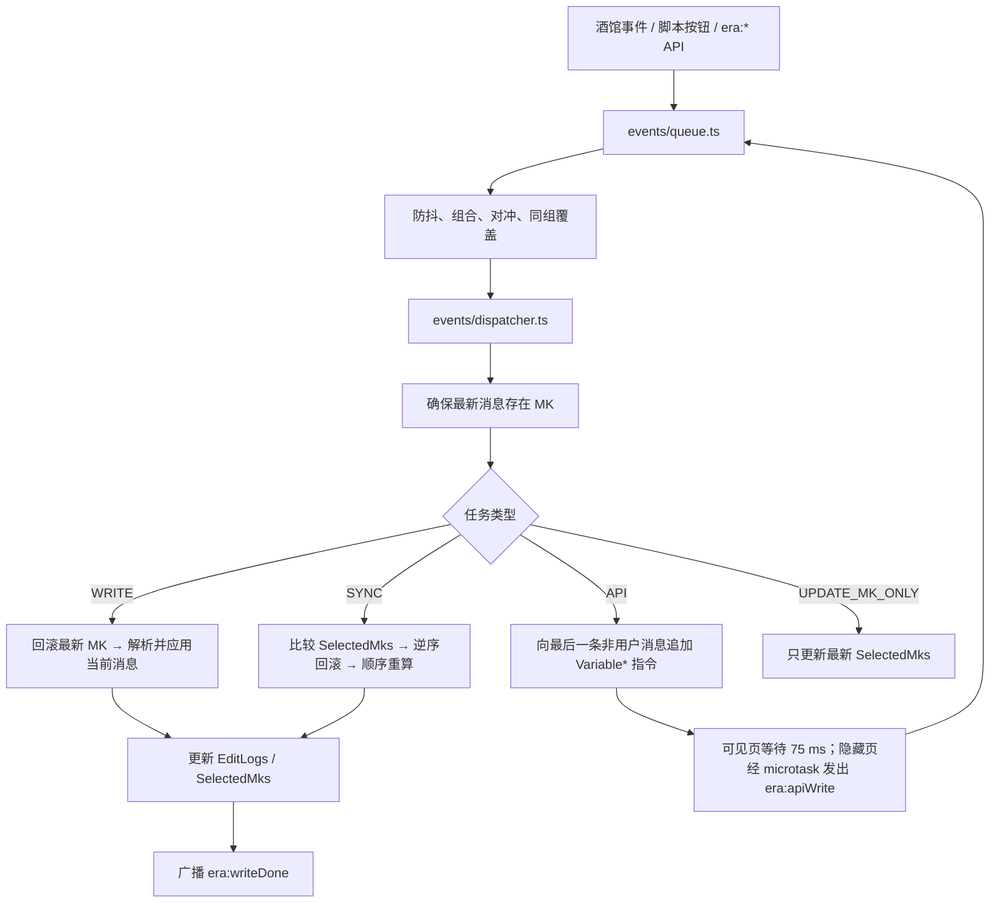
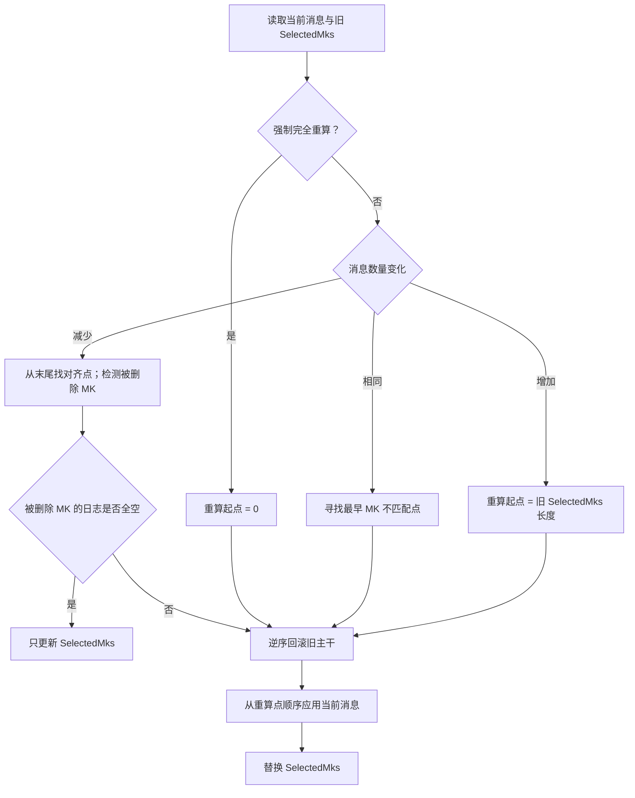

# ERA 变量框架

ERA 是运行在酒馆助手脚本环境中的聊天级变量框架。它把 AI 消息内的变量指令应用到 `chat` 变量，并通过消息密钥（Message
Key，简称 MK）、编辑日志（EditLog）和已选 MK 链（SelectedMks）实现回滚、swipe 分支切换和历史重算。

本文档根据当前恢复出的 21 个 TypeScript 模块编写，描述的是**现有代码的真实行为**。文末的“优化评估”只提出建议，本次恢复没有修改框架逻辑。

## 1. 核心能力

- 从 AI 消息中解析 `<VariableInsert>`、`<VariableEdit>` 和 `<VariableDelete>` 指令。
- 将状态存放在聊天作用域的 `stat_data` 中。
- 为每条消息正文注入 MK，使变量状态与具体消息内容绑定。
- 为每个 MK 保存可逆的 EditLog。
- 在删除消息、切换 swipe 或切换聊天后执行“逆序回滚、顺序重算”。
- 通过六个 `era:*` 事件接受外部脚本的变量写入请求。
- 通过 `{{ERA:...}}` 和 `{{ERA-withmeta:...}}` 宏读取状态。
- 在写入或同步后广播 `era:writeDone`。

## 2. 目录结构

```text
src/ERA变量框架/
├── index.ts                         # 入口与事件监听
├── api/
│   ├── command.ts                   # 外部事件 API 与 writeDone 广播
│   ├── command.test.ts              # API 入队、隐藏页调度与正文合并回归
│   ├── writeScheduler.ts            # 可见性自适应的 API flush 调度器
│   ├── writeScheduler.test.ts       # timer/microtask/提升/续排回归
│   └── macro/
│       ├── parser.ts                # ERA 宏注册与替换
│       └── patch.ts                 # 可选的消息强制重渲染
├── core/
│   ├── crud/
│   │   ├── patcher.ts               # 单消息指令解析与 CRUD 总入口
│   │   ├── delete.ts                # 删除与 necessary 保护
│   │   ├── update.ts                # 更新与 updatable 保护
│   │   └── insert/
│   │       ├── insert.ts            # 非破坏性插入
│   │       └── template.ts          # $template 继承与合并
│   ├── key/
│   │   └── mk.ts                    # MK 读取、生成、注入与校准
│   ├── rollback.ts                  # EditLog 逆序回滚与历史值追溯
│   └── sync.ts                      # 历史差异检测与重算
├── events/
│   ├── merger.ts                    # 事件分组、组合、对冲与覆盖
│   ├── queue.ts                     # 串行队列与批处理
│   └── dispatcher.ts                # 任务分发与后置广播
└── utils/
    ├── constants.ts                 # 路径、标签、事件和公共负载
    ├── data.ts                      # 转义、合并、EditLog/JSONL 解析
    ├── era_data.ts                  # ERA chat 变量读写
    ├── log.ts                       # 分级日志
    ├── message.ts                   # 消息读取与更新
    └── string.ts                    # 指令块与代码围栏处理
```

## 3. 总体架构



框架依赖以下酒馆助手全局接口：

- `getChatMessages`、`setChatMessages`
- `getVariables`、`updateVariablesWith`
- `eventOn`、`eventEmit`、`tavern_events`
- `getButtonEvent`
- `registerMacroLike`
- `getScriptId`
- jQuery `$`

唯一显式第三方依赖是 `lodash`。部分模块仍通过全局 `_` 隐式使用 Lodash。

## 4. Chat 变量数据模型

所有核心数据固定存放在 `{ type: 'chat' }` 作用域：

```ts
type EraChatVariables = {
  ERAMetaData?: {
    EditLogs?: Record<string, string | EditLogEntry[] | EditLogEntry>;
    SelectedMks?: Array<string | null | undefined>;
  };
  stat_data?: unknown;
};

type EditLogEntry =
  | { op: 'insert'; path: string; value_new: unknown }
  | { op: 'update'; path: string; value_old: unknown; value_new: unknown }
  | { op: 'delete'; path: string; value_old: unknown };
```

实际示例：

```json
{
  "ERAMetaData": {
    "EditLogs": {
      "era_mk_1759246942209_jipmrj": "[{\"op\":\"update\",\"path\":\"player.hp\",\"value_old\":90,\"value_new\":100}]"
    },
    "SelectedMks": ["era_mk_greeting", "era_mk_1759246942209_jipmrj"]
  },
  "stat_data": {
    "player": {
      "hp": 100
    }
  }
}
```

### 4.1 `stat_data`

当前游戏或故事状态。AI 指令和外部 API 的增、改、删最终都作用于此对象。

### 4.2 `ERAMetaData.EditLogs`

以 MK 为键，记录该消息当前内容产生的所有变更。当前实现通过 `JSON.stringify(editLog)` 保存，所以运行时通常是“MK →
JSON 字符串”，而不是类型声明中所写的“MK → 数组”。读取侧的 `parseEditLog` 同时兼容：

- 数组；
- 单个对象；
- JSON 数组字符串；
- 无效或缺失值。

同一 MK 被重新处理时，日志会被**覆盖**而不是追加；即使消息没有有效变量指令，也会写入 `"[]"`。

### 4.3 `ERAMetaData.SelectedMks`

按 `message_id` 建索引的稀疏数组，表示当前聊天主干中每一楼对应的 MK。它是历史差异检测、回滚和重算的基准。

### 4.4 内部字段

`$meta`、`$template` 等所有以 `$` 开头的字段均被视为内部字段。 `statWithoutMeta` 和普通 ERA 宏会递归移除**所有** `$`
前缀字段，而不只是 `$meta`。

## 5. 消息密钥 MK

MK 被直接写入当前激活消息正文：

```xml
<era_data>{"era-message-key"="era_mk_时间戳_随机串","era-message-type"="assistant"}</era_data>
```

生成格式：

```text
era_mk_${Date.now()}_${Math.random 生成的 6 位 base36 字符串}
```

关键行为：

- 只从当前激活内容读取 MK；不会到其他 swipe 中寻找旧 MK。
- 当前 swipe 没有 MK 时会获得全新 MK。
- MK 块会被插到正文顶部，原正文跟在换行之后。
- 消息类型取 `user` 或 `assistant`；非 `user` 角色会被写成 `assistant`。
- `updateLatestSelectedMk` 会确保最新消息有 MK，并校准对应的 `SelectedMks` 项。

消息正文内的 MK 是框架的状态锚点。手动删除或伪造 `<era_data>` 块会影响差异检测与回滚。

## 6. 变量指令

单条消息的固定处理顺序为：

1. 提取全部 `<VariableInsert>`；
2. 提取全部 `<VariableEdit>`；
3. 提取全部 `<VariableDelete>`；
4. 解析类似 JSONL 的对象；
5. 执行数据转义；
6. 严格按 **Insert → Edit → Delete** 应用；
7. 覆盖写入该 MK 的 EditLog。

即使三类标签在正文中交错排列，实际执行顺序也不会改变。

指令块可以包含一个对象，也可以包含多个首尾相接的对象：

```xml
<VariableInsert>
{"player":{"hp":100}}
{"world":{"weather":"晴"}}
</VariableInsert>
```

解析器只提取顶层 `{...}` 对象，不支持顶层数组或标量。

### 6.1 VariableInsert

```xml
<VariableInsert>
{
  "player": {
    "name": "张三",
    "hp": 100,
    "inventory": []
  }
}
</VariableInsert>
```

规则：

- 只写入不存在的路径，不覆盖已有值。
- 如果基础路径整体不存在，则把补丁和模板合成为一个原子值，只记录一条 `insert` 日志。
- 如果基础路径已存在，且当前值和补丁都是普通对象，则递归补充不存在的子路径。
- 路径已存在但结构不兼容时跳过并记录警告。
- 根对象不能被标量替换。

日志：

```json
{
  "op": "insert",
  "path": "player",
  "value_new": {
    "name": "张三",
    "hp": 100
  }
}
```

### 6.2 `$template`

模板只在 Insert 流程中作为默认值使用。优先级从低到高为：

1. 上层继承内容；
2. 当前父节点变量中的 `$template`；
3. 父模板中的通用 `$template` 原型；
4. 当前 key 的特异性模板；
5. 实际 Insert 补丁。

对象会深度合并；高优先级数组会整体替换低优先级数组，不按索引合并。空补丁 `{}` 会完全采用计算后的模板内容。

模板示意：

```json
{
  "characters": {
    "$template": {
      "$template": {
        "hp": 10,
        "mana": 100
      },
      "黄蓉": {
        "hp": 15,
        "title": "丐帮帮主"
      }
    }
  }
}
```

### 6.3 VariableEdit

```xml
<VariableEdit>
{
  "player": {
    "hp": 120
  }
}
</VariableEdit>
```

规则：

- 只修改已经存在的完整叶子路径。
- 普通对象会继续递归；数组和其他非普通对象被视为叶子值并整体替换。
- 路径不存在时只跳过该项，不中断同块的其他操作。
- 即使新旧值相同，也会记录 `update`。
- 源码**没有实现** `"+=10"`、`"-=2"` 等运算表达式；它们会作为普通字符串写入。

日志：

```json
{
  "op": "update",
  "path": "player.hp",
  "value_old": 100,
  "value_new": 120
}
```

`$meta.updatable`：

- 未设置时默认允许更新。
- 当前节点为 `false` 时，整个分支停止递归。
- 同一补丁显式包含 `"$meta": { "updatable": true }` 时，当前实现会绕过该节点保护。

### 6.4 VariableDelete

```xml
<VariableDelete>
{
  "player": {
    "gold": {}
  }
}
</VariableDelete>
```

删除意图由补丁结构决定：

- 空对象 `{}`、非对象或 `null`：删除当前节点。
- 非空普通对象：保留当前节点，递归删除指定子节点。
- 不存在路径跳过。
- 根对象禁止删除。

```js
eventEmit('era:deleteByObject', { player: {} });
// 删除整个 player

eventEmit('era:deleteByObject', {
  player: { gold: {}, mana: {} },
});
// 只删除 player.gold 和 player.mana
```

日志：

```json
{
  "op": "delete",
  "path": "player.gold",
  "value_old": 100
}
```

`$meta.necessary`：

- `"self"`：禁止直接删除当前节点，仍允许递归删除子节点。
- `"all"`：禁止直接删除当前节点，也禁止递归删除子节点。
- 补丁含空 `$meta` 或明确含 `$meta.necessary` 时，会绕过当前实现中的 `"all"` 递归保护。
- 直接删除受保护节点本身不能由同一个空补丁豁免，需先递归删除保护元数据。

### 6.5 数组兼容行为

Insert 和 Edit 都会经过 `sanitizeArrays`。这个函数不会删除 `null`，而是把数组的直接对象元素和子数组执行
`JSON.stringify`：

```json
{
  "inventory": [{ "name": "药", "count": 1 }]
}
```

可能存为：

```json
{
  "inventory": ["{\"name\":\"药\",\"count\":1}"]
}
```

调用方不能假定“对象数组”会保持标准 JSON 对象结构。

## 7. 数据转义

在应用指令前，框架会递归转义对象键和所有字符串值：

```text
.  → __DOT__
"  → __DQUOTE__
'  → __SQUOTE__
```

广播 `era:writeDone` 和展开宏时再反转义。非字符串原始值保持不变。

当前编码没有保留字转义层，因此原始数据中应避免直接使用：

```text
__DOT__
__DQUOTE__
__SQUOTE__
```

否则反转义后可能得到不同内容；键名还可能与另一个转义后的键碰撞。

## 8. EditLog 与回滚

`rollbackByMk(MK)` 读取该 MK 的日志并严格逆序执行：

| 日志操作                       | 回滚动作         |
| ------------------------------ | ---------------- |
| `insert`                       | `unset(path)`    |
| `update`                       | 恢复 `value_old` |
| `delete`                       | 恢复 `value_old` |
| update/delete 缺少 `value_old` | `unset(path)`    |

回滚不会删除对应 EditLog。

### 8.1 历史旧值追溯

Edit 生成日志时，`findLatestNewValue` 会：

1. 从目标消息的前一条开始向旧消息扫描；
2. 跳过用户消息和没有 MK 的消息；
3. 读取每条消息 MK 对应的 EditLog；
4. 逆序寻找目标路径的最新 `value_new`；
5. 若日志修改了目标路径的父对象，则尝试从父级 `value_new` 中取子路径；
6. 未找到或遇到该路径的 delete 日志时返回 `null`。

## 9. 历史同步

`resyncStateOnHistoryChange` 通过当前消息 MK 序列和旧 `SelectedMks` 判断差异。



具体规则：

- 消息减少：从后向前找当前 MK 与旧 MK 的对齐点。
- 消息数量相同：找到最早的 MK 不匹配位置。
- 消息增加：从旧 `SelectedMks.length` 开始处理。
- 强制完全重算：从消息 0 开始。
- 被删除 MK 的 EditLog 全为空时，只修正 `SelectedMks`。
- 否则从重算点后的旧 MK 开始逆序回滚，再按当前消息顺序重新应用。

`forceSyncLastAiMessage` 是一个未接入入口事件的内部导出，设计用途是处理“正文被外部修改但 MK未变”的情况。

## 10. 事件系统

入口注册 19 类普通监听事件，并为 3 个脚本按钮注册监听器。

| 分组                  | 事件                                                                    | 行为                               |
| --------------------- | ----------------------------------------------------------------------- | ---------------------------------- |
| `WRITE`               | `APP_READY`、`manual_write`、`era:apiWrite`                             | 回滚最新 MK 后重新应用最后 AI 消息 |
| `SYNC`                | `MESSAGE_RECEIVED`、`MESSAGE_DELETED`、`MESSAGE_SWIPED`、`CHAT_CHANGED` | 历史同步                           |
| `SYNC`                | `manual_sync`、`manual_full_sync`、`combo_sync`                         | 普通或强制同步                     |
| `API`                 | 六个 `era:*` 写入事件                                                   | 向消息追加变量指令                 |
| `UPDATE_MK_ONLY`      | `MESSAGE_SENT`                                                          | 只确保最新用户消息 MK              |
| `COLLISION_DETECTORS` | `GENERATION_STARTED`                                                    | 只用于对冲/组合                    |
| `COMBO_STARTERS`      | `MESSAGE_UPDATED`                                                       | 只用于组合                         |

### 10.1 收集窗口

| 队首事件          | 等待时间 |
| ----------------- | -------: |
| 任意 API 事件     |     0 ms |
| `MESSAGE_SWIPED`  |   500 ms |
| `MESSAGE_UPDATED` |  1500 ms |
| 其他事件          |   300 ms |

防抖只在一次 `processQueue` 处理循环开始时执行。处理任务期间新到达的下一批事件不会重新等待。

### 10.2 组合与对冲

```text
MESSAGE_UPDATED + GENERATION_STARTED
时间差 ≤ 1600 ms
→ combo_sync
```

```text
MESSAGE_SWIPED + GENERATION_STARTED
时间差 ≤ 600 ms
→ 两个事件都丢弃
```

组合和对冲只检查相邻的存活事件。

### 10.3 同组合并

相邻的 WRITE 或 SYNC 事件由后者覆盖前者：

```text
SYNC(A), SYNC(B)   → SYNC(B)
WRITE(A), WRITE(B) → WRITE(B)
```

未配对的 `GENERATION_STARTED` 和 `MESSAGE_UPDATED` 会在合并结束时清除。

### 10.4 脚本按钮

| 按钮名称       | 入队事件           | 最终行为               |
| -------------- | ------------------ | ---------------------- |
| `写入变量修改` | `manual_write`     | 回滚并重写最后 AI 消息 |
| `手动同步状态` | `manual_sync`      | 普通历史同步           |
| `强制完全重算` | `manual_full_sync` | 从消息 0 开始重算      |

## 11. 外部事件 API

ERA 不直接向其他脚本暴露函数；外部调用方通过 `eventEmit` 发起请求。

| 事件                      | detail                                                                                      |
| ------------------------- | ------------------------------------------------------------------------------------------- |
| `era:insertByObject`      | 要插入的对象                                                                                |
| `era:updateByObject`      | 要更新的对象                                                                                |
| `era:deleteByObject`      | 描述删除路径的对象                                                                          |
| `era:transactionByObject` | `{ transactionId, operations: Array<{ type: 'insert' \| 'update' \| 'delete', payload }> }` |
| `era:insertByPath`        | `{ path: string, value: unknown }`                                                          |
| `era:updateByPath`        | `{ path: string, value: unknown }`                                                          |
| `era:deleteByPath`        | `{ path: string }`                                                                          |

```js
eventEmit('era:insertByObject', {
  player: { name: '郭靖', hp: 100 },
});

eventEmit('era:updateByPath', {
  path: 'player.hp',
  value: 120,
});

eventEmit('era:deleteByPath', {
  path: 'player.gold',
});

eventEmit('era:transactionByObject', {
  transactionId: 'event-settlement-42',
  operations: [
    { type: 'update', payload: { player: { hp: 80 } } },
    { type: 'delete', payload: { quests: { active: { old_event: {} } } } },
    { type: 'insert', payload: { quests: { completed: { old_event: true } } } },
  ],
});
```

批事务会先完整校验并克隆全部 operation，再按声明顺序一次性加入现有 API 写入队列。同一 flush 只更新一次 assistant 消息、发出一次
`era:apiWrite`，并在 `era:writeDone` 中返回 `transactionIds`（单事务时同时返回 `transactionId`）。

真实执行链：

```text
era:* API
→ 进入 ERA 事件队列
→ ApiWriteJob 进入独立写入队列
→ 可见页在 75 ms 窗口内收集任务；隐藏页在当前调用栈结束后经 microtask flush
→ 相邻同类型任务按 Insert/Edit/Delete 各自规则合并
→ 压缩正文中相邻、同类型的合法 Variable* 块
→ 找到最后一条“非用户”消息并一次性更新正文
→ setChatMessages(refresh: none)
→ era:apiWrite
→ WRITE：回滚旧日志并重算整条消息
→ era:writeDone
```

合并规则：

- `VariableInsert`：同一路径以先到值为准，缺失路径继续补入。
- `VariableEdit`：同一路径以后到值为准。
- `VariableDelete`：合并所有删除路径；任一侧以空对象删除父节点时，父节点删除优先。
- 只有相邻且同类型的任务或正文块会合并，Insert/Edit/Delete 的先后边界会被保留。
- 合法 JSON 块使用紧凑 JSON 重写；无法解析的块保持原文。

路径 API 使用 `_.set({}, path, value)` 构造嵌套对象。普通单操作外部调用没有 request ID、同步返回值或失败结果；批事务使用
`transactionId` 关联最终 `writeDone`。写入队列一次 flush 只更新一次消息并发送一次 `era:apiWrite`。

API flush 使用可见性自适应调度：

- 页面可见时保留 75 ms 合并窗口，并通过 `scheduleUnthrottledTimeout` 优先把 timer 注册到顶层窗口；
- 页面隐藏时不再等待 timer，而是用 `queueMicrotask` 在当前 JavaScript 调用栈结束后启动 flush；
- 已注册 75 ms timer 后页面转为隐藏，会取消 timer 并提升为 microtask；即使取消失败，调度 ID 校验也会忽略陈旧回调；
- timer 或 microtask 注册失败时立即 fallback flush，避免任务永久留在队列中；
- single-flight 和 flush 完成后队列非空自动续排机制继续防止并发写入及遗漏后续任务。

隐藏页路径仍会合并同一调用栈内的同步入队；跨异步 continuation 的任务不保证共享 75
ms 批次，这是避免 Chromium 将后台 timer 延迟十几秒至数分钟所作的取舍。

调度诊断记录
`scheduledAt`、`expectedAt`、`actualStartAt`、`lagMs`、`timerSource`、调度/启动时队列长度和页面可见状态。`timerSource`
可能为 `top`、`parent`、`self`、`microtask-hidden`、 `microtask-promoted` 或 `immediate-fallback`。

## 12. `era:writeDone`

写入、回滚或同步发生后，框架广播：

```ts
type WriteDonePayload = {
  mk: string;
  message_id: number;
  actions: {
    rollback: boolean;
    apply: boolean;
    resync: boolean;
    api: boolean;
    apiWrite: boolean;
  };
  selectedMks: Array<string | null | undefined>;
  editLogs: Record<string, string | EditLogEntry[] | EditLogEntry>;
  stat: unknown;
  statWithoutMeta: unknown;
  consecutiveProcessingCount: number;
  transactionIds?: string[];
  transactionId?: string;
  syncIds?: string[];
};
```

监听示例：

```js
eventOn('era:writeDone', detail => {
  console.log('写入楼层', detail.message_id);
  console.log('当前 MK', detail.mk);
  console.log('纯净状态', detail.statWithoutMeta);
});
```

注意：

- `stat` 包含内部字段，`statWithoutMeta` 移除了全部 `$*` 字段。
- 两份状态在广播前均执行 ERA 反转义。
- `editLogs` 不执行反转义，且当前通常含 JSON 字符串。
- API 接收任务的 `actions.api` 不会跨任务传给后续 `era:apiWrite`；实际 API 完成广播通常表现为
  `api: false, apiWrite: true`。
- API flush 含批事务时，`transactionIds` 会原样透传；恰好一个事务时同时提供 `transactionId`。
- SYNC 事件（如 `manual_full_sync`）的 detail 携带 `syncId`/`syncIds` 时，处理完成后在 `syncIds`
  中原样回传（含同批合并的全部 ID），供等待方精确匹配"自己发起的同步已完成"。
- `writeDone` 当前没有显式 `success` 或 `error` 字段。

## 13. ERA 宏

```text
{{ERA:path.to.value}}
{{ERA:array[0].name}}
{{ERA:$ALLDATA}}

{{ERA-withmeta:path.to.value}}
{{ERA-withmeta:$ALLDATA}}
```

返回规则：

| 查询结果             | 替换内容         |
| -------------------- | ---------------- |
| 路径不存在           | 空字符串         |
| 对象或数组           | 紧凑 JSON        |
| `null`               | 字符串 `"null"`  |
| 字符串、数字、布尔值 | `String(value)`  |
| `$ALLDATA`           | 整个 `stat_data` |

普通 `ERA` 会递归移除全部 `$` 前缀字段；`ERA-withmeta` 保留内部字段。两者都会反转义输出。

当前快速检测使用区分大小写的 `text.includes('{{ERA')`，因此虽然正式正则不区分大小写且允许空白，
`{{era:...}}`、`{{ ERA:...}}` 实际不会进入替换流程。推荐统一使用文档所示的大写、无前置空格形式。

## 14. 可选强制重渲染

脚本变量：

| 变量             |  默认值 | 含义                 |
| ---------------- | ------: | -------------------- |
| `强制重载功能`   | `false` | 是否启用             |
| `强制重载消息数` |     `1` | 重渲染最近多少条消息 |

启用后：

1. 等待 1000 ms；
2. 获取全部消息并取最后 N 条；
3. 点击每条消息的编辑按钮；
4. 等待 50 ms 后点击确认；
5. 消息间等待 100 ms。

实现依赖 `.mes_button.mes_edit` 和 `.mes_edit_done.menu_button` DOM 选择器。调度器不会 `await`
此流程，因此多个重渲染请求可能并行。

## 15. 日志

日志级别：

```ts
debug = 0;
log = 1;
warn = 2;
error = 3;
```

当前启动级别强制设为 `debug`，debug 还受模块白名单限制。格式为：

```text
《ERA》（可选 MK）「模块名」【函数名】消息
```

`logContext.mk` 是全局可变上下文，依赖事件队列串行执行来保持正确归属。

### 15.1 持久化耗时诊断

ERA 额外维护一个最多 600 条记录的持久化环形缓冲，存储键为：

```text
era_diagnostics_v1
```

诊断记录带 `runtimeId`、`correlationId`、阶段名和耗时。超过 5 秒的操作会记录 `slow`，此后每 15 秒记录一次
`watchdog`；iframe 重载后仍可读取上一实例留下的记录。

在 ERA 脚本 iframe 的控制台中：

```js
window.ERADiagnostics.read(); // 读取全部记录
window.ERADiagnostics.state(); // 查看当前队列、任务和 API flush 状态
window.ERADiagnostics.clear(); // 清空记录
```

也可以从同源页面直接读取：

```js
JSON.parse(localStorage.getItem('era_diagnostics_v1') || '[]');
```

重点判断：

- `flush-api-write-queue-scheduled` 后长期没有 `scheduled-flush-started`：调度没有获得执行机会；新版本隐藏页正常应使用
  `timerSource: microtask-hidden`，且 `lagMs` 通常接近 0；
- `timerSource: microtask-promoted`：任务最初在可见页使用 75 ms timer，随后因页面转为隐藏而提升；
- `timerSource: immediate-fallback`：timer 或 microtask 注册抛错，框架已改为立即 flush；同时检查相邻的
  `schedule-flush-timer-error`；
- 最后停在 `utils-message / set-chat-message`：楼层 `setChatMessages` 保存或其底层队列慢。
- 最后停在 `utils-era-data / update-stat-data` 或 `update-meta-data`：`updateVariablesWith` / 聊天变量保存慢。
- 最后停在 `events-dispatcher / phase:finalize-selected-mk`：ERA 收尾校准慢或抛错。
- 出现 `events-queue / process-queue-unhandled-rejection` 且 `isProcessing=true`：队列因异常未解锁。
- `write-done-emitting` 已出现，但 `write-done-listeners-settled` 很晚：ERA 核心写入已结束，慢点在外部 `era:writeDone`
  监听链。

## 16. 构建

入口文件是 `src/ERA变量框架/index.ts`，现有 Webpack 配置会自动发现它。

仅构建 `src` 项目：

```bash
pnpm exec webpack --mode development --env srcOnly=true
```

输出：

```text
dist/ERA变量框架/index.js
```

最初从 bundle 恢复源码时的验证结果：

- 最初提取的 21 个 TypeScript 文件与内联 source map 的 `sourcesContent` 逐字节一致；
- 审计发现 `api/command.ts` 的 `sourcesContent` 已过期，原 bundle 实际执行的是 75
  ms 写入队列、相邻任务合并和正文块压缩实现，因此该文件已按实际 webpack 模块反向还原；
- 当时其余 20 个模块的编译代码与原 bundle 的对应实际模块逐字节一致；
- 当时修正后重新构建的 21 个实际 webpack 模块全部与原 bundle 对应模块逐字节一致（比较时排除内联 source map 载荷）；
- 所有相对导入均可解析；
- Webpack 开发构建成功。

上述逐字节结果仅是源码恢复基线。此后 `api/command.ts`
已接入新的可见性自适应调度器，当前源码和 bundle 会有意偏离旧 bundle；应以当前回归测试、构建结果和运行诊断为验收依据。

原脚本与新构建文件整体仍不会逐字节相同，因为 `api/command.ts` 的新 source
map 现在记录了真实还原源码，而原脚本携带的是过期源码。验收应比较实际模块代码和差分行为，不应再以旧 `sourcesContent`
为真值。

差分回归覆盖：

- 初始 Insert、连续 Insert 合并、连续 Edit 末值覆盖、Delete；
- `{{ERA:...}}` 宏在初始写入、API 写入、追加消息和删除消息后的值；
- 消息删除后的 EditLog 回滚与 `SelectedMks` 同步；
- `era:apiWrite` 合并次数、`era:writeDone`、最终 `stat_data` 和消息正文。

当前目录还包含 API 调度的永久回归测试，覆盖隐藏页 microtask、可见页 75 ms
timer、可见转隐藏提升、陈旧回调隔离、注册失败立即 flush、flush 后续排，以及隐藏页同步入队后的正文合并。

除每次运行自然生成的 MK 时间戳外，原 bundle 与新构建在上述场景中的所有观察结果一致。

## 17. 优化评估

### 17.1 总结

整体设计的优点是职责拆分清楚、MK 与正文绑定、EditLog 可逆、历史同步思路完整，且所有事件最终进入同一个调度链。API 正文写入已经具有独立队列、可见性自适应调度和批量合并，并已有针对调度关键路径的永久回归测试。当前仍需优先处理的是事件队列异常恢复、数据编码安全和状态/日志的一致性，并继续把其余临时差分场景固化为回归基线。

### 17.2 P0：队列异常后可能永久锁死

证据：

- `processQueue` 设置 `isProcessing = true` 后没有外围 `try/finally`。
- `dispatchAndExecuteTask` 的主体虽有 `catch`，但其 `finally` 中仍有可能失败的 `await updateLatestSelectedMk()`。
- 该异常会跳过队列解锁和等待者通知。
- `pushToQueue` 没有处理 `processQueue()` 返回的 Promise。

影响：一次后置校准异常就可能让后续所有 ERA 事件停止处理。

建议：

1. 用最外层 `try/finally` 无条件复位锁并通知等待者；
2. 单个任务异常只隔离该任务，不终止整个队列；
3. 在 `pushToQueue` 入口显式捕获并记录 rejection；
4. 添加“调度器 finally 抛错后下一任务仍能运行”的测试。

### 17.3 P1：优先修复

#### API flush 失败时任务不会重新入队

`flushApiWriteQueue` 在读取目标消息前就通过 `splice(0)`
取走当前任务。如果找不到 AI 消息或消息更新失败，本批任务不会重新放回队列；调用方也没有 request ID 或失败事件可用于确认。

建议为 flush 增加显式成功/失败结果和有限重试策略；是否在“没有 AI 消息”时保留任务，需要先定义跨楼层写入的兼容语义。

#### 空聊天不会清理旧状态

`resyncStateOnHistoryChange` 在消息列表为空时直接返回。删除全部消息后，旧 `stat_data`、 `SelectedMks`
和日志引入的状态仍可能保留。

建议逆序回滚全部旧 MK 并清空 `SelectedMks`；是否保留历史 EditLog 应制定明确兼容策略。

#### CRUD 和 EditLog 不是同一事务

Insert/Edit/Delete 通过多次 `updateEraStatData`
落盘，最后才单独保存 EditLog。任一步骤失败都可能产生“状态已修改但日志缺失”的不可可靠回滚状态。

建议先构造完整变更计划，再在一次 `updateVariablesWith` 中同时提交 `stat_data` 和当前 MK 日志；失败时不要更新
`SelectedMks`，并向上抛出错误。

#### 转义方案不可逆

`a.b` 与 `a__DOT__b` 等输入可能在转义后碰撞；原始字面量 `__DOT__` 也会在反转义时变成 `.`。对象键碰撞会覆盖数据。

建议引入带版本的可逆编码，并为旧存档提供迁移。迁移前至少应在输入处拒绝三个保留 token。

#### JSONL 注释清理会破坏合法字符串

解析前直接全局删除 `//`、`/*...*/` 和 `<!--...-->`，例如 `{"url":"https://example.com"}` 会被截断。

建议使用字符串感知的扫描器；更理想的是把协议收敛为标准 JSON 数组或严格 JSONL，并在入口校验。

#### 不安全键与路径

数据复制函数直接向普通 `{}` 写入外部键，路径 API 又接受任意 Lodash path。`__proto__`、 `prototype`、`constructor`
等输入可能改变对象原型或污染后续数据。

建议在所有 AI/API 边界拒绝危险路径段，使用 `Object.create(null)` 或安全赋值，并做 schema 校验。

#### 损坏 EditLog 被视为空日志

`parseEditLog` 对缺失、合法空数组和解析失败都返回
`[]`。同步快速路径可能把损坏日志误判为“没有变量修改”，从而跳过必要回滚。

建议返回可区分的 `missing | valid | invalid` 结果；无效日志应阻断破坏性同步并给出明确错误。

#### “最后 AI 消息”可能选中 system 消息

`findLastAiMessage` 只排除用户消息，因此 system 等非 user 消息也会被当成 API 指令注入目标。

建议严格筛选 `role === 'assistant'`，MK 中的消息类型只作兼容校验。

#### 保护豁免范围过大

补丁中出现 `$meta.updatable: true` 或 `$meta.necessary` 时，当前豁免会影响同一补丁下的其他业务字段或兄弟删除项。

建议把豁免限制在元数据那条精确路径，解除保护与业务修改分成两个操作。

### 17.4 P2：近期优化

| 项目                     | 当前问题                                                      | 建议                                |
| ------------------------ | ------------------------------------------------------------- | ----------------------------------- |
| 同消息连续 Edit          | `intraMessageState` 只写不读，后续日志 `value_old` 可能不准确 | 优先读楼内状态，再查历史            |
| EditLog 类型契约         | 类型声明为数组，实际通常存 JSON 字符串                        | 统一存数组，或广播前规范化          |
| 数组数据形态             | 对象数组会被字符串化，且注释误称“删除 null”                   | 明确兼容需求；无必要则保留标准 JSON |
| 事件时间窗               | 收集 500/1500 ms，小于规则 600/1600 ms                        | 收集窗口覆盖规则截止时间            |
| 后续批次                 | 处理期间新批次不重新防抖                                      | 每批重新计算收集截止时间            |
| 宏快速检测               | 与不区分大小写、允许空白的正式正则不一致                      | 删除快速判断或统一规则              |
| 重渲染                   | 未 await、无互斥、依赖 DOM 点击                               | 单实例合并；优先宿主刷新 API        |
| `writeDone` 成功语义     | 部分操作失败后仍可能广播                                      | 增加 `success/error/stage`          |
| `actions.api`            | API 来源不会跨任务保留到最终广播                              | 删除字段或传递关联上下文            |
| MK 校验                  | 正则不锚定开头，也不验证前缀、角色、重复 MK                   | 严格解析并做冲突检测                |
| `forceSyncLastAiMessage` | 无 MK 分支直接调用必然跳过的写入函数                          | 先确保 MK 再重算                    |
| 旧值追溯性能             | 每个 Edit 叶子重新扫描消息和日志                              | 单次处理建立消息/MK/日志索引        |
| 状态快照性能             | 完整状态多次深拷贝和反转义                                    | 单次遍历或按需读取                  |
| 日志开销                 | 默认 debug，频繁 clone/JSON.stringify 大对象                  | 默认 log/warn，采用惰性日志参数     |
| 根数据校验               | `ERAMetaData`、`stat_data` 可为 null/数组/标量                | plain-object 校验与自愈             |
| API 参数                 | 无 schema、危险路径和序列化失败检查                           | 用 Zod/type guard 验证六类 detail   |
| 转义/净化递归            | 外部循环对象或极深对象可导致栈溢出                            | 限定 JSON-compatible 或使用 WeakSet |

### 17.5 P3：维护性

- 定义 `EraMetaData`、`EditLogEntry`、`EraDataBlock` 和六类 API detail 的判别联合类型，逐步替换 `any`。
- 合并 `utils/message.ts` 与 `core/key/mk.ts` 中重复的 `parseEraData`。
- 在隐式使用 `_` 的模块中显式导入 Lodash。
- 清理不可达的 `CHARACTER_MESSAGE_RENDERED` 忽略逻辑、长期注释掉的旧实现和未使用的 `rollbackByMk(..., silent)` 参数。
- `mergeEventBatch` 的调试快照只需保存事件类型，不必 `cloneDeep(detail)`。
- 给 EditLog 制定分支历史保留和垃圾回收策略，避免长会话无限增长。
- 将宿主消息、变量、时钟、随机源和日志包装成可注入 adapter，提高单元测试能力。

## 18. 推荐实施顺序与验收

### 阶段一：先建立回归基线

- 事件队列异常解锁；
- 连续 API 追加；
- Insert/Edit/Delete 与逆序回滚；
- 同楼多次修改同一路径；
- 删除全部消息；
- swipe、删除和完全重算；
- 损坏 EditLog；
- 保护解除与同补丁业务修改；
- URL、注释样文本、奇偶反斜杠 JSON；
- 对象数组和保留 token；
- `__proto__` 与危险 path；
- system/user/assistant 消息选择；
- 伪造或重复 MK。

### 阶段二：修复 P0/P1

先修复事件队列解锁和 API
flush 失败反馈；随后处理空聊天、事务一致性、可逆编码、严格日志解析和输入安全。每一项都应保持现有事件名、指令标签和宏语法兼容。

### 阶段三：统一类型与性能

统一 EditLog 存储/广播格式，增加 schema，缓存历史索引，降低全状态深拷贝和 debug 日志开销。

### 验收标准

- 任意单任务抛错后，后续队列任务仍能执行。
- 同时发出多次 API 写入时，每个指令块恰好保留一次并只触发一次合并写入。
- 任意历史操作后，`stat_data` 等于从当前消息主干自零重放得到的结果。
- 每次状态提交都有可解析、可逆的对应 EditLog。
- 转义满足 `decode(encode(value)) === value`，包括保留 token。
- 无效事件 detail、危险路径、损坏日志不会静默进入快速同步。
- 大状态和长聊天有可重复的性能基准，不出现明显 UI 长任务。
