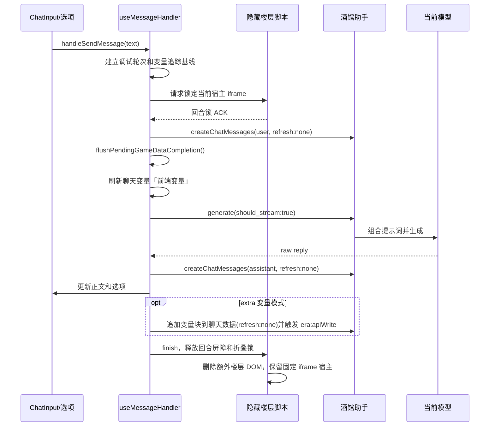

# 消息生命周期

## 目的与边界

本文记录手动发送、自动推进和重新生成共享的消息链路。变量写入的具体格式见
[03-变量读取与写入](./03-变量读取与写入.md)，变量条归因见 [04-变量变更追踪](./04-变量变更追踪.md)，地图与地图指令见
[09-地图与指令](./09-地图与指令.md)。

## 普通发送

底部输入框最终调用 `useMessageHandler.handleSendMessage()`：



当前实现由前端显式创建 user 和 assistant 楼层，并用 `generate()`
获取回复。不要在其他功能中复制这套流程；自动推进必须调用该入口。

显示最新正文时不会直接使用原始楼层字符串。`variableReader.ts`
会剥离 ERA 变量块、前端 loader 和无效 HTML 残留，再选择最新有效 assistant swipe。

如果待发送指令队列非空，`App.handlePlayerSend()` 会先通过 `useCommandQueue.sendMessageWithCommands()`
把指令逐行附加到玩家输入，再进入本链路。点击选项与底部输入共用这条附加逻辑。

真实玩家发送还会把未附加地图/物品指令的原始输入写入 user 楼层
`data.wuxiaInputHistoryV1.text`。指令队列浮窗只从当前聊天带此元数据的可见 user 楼层读取最近五条并回填输入框；旧楼层正文不做反向拆分，自动推进与重新生成也不写入该元数据。

## 关键步骤

1. `prepareExtraVariableUpdateTurn()` 根据设置预留额外变量任务，并在需要时暂时禁用精确世界书条目。
2. 如当前存在待发送地图/物品指令，先由 `useCommandQueue` 将其拼接到玩家输入末尾。
3. 向隐藏楼层脚本发送 `wuxia:turn-lifecycle(start)`，等待同一 `roundId` 的 `wuxia:turn-lock-ack`。
4. ACK 最长等待 2 秒；未确认时明确失败，不创建 user 楼层，也不调用模型。
5. 记录发送前最新消息 ID，并建立变量追踪基线。
6. 创建真实 user 楼层。
7. `flushPendingGameDataCompletion('before-generate')` 等待已排队的前端补全写入，避免提示词读取旧变量。
8. 前端根据当前 `stat_data` 刷新 `stat_data.前端变量` 的派生字段（含
   `周围地点`、`战力区`、`随机数`、`修为变化参考`），并合并保留 `永久属性修正`，不直接注入提示词。
9. `generate({ should_stream: true })` 生成完整 raw 回复；世界书是否读取周围地点、放在何处由世界书条目自行决定。
10. 解析 `<option>`，创建真实 assistant 楼层，并刷新 React 显示。
11. `extra` 模式继续把变量块写入聊天数据，保持当前楼层 shell 不重绑，并等待 ERA 同步。
12. `finally` 中释放额外变量预留，等待 `wuxia:turn-lifecycle(finish)` 解锁处理完成。隐藏楼层脚本只删除额外 DOM，固定宿主不改 `mesid`、不调用 `refreshOneMessage()`。

## 自动推进

`handleAutoAdvanceTurn()` 只增加两项行为：

- 自动传入固定推进句。
- 在 `handleSendMessage()` 完成后读取新增 user/assistant 楼层并返回记录。

它不应实现独立生成流程，也不应通过定时刷新模拟发送。多轮串行控制位于 `SettingsPanel`，只有当前轮完整结束后才调用下一轮。

## 重新生成

重新生成由 `handleRegenerateLastAssistant()` 和 `utils/messageActions.ts` 处理：

1. 找到最新可重新生成的 assistant swipe 及其前置 user 楼层。
2. 建立独立变量追踪基线。
3. 先按 `swipes -> swipe_id -> message` 的顺序把临时 swipe 写入聊天数据（`refresh:none`），并通过 `manual_sync`
   回滚旧 swipe 对变量的影响。
4. 回滚完成后按当前 `stat_data` 刷新 `stat_data.前端变量`，再调用 `generate()` 生成新正文。
5. 先按 `swipes -> message` 的顺序把新正文写回目标 swipe 的聊天数据（`refresh:none`）。
6. 通过 `era:apiWrite` 重算新 swipe 变量。
7. 任一步失败时切回旧 swipe 的聊天数据，并再次同步恢复变量。
8. 回合结束后释放回合锁；隐藏楼层脚本继续保留原宿主 DOM，因此同一聊天不会因重新生成重绑 iframe。

不要把重新生成简化为只替换正文，否则变量状态会继续沿用旧 swipe。

## 编辑最新回复

底部“编辑最新 AI 回复”按钮只允许覆写当前最后一条未隐藏、非 loader 的 assistant active swipe：

1. 编辑器读取完整 raw 文本，但不展示或改写 `data / extra / swipes_data / swipes_info`。
2. 保存前等待补全队列，并核对聊天、楼层、active swipe、raw 文本和 `message` 镜像均未变化。
3. `<era_data>` 必须逐块原样保留；`VariableInsert / Edit / Delete` 必须是成对标签和合法 JSON 对象。
4. 使用 `setChatMessages(..., { refresh: 'none' })` 同时更新 active swipe 与 `message` 镜像；其他 swipe 和元数据保持不变。
5. 变量动作语义变化时执行 `manual_sync`。ERA 失败会在目标仍是本次草稿时恢复原文；无法安全恢复则明确报告状态不确定。

## 周围地点变量

发送和重新生成会在生成前刷新聊天变量里的 `stat_data.前端变量`。其中 `周围地点` 对象包含：

- `相邻三级地点`：当前二级地点内的完整三级地点路径
- `相邻二级地点`

需要在世界书条目中使用时，由条目自行组织格式和插入位置，例如：

```ejs
<% const surroundingLocations = getVariables({ type: 'chat' }).stat_data?.前端变量?.周围地点; %>
相邻三级地点：<%= surroundingLocations ? JSON.stringify(surroundingLocations.相邻三级地点) : '[]' %>
相邻二级地点：<%= surroundingLocations ? JSON.stringify(surroundingLocations.相邻二级地点) : '[]' %>
```

如果当前聊天变量没有 `stat_data` 外壳，可改用：

```ejs
<% const surroundingLocations = getVariables({ type: 'chat' }).前端变量?.周围地点; %>
相邻三级地点：<%= surroundingLocations ? JSON.stringify(surroundingLocations.相邻三级地点) : '[]' %>
相邻二级地点：<%= surroundingLocations ? JSON.stringify(surroundingLocations.相邻二级地点) : '[]' %>
```

同批刷新的 `修为变化参考` 是数值字段，表示每日专心修行可获得的修为参考值；它是前端派生上下文，不是持久角色属性。

## 消息边界事件

`useEventListeners` 监听：

- `MESSAGE_SENT`
- `MESSAGE_RECEIVED`
- `MESSAGE_UPDATED`
- `MESSAGE_SWIPED`
- `CHAT_CHANGED`

这些事件用于刷新显示、补偿变量追踪和响应酒馆外部操作。业务流程不应依赖事件到达顺序完成关键写入，关键写入需要显式等待对应 API 或
`era:writeDone`。

## 关键入口文件

- `hooks/useMessageHandler.ts`
- `utils/messageActions.ts`
- `hooks/useEventListeners.ts`
- `components/ChatInput.tsx`
- `components/SettingsPanel.tsx`
- `App.tsx`

## 必须保持的约束

1. 自动推进串行复用 `handleSendMessage()`。
2. user 和 assistant 都必须形成真实聊天楼层。
3. 生成前必须清空待执行的变量补全队列。
4. `extra` 模式的变量失败不能删除已成功生成的正文，但必须明确报错。
5. 重新生成必须同时处理 swipe 和变量回滚/重算。
6. 组合提示词监听器必须在生成完成或失败后注销。
7. 回合锁 ACK 必须先于真实 user 楼层；finish 必须释放 ERA 屏障和折叠锁，但不得重绑固定宿主。

## 修改后验证

- 手动发送新增 user 和 assistant 两个楼层。
- 选项点击与文字输入走同一发送链。
- 自动推进多轮按顺序新增楼层，不并发生成。
- `inline` 和 `extra` 模式均能完成一轮。
- 重新生成切换到新 swipe，变量与新回复一致。
- 编辑最新回复使用 `refresh:none`，普通正文不触发 ERA，变量动作修改后完成同步或安全回滚。
- 同一聊天连续推进期间 iframe runtime 不变；切换聊天时允许正常换代。
- 生成为空、额外变量失败和重新生成失败均能恢复可操作状态。
