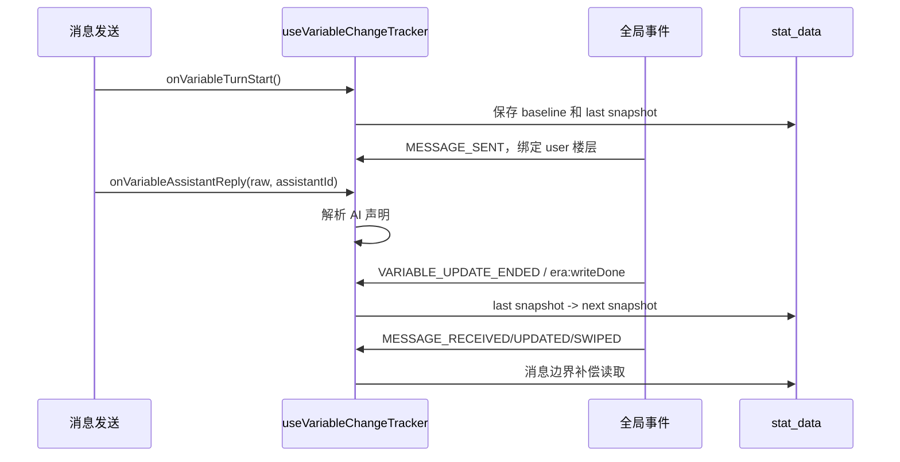

# 变量变更追踪

## 目的与边界

变量变更条用于角色卡测试阶段观察当前回合：

- `AI回复`：AI raw 回复声明了什么，以及这些声明是否实际落地。
- `后台变更`：事件脚本、游戏前端、变量编辑器或补偿读取造成的其他实际差分。

它是观测 UI，不负责执行变量写入，也不能阻塞消息发送。

## 数据模型

`utils/variableChanges.ts` 定义：

- `VariableDeclaredChange`：从 `<VariableInsert>`、`<VariableEdit>`、`<VariableDelete>` 解析出的叶子声明。
- `VariableActualChange`：两次 `stat_data` 快照之间的叶子差分。
- `VariableAiComparison`：声明与实际 AI 差分的比较结果。
- `VariableChangeSummary`：当前回合的 AI、后台、批次和解析信息。

`<VariableThink>` 只显示为思考摘要，不计入变量变更数量。

## 回合生命周期



新回合开始时结束上一轮。回复后的后台写入继续属于当前轮，直到下一次发送或切换聊天。

## 增量批次

追踪器计算的是：

```text
上次快照 -> 本次快照
```

而不是每次都计算：

```text
回合基线 -> 当前最终状态
```

这样可以保留同一路径先被 AI 修改、后被后台覆盖的两个有效步骤。

MVU 通知可能先到，`era:writeDone` 后到。若两者指向同一快照，后者只升级前一批次的来源元数据，不重复添加差分。

## AI 与后台归因

进入 `AI回复` 的实际差分必须同时满足：

1. 写入事件属于当前 assistant 的 AI 写入候选批次，例如 `apply`，或已显式登记目标楼层的 `apiWrite`。
2. 差分路径与本轮 raw 回复中的变量声明路径一致。
3. 差分目标值与声明值一致；删除则要求目标节点不存在。

未匹配的叶子差分即使与 AI 批次同时发生，也进入 `后台变更`。

后台来源包括：

- `directChatWrite`
- 事件脚本写入
- 前端属性或功法补全
- 变量编辑器
- 未匹配 AI 声明的 API 写入
- MVU 或消息边界补偿发现的残余差分

UI 还会过滤没有原始回复声明的 `api-only` 对比项，避免错误标记泄漏到 AI 展开面板。

## AI 对比状态

| 状态 | 含义 |
| --- | --- |
| `applied` | 声明存在，且观察到对应目标值写入 |
| `not-applied` | 有声明，但没有观察到对应写入 |
| `diverged` | 观察到同路径 AI 写入，但操作或值与声明不一致 |
| `no-op` | 回合开始前已经是目标值 |
| `api-only` | AI 批次有写入但 raw 回复无声明；当前 AI 面板不渲染此类项 |

对比状态以 AI 实际写入时的值判断。后台随后覆盖同一路径时，AI 项仍保留原本的落地结果，覆盖操作另列入后台。

## 会话缓存

当前回合保存在 `sessionStorage`，键名带版本号。归因规则或数据结构变化时必须提升版本并丢弃旧缓存，防止旧统计在刷新后继续显示。

缓存仅在同一聊天中恢复，并设有 30 分钟有效期。每类最多保存和渲染 100 条叶子变化，超出部分只记录省略数量。

## 关键入口文件

- `hooks/useVariableChangeTracker.ts`
- `utils/variableChanges.ts`
- `components/VariableChangeBar.tsx`
- `hooks/useEventListeners.ts`
- `App.tsx`
- `styles/_panels.scss`

## 必须保持的约束

1. 基线必须早于本轮事件脚本和前端写入。
2. AI 批次不能整批归入 AI，必须逐叶子匹配声明路径和值。
3. 同一快照的多种通知必须去重。
4. 同一路径的多次有效修改不能合并丢失。
5. 变量条不等待变量系统完成，也不改变发送链。
6. 切换聊天必须清除当前追踪状态。

## 常见故障

| 现象 | 优先检查 |
| --- | --- |
| AI 实际数远大于声明数 | 是否把整个 `apply/apiWrite` 批次归入 AI |
| 后台变化缺失 | `MESSAGE_SENT` 是否建立基线；消息边界补偿是否执行 |
| 同一项重复两次 | MVU 与 `era:writeDone` 是否按快照去重 |
| 刷新后仍显示旧错误统计 | `sessionStorage` 版本是否升级 |
| 变量条不出现 | 是否建立回合、是否传入 `VariableChangeBar`、当前是否有 summary |

## 修改后验证

- 普通变量块声明显示 `applied`。
- 未落地、值不一致和原值已满足分别显示正确状态。
- 事件计数器和前端补全只进入后台。
- 同一路径 AI 写入后被后台覆盖时两边各保留一条。
- 自动推进、酒馆外部发送和重新生成都能建立独立回合。
- 折叠条只能择一展开 AI 或后台分类。
