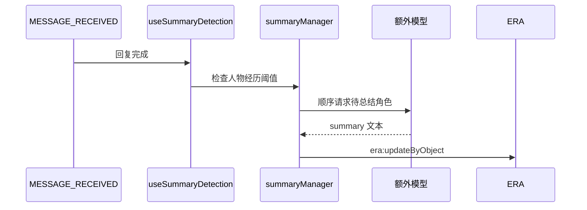

# 额外模型

## 目的与边界

“额外模型”配置同时服务：

- 人物经历自动总结。
- 正文生成后的额外变量更新。

两者共享 API 配置和请求客户端，但任务提示词、触发条件和写回方式不同。

## 配置结构

配置保存在 `DisplaySettings.summarySettings`，由 `utils/settingsManager.ts` 负责：

- 默认值。
- localStorage 读写。
- 旧版本配置迁移。
- 预设 API 与自定义 API 档案选择。

不要在自动总结和额外变量功能中分别维护第二套凭据。

## 请求客户端

`utils/summaryApiClient.ts` 的 `requestConfiguredText()` 提供两条路径：

| 模式 | 行为 |
| --- | --- |
| `preset` | 使用酒馆 `generateRaw()`，复用当前预设和连接配置 |
| `custom` | 请求酒馆后端的 OpenAI 兼容 chat-completions 接口 |

额外变量请求需要隔离不相关世界书、角色描述、示例对话和聊天历史，避免正文生成提示再次污染变量输出。

## 自动总结

`summaryManager.ts` 扫描玩家和 NPC 的 `人物经历`。单角色达到阈值后先进入待处理列表，真正触发还要满足待处理角色数阈值或总条目数阈值。多个角色顺序执行，避免并发写 ERA；写回会整体替换该角色的 `人物经历`。

额外变量任务运行时，自动总结检测会跳过本次消息，防止两个模型同时修改变量。
当前自动检测没有为被跳过的消息安排补偿重试，修改并发策略时要显式考虑这一点。

## 额外变量模式

`summarySettings.variableUpdateMode`：

| 模式 | 行为 |
| --- | --- |
| `inline` | 正文模型按世界书指导直接输出变量块 |
| `extra` | 正文生成时临时禁用精确的变量指导条目，正文落楼后再调用额外模型生成变量块 |

`extraVariableUpdateManager.ts` 的流程：

1. 预留任务并记录世界书条目原状态。
2. 正文生成完成并创建 assistant 楼层。
3. 构造前序只读完整轮次、最新 assistant 正文、当前变量快照、动态地图地点白名单，并从“世界背景”中只提取 `<叙事表现标尺>` 标记段。
4. 请求额外模型。
5. 只接受合法的 ERA 变量块。
6. 先把变量块写入目标 assistant swipe 对应的聊天数据，不立即刷新楼层 shell。
7. 触发 `era:apiWrite`，等待匹配楼层及动作的原始 `era:writeDone`；不等待与写入无关的 UI 刷新、事件结算或后台补全监听器。
8. 收到信号后回读聊天级 `stat_data`，逐项核对本轮声明的叶子路径和值。页面可见时允许短时轮询；页面已隐藏或轮询期间转为隐藏时立即结束前台等待，避免 Chromium 把名义 15 秒的计时器延长到数分钟。
9. 回读已一致时标记“变量已持久化”；暂未刷新时标记“持久化仍在等待”，转入带代际隔离的后台核对。后台先用微任务回读，并在状态查询时机会性回读，普通计时器只作为兜底。
10. 释放本轮执行锁并返回最终楼层文本；若快照仍未确认，持久化锁继续阻止下一次额外变量任务与它重叠；任意 busy 状态查询都会先回读最新 `stat_data`，已持久化时立即释放该锁。

当前角色世界书中必须存在名称精确为“变量指导”和“世界背景”的条目；“世界背景”必须包含完整的 `<叙事表现标尺>` 标记段。额外变量提示词不会复制整个世界背景，只读取该标尺；当前变量上下文则始终由前端专用严格投影构造。

“变量指导”在 `extra` 模式期间保持禁用，切回 `inline` 时才根据 localStorage 快照恢复原启用状态。单轮完成或失败只释放任务锁，不恢复该条目。

## 输出约束

额外变量输出只接受：

- `<VariableThink>`
- `<VariableInsert>`
- `<VariableEdit>`
- `<VariableDelete>`

Insert/Edit/Delete 必须包含严格 JSON 对象。写入前会兼容部分根键别名，但不应依赖宽松解析。

默认额外变量提示词按“任务定位 → 前序只读轮次 → 当前变量 → 地点 → 叙事表现标尺 → 变量指导 → 最新 assistant 正文 → 最终执行契约”排列。新模板变量为 `{{readonlyContextRounds}}`、`{{latestAssistantBody}}`、`{{variableContext}}`、`{{locationContext}}`、`{{narrativeScale}}`、`{{variableGuidance}}`；`{{recentBodies}}` 继续兼容旧自定义模板。旧模板若使用 `{{variableGuidance}}` 但没有 `{{narrativeScale}}`，构造器会把标尺与变量指导合并注入同一位置，避免丢失共享规则。

只有模板实际包含 `{{locationContext}}` 时才会插入动态地点约束，前端不会在模板末尾强行追加；可在设置页移动或删除。地点约束只允许写入当前二级地点下的完整三级路径，或坐标最近的相邻二级路径。无法从地点表解析当前位置时，本轮不得修改该变量。

## 并发保护

- `extraVariableUpdateBusy`
- `extraVariableUpdateReserved`
- `extraVariableApplyPending`：已收到 ERA 写入信号、但聊天级 `stat_data` 尚未确认时保留的持久化锁；状态查询会先机会性回读，避免后台计时器被节流后锁无法释放
- 追加变量块时使用 `refresh:none`，避免等待 `era:writeDone` 的 runtime 被中途卸载
- 匹配 `assistantMessageId` 和 `writeDone.actions` 的等待器

这些保护用于避免连续发送、自动总结或无关事件写入被误认为本次额外变量任务完成。`era:writeDone` 只确认 ERA 原始写入，不等同于变量最终验证；最终真相仍是聊天级 `stat_data`。

## 关键入口文件

- `utils/settingsManager.ts`
- `utils/summaryApiClient.ts`
- `utils/summaryManager.ts`
- `hooks/useSummaryDetection.ts`
- `utils/extraVariableUpdateManager.ts`
- `hooks/useMessageHandler.ts`

## 必须保持的约束

1. 自动总结和额外变量共享 API 配置。
2. 额外变量任务必须锁定目标 assistant 楼层。
3. 等待 `era:writeDone` 时必须同时校验楼层 ID 和动作。
4. 模式切换失败时不能提交新模式；切回 `inline` 时必须恢复“变量指导”的原状态。
5. 正文已成功时，额外变量失败只能报错，不能删除正文。
6. 多角色总结必须顺序写入。
7. `ERA_BASE_REGEX_RULE` 必须保留并启用，防止变量块泄漏到正文显示。

## 修改后验证

- 预设 API 和自定义 API 均能请求。
- `inline` 模式不触发额外变量请求。
- `extra` 模式只在目标 assistant 楼层追加合法变量块。
- 无关 `era:writeDone` 不会提前结束等待。
- 额外变量运行时不会同时启动自动总结。
- 请求失败后本轮忙碌/预留状态释放，“变量指导”仍保持与当前模式一致。
- ERA 写入后处理较慢时，变量模型状态不能长期停在 `running`；应显示写入确认、快照验证或后处理的各自状态。
- 已存在的嵌套事件/人物经历数据不能再被同路径 `VariableInsert` 重复插入；事件脚本应转为更新或跳过相同值。
