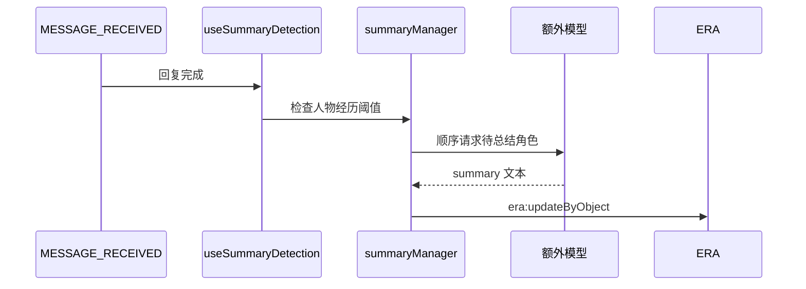

# 额外模型

## 目的与边界

“额外模型”配置同时服务：

- 人物经历自动总结。
- 正文生成后的额外变量更新。

两者共享 API 配置和请求客户端，但任务提示词、触发条件和写回方式不同。

## 配置结构

配置保存在 `DisplaySettings.summarySettings`，由 `utils/settingsManager.ts` 负责：

- 默认值。
- localStorage 读写。
- 旧版本配置迁移。
- 预设 API 与自定义 API 档案选择。

不要在自动总结和额外变量功能中分别维护第二套凭据。

## 请求客户端

`utils/summaryApiClient.ts` 的 `requestConfiguredText()` 提供两条路径：

| 模式 | 行为 |
| --- | --- |
| `preset` | 使用酒馆 `generateRaw()`，复用当前预设和连接配置 |
| `custom` | 请求酒馆后端的 OpenAI 兼容 chat-completions 接口 |

额外变量请求需要隔离不相关世界书、角色描述、示例对话和聊天历史，避免正文生成提示再次污染变量输出。

## 自动总结

`summaryManager.ts` 扫描玩家和 NPC 的 `人物经历`，按设置阈值决定是否总结。多个角色顺序执行，避免并发写 ERA。

额外变量任务运行时，自动总结检测会跳过本次消息，防止两个模型同时修改变量。

## 额外变量模式

`summarySettings.variableUpdateMode`：

| 模式 | 行为 |
| --- | --- |
| `inline` | 正文模型按世界书指导直接输出变量块 |
| `extra` | 正文生成时临时禁用精确的变量指导条目，正文落楼后再调用额外模型生成变量块 |

`extraVariableUpdateManager.ts` 的流程：

1. 预留任务并记录世界书条目原状态。
2. 正文生成完成并创建 assistant 楼层。
3. 构造最近有效正文、当前变量快照和渲染后的变量指导。
4. 请求额外模型。
5. 只接受合法的 ERA 变量块。
6. 追加到目标 assistant swipe。
7. 触发 `era:apiWrite` 并等待匹配楼层及动作的 `era:writeDone`。
8. 恢复世界书条目状态并返回最终楼层文本。

## 输出约束

额外变量输出只接受：

- `<VariableThink>`
- `<VariableInsert>`
- `<VariableEdit>`
- `<VariableDelete>`

Insert/Edit/Delete 必须包含严格 JSON 对象。写入前会兼容部分根键别名，但不应依赖宽松解析。

## 并发保护

- `extraVariableUpdateBusy`
- `extraVariableUpdateReserved`
- 匹配 `assistantMessageId` 和 `writeDone.actions` 的等待器

这些保护用于避免连续发送、自动总结或无关事件写入被误认为本次额外变量任务完成。

## 关键入口文件

- `utils/settingsManager.ts`
- `utils/summaryApiClient.ts`
- `utils/summaryManager.ts`
- `hooks/useSummaryDetection.ts`
- `utils/extraVariableUpdateManager.ts`
- `hooks/useMessageHandler.ts`

## 必须保持的约束

1. 自动总结和额外变量共享 API 配置。
2. 额外变量任务必须锁定目标 assistant 楼层。
3. 等待 `era:writeDone` 时必须同时校验楼层 ID 和动作。
4. 世界书条目无论成功失败都必须恢复。
5. 正文已成功时，额外变量失败只能报错，不能删除正文。
6. 多角色总结必须顺序写入。

## 修改后验证

- 预设 API 和自定义 API 均能请求。
- `inline` 模式不触发额外变量请求。
- `extra` 模式只在目标 assistant 楼层追加合法变量块。
- 无关 `era:writeDone` 不会提前结束等待。
- 额外变量运行时不会同时启动自动总结。
- 请求失败后世界书条目和忙碌状态恢复。
