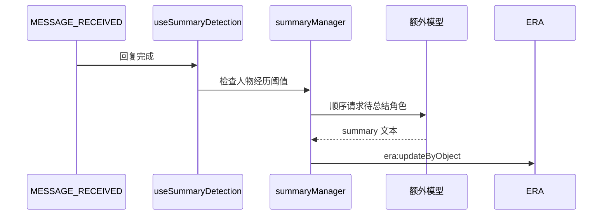

# 额外模型

## 目的与边界

“额外模型”配置同时服务：

- 人物经历自动总结。
- 正文生成后的额外变量更新。

同一设置页还管理独立的“对话摘要来源”：
- `card`：启用角色卡世界书条目“对话摘要指令”，并安装当前角色卡专用提示词正则。最近 N 条 assistant 回复保留全文但去掉摘要，更早 assistant 回复只保留 `
`，对应的旧 user 输入清空。
- `preset`：禁用卡内摘要条目和卡内正则，完全交给玩家当前预设自己的 XML 摘要/过滤方案。
- `off`：禁用卡内摘要条目和卡内正则。

摘要模式初始化必须严格幂等：固定游戏 iframe 挂载时先用 `getTavernRegexes()` 只读比较当前角色的卡内摘要规则；只有自有规则缺失、多余或行为字段发生变化时才允许调用 `updateTavernRegexesWith()`。该 API 会让 SillyTavern 重新载入聊天消息，因此禁止在“当前状态已经正确”时为了校验配置而无条件重写角色正则，否则会形成 iframe mount → 正则重载 → iframe unmount → 再 mount 的刷新闭环。

卡内摘要还可单独启用“长期章节归档”。默认每积累 10 条已经离开最近全文窗口的旧 `
`，额外模型把这一固定批次一次性压成一条章节记忆，并通过 `era:transactionByObject` 原子写入聊天级 `stat_data.叙事记忆.章节摘要`、`已归档至楼层` 与 `已归档摘要数`。历史楼层文本本身不改写；最终 Chat Completion prompt 在发送前根据 `已归档摘要数` 裁掉对应的旧逐轮摘要和配对 user 消息，再由“对话摘要指令”世界书条目注入章节记忆。这样归档既是分支敏感状态，又不会破坏历史树的原消息。

两者共享 API 配置和请求客户端，但任务提示词、触发条件和写回方式不同。

## 配置结构

配置保存在 `DisplaySettings.summarySettings`，由 `utils/settingsManager.ts` 负责：

- 默认值。
- localStorage 读写。
- 旧版本配置迁移。
- 预设 API 与自定义 API 档案选择。

不要在自动总结和额外变量功能中分别维护第二套凭据。

## 请求客户端

`utils/summaryApiClient.ts` 的 `requestConfiguredText()` 提供两条路径：

| 模式 | 行为 |
| --- | --- |
| `preset` | 使用酒馆 `generateRaw()`，复用当前预设和连接配置 |
| `custom` | 请求酒馆后端的 OpenAI 兼容 chat-completions 接口 |

额外变量请求需要隔离不相关世界书、角色描述、示例对话和聊天历史，避免正文生成提示再次污染变量输出。

## 自动总结

```mermaid
sequenceDiagram
    participant Event as MESSAGE_RECEIVED
    participant Hook as useSummaryDetection
    participant Manager as summaryManager
    participant Model as 额外模型
    participant ERA as ERA

    Event->>Hook: 回复完成
    Hook->>Manager: 检查人物经历阈值
    Manager->>Model: 顺序请求待总结角色
    Model-->>Manager: summary 文本
    Manager->>ERA: era:updateByObject
```

`summaryManager.ts` 扫描玩家和 NPC 的 `人物经历`。单角色达到阈值即可触发压缩；待处理角色数和总条目数阈值只用于标记批量触发原因，不再阻塞单角色。压缩只选择最旧的一批原始经历，默认保留最近 5 条原始经历，并把旧批次替换成一个 `阶段经历N`；既有阶段经历不会再次进入后续压缩。阶段经历的值从源条目中的游戏内 `(年.月.日)` 前缀计算时间范围，旧存档缺时间时明确标记“旧记录时间不详”，绝不再写浏览器现实日期。多个角色仍顺序执行，避免并发写 ERA。

额外变量任务运行时，自动总结检测会跳过本次消息，防止两个模型同时修改变量。
当前自动检测没有为被跳过的消息安排补偿重试，修改并发策略时要显式考虑这一点。

## 额外变量更新

变量更新只有独立额外变量模型这一条正式链路。`summarySettings.variableUpdateMode` 仅保留为固定值 `extra` 的运行时状态标识，不提供模式切换，也不再同步任何“变量指导”世界书条目。

变量提示词分为四层，均由设置与项目内置默认资源维护：

- 主提示词：`variablePromptTemplate`
- 输入上下文伪代码：`variableInputTemplate`
- 变量结构与权限：`variableStructureTemplate`
- 变量更新规则：`variableGuidanceTemplate`

`extraVariableUpdateManager.ts` 的流程：

1. 预留额外变量任务。
2. 正文模型只生成剧情正文；正文成功创建 assistant 楼层后再进入变量阶段。
3. 前端独立构造变量输入 slots，包括前序只读轮次、本轮 User、本轮正文、世界信息、玩家变量、参与事件、后续线索、相关人物、地点与修为参考；无内容的可选 slot 直接省略。
4. 从“世界背景”中只提取 `<叙事表现标尺>` 标记段，与设置中的变量结构、变量指导一起组装最终提示词。
5. 请求额外变量模型。
6. 校验变量标签闭合、严格 JSON 对象、世界时间与地点白名单；JSON 语法损坏时只允许不改变动作语义的格式修复。
7. 把合法变量块追加到目标 assistant active swipe，不立即刷新楼层 shell。
8. 触发 `era:apiWrite`，只等待目标楼层与目标动作匹配的原始 `era:writeDone`。
9. 回读聊天级 `stat_data`，逐项验证本轮变量声明是否真实落库；最终真相始终以聊天级 `stat_data` 为准。
10. 完成后释放本轮额外变量锁并返回最终楼层文本。

当前角色世界书中只要求“世界背景”继续提供稳定的 `<叙事表现标尺>`。变量模板与变量指导已经退出世界书，不再由世界书启停状态控制。

变量输入上下文中的 XML 只承担顶层定位作用。例如 `<参与事件>`、`<后续未发生事件脉络>` 是稳定锚点；标签内部直接使用无引号、中文键名的紧凑 YAML 风格键值，不再为事件名、时间、详情继续嵌套 XML。

## 输出约束

额外变量输出只接受：

- `<VariableThink>`
- `<VariableInsert>`
- `<VariableEdit>`
- `<VariableDelete>`

Insert/Edit/Delete 必须包含严格 JSON 对象。写入前会兼容部分根键别名，但不应依赖宽松解析。解析后的同类动作按完整嵌套对象重新组装，禁止把同一新物品、角色或其他结构拆成多个叶子 Insert；逐路径存在性不由前端预判。

`<后续未发生事件脉络>` 全部只读。内部按“事件名: 线索内容”的紧凑键值表达，只用于约束正文耗时与世界时间推进，不属于可写变量投影。

默认额外变量主提示词通过 `{{variableInputContext}}` 引入可编辑的输入上下文，再组合 `{{narrativeScale}}`、`{{variableTemplate}}`、`{{variableGuidance}}` 与最终执行契约。输入上下文模板可使用 `{{readonlyContextRounds}}`、`{{latestUserBody}}`、`{{latestAssistantBody}}`、`{{worldContext}}`、`{{playerContext}}`、`{{participationEvents}}`、`{{followupClues}}`、`{{relevantCharacters}}`、`{{locationContext}}`、`{{cultivationReference}}`、`{{decisionChecklist}}`，并可用 `@if slotName ... @endif` 省略空 section。

只有模板实际包含 `{{locationContext}}` 时才会插入动态地点约束，前端不会在模板末尾强行追加；可在设置页移动或删除。地点使用 `一级/二级/三级[/四级]`：前三段必须逐字复用动态白名单中的严格活动区，第四段可按正文维护且不参加白名单匹配。同一活动区内可新增、修改或移除第四级；跨活动区必须命中普通移动、事件目标或地图指定路径的前三段。无法从地点表解析当前位置时，本轮不得修改任何 `所在位置`。时间提示仍要求模型完整核算五字段，但守卫会将稀疏声明覆盖到当前完整时间后判断，不因缺字段本身拒绝，只拒绝无效值、删除必需字段或时间不向前。

## 并发保护

- `extraVariableUpdateBusy`
- `extraVariableUpdateReserved`
- `extraVariableApplyPending`：已收到 ERA 写入信号、但聊天级 `stat_data` 尚未确认时保留的持久化锁；状态查询会先机会性回读，避免后台计时器被节流后锁无法释放
- 追加变量块时使用 `refresh:none`，避免等待 `era:writeDone` 的 runtime 被中途卸载
- 匹配 `assistantMessageId` 和 `writeDone.actions` 的等待器

这些保护用于避免连续发送、自动总结或无关事件写入被误认为本次额外变量任务完成。`era:writeDone` 只确认 ERA 原始写入，不等同于变量最终验证；最终真相仍是聊天级 `stat_data`。

## 关键入口文件

- `utils/settingsManager.ts`
- `utils/summaryApiClient.ts`
- `utils/summaryManager.ts`
- `hooks/useSummaryDetection.ts`
- `utils/extraVariableUpdateManager.ts`
- `hooks/useMessageHandler.ts`

## 必须保持的约束

1. 自动总结和额外变量共享 API 配置。
2. 额外变量任务必须锁定目标 assistant 楼层。
3. 等待 `era:writeDone` 时必须同时校验楼层 ID 和动作。
4. 变量更新固定走额外模型；变量结构、变量指导与输入模板由设置/内置默认值维护，不再依赖世界书模式同步。
5. 正文已成功时，额外变量失败只能报错，不能删除正文。
6. 多角色总结必须顺序写入。
7. `ERA_BASE_REGEX_RULE` 必须保留并启用，防止变量块泄漏到正文显示。

## 修改后验证

- 预设 API 和自定义 API 均能请求。
- 只有额外变量模型可以在目标 assistant 楼层追加本轮 AI 变量块。
- 无关 `era:writeDone` 不会提前结束等待。
- 额外变量运行时不会同时启动自动总结。
- 请求失败后本轮忙碌/预留状态正确释放，设置中的变量提示词配置保持不变。
- ERA 写入后处理较慢时，变量模型状态不能长期停在 `running`；应显示写入确认、快照验证或后处理的各自状态。
- 已存在的嵌套事件/人物经历数据不能再被同路径 `VariableInsert` 重复插入；事件脚本应转为更新或跳过相同值。
