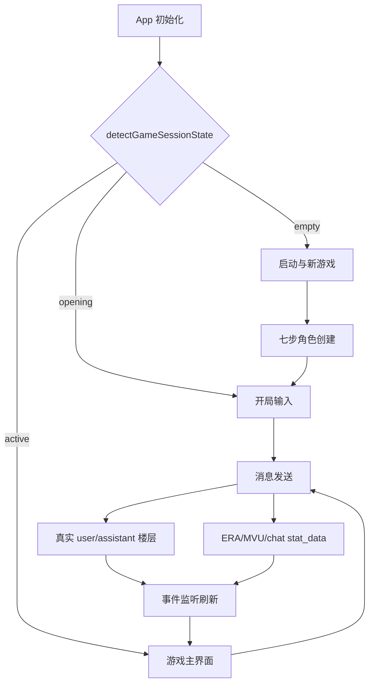

# 墨剑录前端架构入口

## 文档用途

本文件只提供稳定的系统边界、关键入口和阅读路由，不记录每个组件的实现细节。

维护功能时先查下方“按任务阅读”，只读取当前任务相关的专项文档和源码。不要默认加载 `docs/` 下的全部文件。

## 项目边界

墨剑录是运行在酒馆助手无沙盒 iframe 中的 React 武侠 RPG 前端：

- 酒馆聊天楼层保存用户输入、AI raw 回复和 swipe。
- 聊天级 `stat_data` 保存当前游戏变量。
- React `GameState` 是变量合并视图的 UI 投影，不是持久数据源。
- ERA、MVU、酒馆事件和独立事件脚本都可能参与一次回合的变量变化。
- 设置页同时承担显示设置、额外模型、变量编辑、自动推进和调试控制台职责。

## 顶层流程



## 数据源速查

| 数据 | 读取入口 | 用途 |
| --- | --- | --- |
| 合并变量视图 | `getAllVariables()` | `readGameDataPure()` 映射 UI |
| 聊天实际变量 | `getVariables({ type: 'chat' }).stat_data` | 变量编辑、差分追踪、写入验证 |
| 聊天楼层 | `getChatMessages()` | 正文、楼层 ID、swipe、自动推进记录 |
| 角色级变量 | `getVariables({ type: 'character' })` | checkpoint 存档树 |
| 显示设置 | `localStorage` | 外观、正则、额外模型和阈值 |
| 当前回合观测 | `sessionStorage` | 变量变更追踪的刷新恢复 |

不要用 React 状态判断变量是否真正写入；需要核对聊天级 `stat_data`。

## 关键入口

| 入口 | 职责 |
| --- | --- |
| [`App.tsx`](./App.tsx) | 装配页面、消息、事件、总结、变量追踪和面板 |
| [`types.ts`](./types.ts) | 页面、游戏状态、角色创建、地图和指令类型 |
| [`hooks/useMessageHandler.ts`](./hooks/useMessageHandler.ts) | 手动发送、自动推进单轮、重新生成编排 |
| [`hooks/useEventListeners.ts`](./hooks/useEventListeners.ts) | 酒馆、MVU、ERA 全局事件监听 |
| [`utils/variableReader.ts`](./utils/variableReader.ts) | 变量读取、正文归一化和后台补全调度 |
| [`utils/messageActions.ts`](./utils/messageActions.ts) | swipe 重新生成、回滚和 ERA 同步 |
| [`components/SettingsPanel.tsx`](./components/SettingsPanel.tsx) | 运行时设置与调试控制台 |
| [`hooks/useVariableChangeTracker.ts`](./hooks/useVariableChangeTracker.ts) | 当前回合变量增量追踪和归因 |

文件列表会持续变化，不在这里维护完整组件树。需要查找实现时使用 `rg --files src/武侠` 和源码引用。

## 按任务阅读

| 修改内容 | 必读文档 | 常见源码入口 |
| --- | --- | --- |
| 页面切换、开局、主界面状态、存档 | [01-页面与状态](./docs/01-页面与状态.md) | `App.tsx`、`usePageFlow.ts`、`useGameState.ts` |
| 手动发送、选项、自动推进底层、重新生成 | [02-消息生命周期](./docs/02-消息生命周期.md) | `useMessageHandler.ts`、`messageActions.ts` |
| 变量读取、写入、变量编辑器 | [03-变量读取与写入](./docs/03-变量读取与写入.md) | `variableReader.ts`、`variableEditorState.ts` |
| 变量条、AI/后台归因、差分 | [04-变量变更追踪](./docs/04-变量变更追踪.md) | `useVariableChangeTracker.ts`、`variableChanges.ts` |
| 额外 API、自动总结、额外变量模式 | [05-额外模型](./docs/05-额外模型.md) | `summaryApiClient.ts`、`extraVariableUpdateManager.ts` |
| 酒馆事件、MVU、属性和功法补全 | [06-事件与自动补全](./docs/06-事件与自动补全.md) | `useEventListeners.ts`、`variableReader.ts` |
| 设置页、正则、变量页、自动推进 UI | [07-设置与自动推进](./docs/07-设置与自动推进.md) | `SettingsPanel.tsx`、`settingsManager.ts` |
| 故障定位、日志、回归测试 | [08-调试与排错](./docs/08-调试与排错.md) | `useDebugLogs.ts`、`logger.ts`、设置页调试 |

示例：

- 只修改角色面板布局：读取本文件和对应组件，不需要读取变量追踪文档。
- 修改发送后变量不更新：读取 `02`、`03`，涉及变量条显示时再读取 `04`。
- 修改额外变量生成：读取 `02`、`05`；若归因错误再补读 `04`。

## 稳定约束

1. 持久游戏状态必须落在聊天变量或聊天楼层，不能只改 React 状态。
2. `readGameDataPure()` 保持纯读取；变量补全通过调度队列写回。
3. 自动推进必须串行复用普通发送逻辑，不能建立第二套生成流程。
4. 重新生成必须同时处理 swipe、旧变量回滚和新变量重算。
5. 额外变量和重新生成等待 `era:writeDone` 时必须匹配目标楼层及动作。
6. AI 变量归因必须逐叶子匹配 raw 回复中的声明路径和值，不能把整个写入批次算作 AI。
7. 全局事件监听集中在 Hook，并在卸载时注销。
8. 事件脚本和游戏前端造成的变量写入属于后台变化，不因发生在 AI 回复后就归为 AI。

## 目录职责

```text
src/武侠/
├── App.tsx                 # 总装配
├── components/             # React 视图与交互
├── hooks/                  # 状态与流程编排
├── utils/                  # 酒馆接口、变量、生成和业务工具
├── data/                   # 静态游戏数据
├── styles/                 # 模块化 SCSS
├── docs/                   # 按业务链路拆分的维护文档
├── types.ts                # 共享类型
└── 架构.md                 # 当前文档入口
```

## 文档维护规则

专项文档应记录：

- 跨越多个文件的真实流程。
- 数据源和外部事件。
- 容易被误改的约束。
- 常见故障定位和验证清单。

专项文档不应记录：

- 可由文件搜索得到的完整组件清单。
- CSS 类逐项说明。
- 函数逐行复述。
- 经常变化的文件行数。
- 单个简单展示组件的内部实现。

新增功能只有在跨越多个模块、事件或数据源时才建立新文档。否则更新现有业务链路文档或直接依赖源码。

## 其他资料

- [`CHANGELOG.md`](./CHANGELOG.md)：历史问题和修复记录。
- [`功法提取模板.md`](./功法提取模板.md)：功法数据相关模板。
- [`修为境界功法属性战斗的体系架构.txt`](./修为境界功法属性战斗的体系架构.txt)：游戏规则体系。

文档描述与源码冲突时，以当前源码和实际酒馆事件为准，并同步修正文档。
